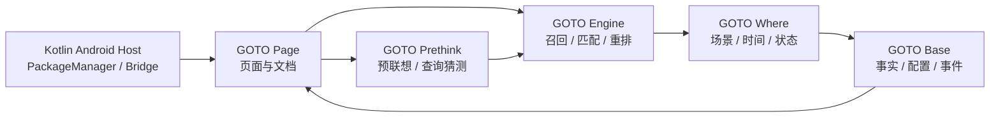

# GOTO 架构设计

> 这页是阅读 GOTO 项目的入口。请先记住一条边界：**GOTO Page 是页面源，GOTO Engine、GOTO Base、GOTO Where 是冻结组件**。页面可以展示、编排和调用它们，但不在页面里重写它们的实现。

  四层协作
  <strong>输入从 Page 进入，经 Prethink 预处理，由 Engine 匹配，再由 Where 结合情境，最后由 Base 保存事实。</strong>
  
Android 端提供系统应用和事件；Page 负责交互、文档与预览；Prethink 只提出候选，不改变输入；三个核心组件保持独立、可测试、不可被页面重写。

## 一张图看懂职责

## 组件关系与调用顺序

GOTO 不是一个把所有逻辑塞进页面的单体应用，而是“页面编排层 + 预联想层 + 三个冻结核心组件 + Android 宿主”的组合。页面负责把用户操作转成既有接口能理解的请求，再把结果还原成可读的手机界面和文档说明。

| 层级 | 组件 | 主要职责 | 不负责什么 |
| --- | --- | --- | --- |
| 体验层 | GOTO Page | 搜索框、设置页、文档目录、手机预览、状态反馈和页面级联动 | 不重写搜索算法、数据契约或通知策略 |
| 预联想层 | GOTO Prethink | 根据键盘邻位、字符交换、重复/缺失字符、拼音和历史生成少量可解释候选 | 不修改原始输入，不直接决定最终应用 |
| 核心匹配层 | GOTO Engine | 建立应用索引，执行精确、前缀、拼音、模糊召回和统一排序 | 不保存用户配置，不负责情境提醒 |
| 情境层 | GOTO Where | 结合时间、前台应用、最近行为和动作链调整提醒与展示权重 | 不发明应用，不替代 Engine 搜索 |
| 事实层 | GOTO Base | 保存应用事实、配置、行为事件、统计和备份契约 | 不替 Page 做展示决策，不被页面改写存储语义 |
| 宿主层 | Kotlin Android Host | 连接 PackageManager、系统权限、真实启动、通知和 WebView Bridge | 不把 Android 私有实现硬编码进 Page |

一次完整查询的顺序是：Page 保留原始输入并交给 Prethink；Prethink 最多给出 3–5 个带置信度和来源的查询假设；原始查询与这些假设一起进入同一个 Engine；Engine 统一竞争并返回最终候选；Where 只在允许时补充当前情境；Page 展示结果；用户启动应用后，Kotlin 宿主调用系统启动并把行为事件交给 Base。每一步都可以独立记录耗时和失败原因。

### 一次查询中可以观察什么

| 观察点 | 页面反馈 | 真实归属 |
| --- | --- | --- |
| 输入保留 | 搜索框保留用户原文，候选变化不覆盖输入 | Page / Kotlin Bridge |
| 预联想 | 可选候选显示来源与置信度，不自动提交 | GOTO Prethink |
| 目标匹配 | 结果行显示命中类型与排序后的目标 | GOTO Engine |
| 情境补充 | 最近、当前时段或动作链只影响展示权重 | GOTO Where |
| 事实更新 | 启动、失败和统计事件回写本地数据 | GOTO Base |

桌面文档中的按钮只模拟一次可观察调用，左侧手机负责呈现状态；Android 端则由 Kotlin 宿主完成真实应用启动、通知权限和系统事件接入。这样可以在不改动冻结组件的前提下，让文档、预览和真机行为保持同一条解释链。

## GOTO Engine：把线索变成候选

Engine 是搜索计算层。它接收用户输入、应用索引和可选的上下文，输出带有来源、分数和解释的候选结果。

- 负责精确匹配、前缀匹配、拼音/缩写、模糊召回和排序。
- 不负责保存用户偏好，不直接读写 Android 数据库。
- 结果必须可解释：页面可以展示命中原因和耗时，但不能偷偷改写分数含义。
- 页面中的 “调用 GOTO Engine” 按钮是一个只读演示，会把查询结果联动到左侧手机预览。

<button class="doc-inline-demo" data-preview-action="engine-api" data-preview-target="engineApiOutput" data-preview-query="weix">在左侧调用一次 Engine</button>

<pre id="engineApiOutput" data-engine-output>等待文档联动…</pre>

## GOTO Base：保存事实和契约

Base 是本地数据与配置边界。它回答“已经发生了什么”和“当前保存了什么”，不替页面做产品决策。

| 数据类别 | 例子 | 允许的使用方式 |
| --- | --- | --- |
| 应用事实 | 包名、显示名、可启动状态 | 提供给 Engine 建索引 |
| 用户配置 | 语言、主题、快捷索引、布局 | 由设置页读写，并通过契约校验 |
| 行为事件 | 搜索、启动、失败、使用时段 | 提供给统计与 Where |
| 导入导出 | 备份文件、版本信息、迁移标记 | 只通过 Base 的数据边界处理 |

Base 的实现已经定档。后续页面工作只能补充调用说明、错误提示和可视化，不得改变存储结构、读写语义或组件内部实现。

## GOTO Where：把候选放回当前情境

Where 是情境层。它可以使用时间、前台应用、最近行为和用户偏好来选择合适的展示方式，但不替代 Engine 的搜索，也不直接操作存储。

- 例如同一个输入在工作时段优先显示文档，在通勤时段优先显示地图或音乐。
- Where 可以调整候选的上下文权重，但不能把不存在的应用“猜”出来。
- Where 的输出应当能被页面解释为“为什么现在显示它”，并允许用户关闭主动建议。

Where 的实现已经定档。页面只通过既有接口消费结果，文档负责说明边界和验收方式。

## GOTO Prethink：正式匹配前的预处理

Prethink 是独立的页面级第四组件，属于“预联想”一类，与 Engine、Base、Where 的“模糊索引与提醒”核心类别不同。它的作用是猜测用户可能想输入什么，而不是替用户改写查询。

- 原始输入永远保留且权重最高；Prethink 只生成平行候选。
- 每个候选携带 `query`、`confidence`、`source`、`editCost` 和 `explanation`，例如“字符交换 + 邻位误触”。
- 最多生成 3–5 个候选，低于最低置信度的候选直接丢弃。
- 同一应用被多条路径召回时以最高路径得分为主，只给予有限的多路径奖励，避免分数膨胀。
- JS、Rust、Kotlin 版本共享 DTO 与 API 边界，但不修改 Engine、Base、Where 的实现。

因此，Engine 仍拥有最终解释权：Prethink 可以提出“可能是 chrome”的参考，Engine 才决定已安装应用中哪个目标真正匹配。

## Page 与 Kotlin 的同步关系

| 层 | 权威位置 | 变更方式 |
| --- | --- | --- |
| 页面源 | `GOTO Page/` | 先改这里，再生成 bundle |
| Android WebView 资源 | `GOTO/app/src/main/assets/goto_page/` | 使用同步脚本复制页面文件 |
| Android 宿主 | `GOTO/app/src/main/java/.../GotoWebActivity.kt` | 仅在 Bridge 或宿主契约需要变化时修改 |
| Engine / Base / Where | 对应冻结目录 | 本轮不改实现 |

同步检查的最低要求：页面 URL 能打开、文档 bundle 覆盖全部 Markdown/HTML、Android asset 与 Page 的页面文件一致、Kotlin Bridge 仍能注入已安装应用。

## 允许改什么，不能改什么

允许改：文档结构、PRD 表述、页面间距/圆角/动效、预览联动、页面级错误提示、播放器入口和页面到 Android asset 的同步脚本。

不能改：Engine/Base/Where 的核心实现、已有数据契约、Android Bridge 的注入字段语义、页面之外的算法结果解释。

<b>判断标准</b>如果一个改动改变了“如何计算、如何保存、如何做情境决策”，它不属于 Page 编辑范围；如果只是让用户更容易理解或验证既有结果，它属于 Page。

