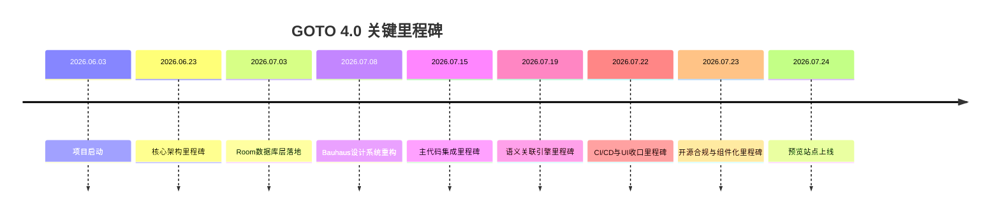

# 开发历史

> GOTO 4.0 开发时间线 — 从 2026 年 6 月项目启动到 2026 年 7 月 24 日预览站点上线

---

## 技术路径

GOTO 的技术演进遵循 **Local-First** 原则：全部计算在设备端完成，零云端依赖、零隐私泄露。

- **搜索引擎层**：拼音前缀树 + 元标签索引 + HyperFuzzy 模糊匹配（高斯核按键距离衰减）
- **自适应层**：HAC 自适应刷新 — 根据用户输入速度动态调节防抖延迟
- **智能预测层**：Chain-of-Action 模拟智能 — 结合上下文（时间、位置、硬件状态）进行零输入推荐
- **语义层**：基于词林同义词语料库的语义关联引擎，26 分片本地化部署
- **数据层**：Room 数据库（DAO 模式），支持全量导出与配置迁移
- **UI 层**：Bauhaus 设计系统 → 毛玻璃材质 → 光感模式三阶段演进

## 技术思考

### 为什么选择纯本地运算？

GOTO 作为启动器，核心体验是「快」。任何网络往返都是不可接受的延迟。我们将全部索引、搜索、排序逻辑放在设备端，用空间换时间：拼音前缀树常驻内存，同义词语料预加载，统计数据进行 EMA 平滑而非全量存储。

### 模块化设计哲学

GOTO Engine 从第一天就被设计为独立模块。它不依赖 Android 平台 API，全部接口通过 interface.d.ts 定义。这意味着：
- JS 预览版可以直接调用同一套算法逻辑
- Kotlin 手机端通过 GOTO Engine Module 调用
- 未来可以移植到任何平台

### 稳定性优先

每一次算法增强都遵循「不破坏现有功能」原则。新增的高斯核距离衰减是乘积比例制，不会让已有评分归零；负反馈机制有 Block Flag 保护，不会无限惩罚。

---

## 发展路径

### 2026.06.03 — 项目启动
首批代码提交：Android 工程脚手架、Poppins 字体系统、启动器图标、毛玻璃 drawable 资源、LicenseManager 授权模块雏形。奠定视觉基底。

### 2026.06.13 — 深浅主题与排行榜
引入深色/浅色卡片材质（frosted_card_bg_dark / light），完成排行榜页面布局。授权 API 客户端落地。

### 2026.06.19 — 激活流程与品牌
激活页布局上线，GithubPages 品牌 Logo（goto-logo.svg）定稿。

### 2026.06.23 — 核心架构里程碑
全部核心模块一次性定义：AdaptiveRefresh、BasicSearch、FuzzyMatchEngine、Personalization、SmartPredictionEngine、StatisticsData。配套 8 套类图（mmd + svg 双格式）。

### 2026.06.25 — 索引与统计可视化
索引数据模块文档化，Python 脚本生成 6 张架构 PNG，统计三线表自动生成。

### 2026.07.03 — 数据库层里程碑
Room 数据库全套落地：AppDatabase、ConfigDao、IndexDao、StatisticsDao、Tables、JsonCodec。PRD v2.0 发布。

### 2026.07.08 — Bauhaus 设计系统重构
Bauhaus 三阶段重构（phase1 → phase2 → v14）。配套 10+ 预发布审计脚本（无障碍检查、重复检测、Z-index 审计、全局审计）。

### 2026.07.15 — 主代码集成里程碑
AndroidManifest + 全部引擎 / Activity / ViewModel 落地。SearchOrchestrator、AppIndexEngine、MetaTagEngine、OverlaySearchService 等核心类一次性集成。

### 2026.07.18 — 核心算法文档
GOTO 核心算法文档定稿。手势交互重设计方案。UI 多轮优化规划（batch1 → batch3）。

### 2026.07.19 — 语义关联引擎里程碑
语义关联模块上线，词林同义词语料库 26 分片（shard-a ~ shard-z）本地化部署。pinyin-index.json + semantic-config.json 配置体系。run_all_tests.js 全量测试通过。

### 2026.07.20 — 开源许可证
LICENSE 文件添加。GOTO-Engine 扩展文档（EXTENSIONS.md）和同义词负例测试。

### 2026.07.21 — 技能框架与预览运行时
skills-main 框架大批量导入（~150 文件）。GOTO-Engine 自愈测试（test_self_healing.js）。预览运行时四件套：preview-data.js、search-runtime.js、statistics-runtime.js、home-stats-runtime.js。功能文档中英双语化。

### 2026.07.22 — CI/CD 与 UI 收口里程碑
CI/CD 流水线（ci.yml + release.yml）。PPAM 工作流接入。Anthropic 技能市场导入。UI 最终布局层收口：三套 UI 统一、搜索结果匹配规则确认、无障碍状态恢复、超级语音。.vibe/ 工作目录建立。单日 455 文件变更，项目爆发期峰值。

### 2026.07.23 — 开源合规与组件化里程碑
开源许可证三件套（Apache-2.0、MIT、OFL-1.1）+ 第三方声明 + Dependabot 配置。GOTO-Engine 组件化 API（component-api.d.ts + goto-engine-component.js）。社区功能上线（community-config.js + community-dock.js + 赞赏二维码）。全功能文档中英双语完成（14 个 feature 文档）。

### 2026.07.24 — 预览站点上线
GOTO 增强算法文档定稿。GitHub Pages 部署配置（pages.yml）。预览站点最终版上线。仓库整理归档完成。

---

## 软件截图

> 截图将在正式发布后补充

---

*最后更新：2026.07.24*
