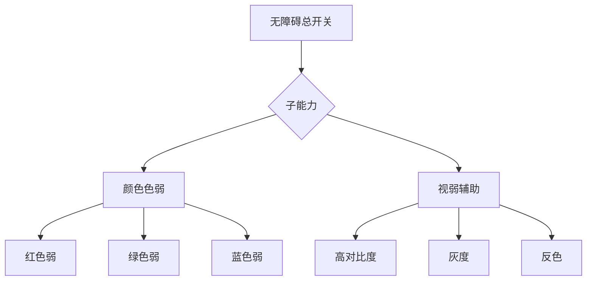

# 无障碍

无障碍总开关统一管控整组能力。开启后，子卡片在自身位置向下延展，不推动或展开母卡片；关闭后整组能力一并收回。设置页只展示功能名与当前状态，副标题与开发提示移入文档，减少视觉负担。



关闭总开关只暂停无障碍效果，不清空颜色色弱与视弱辅助的选择。下一次开启时恢复上一次关闭前的子项状态；用户仍可再次点击当前选项，将单项恢复为未选择状态。

## 功能

### 子能力

无障碍模式开启后可用以下两项子能力：

- **颜色色弱**：通过色觉变换帮助区分关键状态。提供红色弱、绿色弱、蓝色弱三档，选择后立即生效，不需要二次确认。再次点击当前档位即可取消。开启后强调色不会成为唯一的启停依据，状态仍可通过文字、形状与位置冗余识别。
- **视弱辅助模式**：用于特定阅读情境，提供 高对比度 / 灰度 / 反色 三档。
  - 高对比度提升前景与背景差异。
  - 灰度去除颜色信息，保留亮度层级。
  - 反色用于夜间或强光阅读，与文档区的反色同步生效。

所有交互控件应具备可读名称、清晰焦点和不依赖颜色的状态表达。

## 设计

### 设置原则

设置页只显示功能名称、当前状态和必要控件，不在卡片中堆放解释性副标题。色觉辅助与视弱辅助分别在自己的卡片中延展，选择后立即预览，不需要额外确认。两类子能力可叠加，叠加顺序按色觉 → 视弱处理。

### 与其他模块的关系

- 视弱辅助中的反色会与文档区反色模式联动，文档字体与图表同步反色处理。
- 高对比度不会覆盖强调色与品牌色，只提升文字与背景对比。
- 关闭无障碍总开关后立即恢复普通视觉，但保留用户上次选择，便于再次启用。

## 算法

无障碍模块的视觉变换遵循“叠加 → 变换管线 → 即时预览”的处理流程，所有变换均在客户端实时计算，不依赖远端服务：

1. **状态叠加**：色觉变换与视弱变换按“色觉 → 视弱”顺序叠加，前一阶段输出作为后一阶段输入，保证两类子能力可同时启用且互不覆盖。
2. **变换管线**：色觉档位通过色觉矩阵对像素 RGB 分量做线性映射；视弱档位中高对比度调整 Gamma 与亮度差、灰度按 ITU-R BT.601 亮度系数合成、反色对 RGB 通道取反。
3. **即时预览**：选择后立即生效，无需二次确认；取消时回退到上一稳定状态，保留用户上次选择以便再次启用。

### 色觉变换矩阵

色觉档位（红色弱 / 绿色弱 / 蓝色弱）通过 3×3 矩阵对像素 RGB 分量做线性映射，参考 Brettel 1997 简化模型，将二色视觉者混淆的颜色对在保留亮度信息的前提下投影到可区分方向。

#### 通用变换公式

对像素 $(R, G, B)$，变换后 $(R', G', B')$ 由矩阵乘法给出：

$$
\begin{bmatrix} R' \\ G' \\ B' \end{bmatrix}
=
M_{\text{type}}
\begin{bmatrix} R \\ G \\ B \end{bmatrix}
$$

#### 三档色觉矩阵系数

| 档位 | 矩阵 $M$ |
|---|---|
| 红色弱（Protanopia） | $\begin{bmatrix} 0.567 & 0.433 & 0 \\ 0.558 & 0.442 & 0 \\ 0 & 0.242 & 0.758 \end{bmatrix}$ |
| 绿色弱（Deuteranopia） | $\begin{bmatrix} 0.625 & 0.375 & 0 \\ 0.7 & 0.3 & 0 \\ 0 & 0.3 & 0.7 \end{bmatrix}$ |
| 蓝色弱（Tritanopia） | $\begin{bmatrix} 0.95 & 0.05 & 0 \\ 0 & 0.433 & 0.567 \\ 0 & 0.475 & 0.525 \end{bmatrix}$ |

矩阵每一行系数之和为 1，保证白色 $(255,255,255)$ 变换后仍为白色，避免整体偏色。

#### 矩阵应用实现

```js
const CV_MATRICES = {
  protan:    [[0.567,0.433,0],    [0.558,0.442,0],   [0,0.242,0.758]],
  deutan:    [[0.625,0.375,0],    [0.7,0.3,0],       [0,0.3,0.7]],
  tritan:    [[0.95,0.05,0],      [0,0.433,0.567],   [0,0.475,0.525]]
};
function applyColorVision(rgb, type) {
  const m = CV_MATRICES[type];
  if (!m) return rgb;
  const [r,g,b] = rgb;
  return [
    m[0][0]*r + m[0][1]*g + m[0][2]*b,
    m[1][0]*r + m[1][1]*g + m[1][2]*b,
    m[2][0]*r + m[2][1]*g + m[2][2]*b
  ];
}
```

### Gamma 校正与色彩空间转换

RGB 分量在 sRGB 空间中是非线性的（γ≈2.2）。色觉矩阵需在**线性光空间**应用，否则在暗部会产生色阶断裂。完整流程：

```
sRGB → linear → 矩阵变换 → linear → sRGB
```

#### sRGB ↔ linear 转换公式

gamma ≈ 2.2，分段近似（IEC 61966-2-1 标准）：

```js
// sRGB [0,1] → linear
function srgbToLinear(c) {
  return c <= 0.04045
    ? c / 12.92
    : Math.pow((c + 0.055) / 1.055, 2.4);
}
// linear → sRGB [0,1]
function linearToSrgb(c) {
  return c <= 0.0031308
    ? c * 12.92
    : 1.055 * Math.pow(c, 1/2.4) - 0.055;
}
```

#### 完整线性空间变换

```js
function colorVisionTransform(rgb, type) {
  // 1. 归一化到 [0,1]
  const norm = rgb.map(v => v / 255);
  // 2. sRGB → linear
  const lin = norm.map(srgbToLinear);
  // 3. 线性空间矩阵变换
  const out = applyColorVision(lin, type);
  // 4. linear → sRGB
  const srgb = out.map(linearToSrgb);
  // 5. 反归一化并钳制
  return srgb.map(v => Math.round(Math.max(0, Math.min(1, v)) * 255));
}
```

#### Gamma 校正必要性对比

| 处理方式 | 暗部表现 | 计算量 |
|---|---|---|
| 直接在 sRGB 应用矩阵 | 暗部色阶断裂、偏色 | 低（无 pow） |
| 线性空间应用矩阵 | 平滑过渡、色彩准确 | 高（4 次 pow） |

GOTO 优先色彩准确性，采用线性空间变换；对性能敏感场景（实时视频）可缓存查表（LUT）优化。

### 灰阶合成（ITU-R BT.601）

灰度档位按 ITU-R BT.601 亮度系数将 RGB 合成为单通道亮度，再回填三通道，去除色度信息但保留亮度层级。

#### 亮度公式

$$
Y = 0.299 R + 0.587 G + 0.114 B
$$

系数源于 NTSC 制式人眼对绿光最敏感的特性，G 通道权重最大。

```js
function toGrayscale(rgb) {
  const [r,g,b] = rgb;
  const y = Math.round(0.299*r + 0.587*g + 0.114*b);
  return [y, y, y];
}
```

#### 与 BT.709 的差异

| 标准 | 公式 | 适用场景 |
|---|---|---|
| BT.601 | $Y = 0.299R + 0.587G + 0.114B$ | SD/SDR，GOTO 默认 |
| BT.709 | $Y = 0.2126R + 0.7152G + 0.0722B$ | HD/HDR |

GOTO 选用 BT.601 因其系数更直观且与多数浏览器 Canvas 默认一致，避免跨设备灰度偏差。

### 反色实现

反色（Invert）对 RGB 三通道分别取反，公式：

$$
R' = 255 - R,\quad G' = 255 - G,\quad B' = 255 - B
$$

```js
function invertColor(rgb) {
  const [r,g,b] = rgb;
  return [255 - r, 255 - g, 255 - b];
}
```

#### 边界情况

| 输入 | 输出 | 说明 |
|---|---|---|
| $(0,0,0)$ 黑 | $(255,255,255)$ 白 | 极端翻转 |
| $(255,255,255)$ 白 | $(0,0,0)$ 黑 | 极端翻转 |
| $(128,128,128)$ 中灰 | $(127,127,127)$ | 接近原值（中灰反色近似不变） |
| 强调色 `#3B82F6` | `#C47D09` | 用于夜间阅读 |

反色与文档区反色模式联动，文档字体与图表同步取反，保证两者视觉一致。

### 叠加管线执行顺序

当色觉变换与视弱辅助同时启用时，按固定顺序叠加，前一阶段输出作为后一阶段输入。顺序为：

```
色觉变换 → 反色 → 灰阶 → 高对比度
```

#### 各阶段输入输出

| 阶段 | 输入 | 处理 | 输出 |
|---|---|---|---|
| 1. 色觉变换 | 原始 RGB | 应用 3×3 色觉矩阵（线性空间） | 色觉校正后 RGB |
| 2. 反色 | 色觉校正后 RGB | `255 - c` 通道取反 | 反色 RGB |
| 3. 灰阶 | 反色 RGB | BT.601 亮度合成 | 灰度 RGB |
| 4. 高对比度 | 灰度 RGB | Gamma 调整 + 亮度差拉伸 | 高对比度 RGB |

#### 管线实现

```js
function applyPipeline(rgb, opts) {
  let out = rgb.slice();
  if (opts.colorVision) {
    out = colorVisionTransform(out, opts.colorVision);
  }
  if (opts.invert) {
    out = invertColor(out);
  }
  if (opts.grayscale) {
    out = toGrayscale(out);
  }
  if (opts.highContrast) {
    out = applyHighContrast(out, opts.contrastGamma);
  }
  return out;
}
```

#### 高对比度处理

高对比度通过 Gamma 调整与亮度差拉伸提升前景背景差异：

```js
function applyHighContrast(rgb, gamma = 1.5) {
  // 拉伸对比度：以 128 为中心做幂次变换
  return rgb.map(c => {
    const norm = c / 255 - 0.5;        // [-0.5, 0.5]
    const stretched = Math.sign(norm) * Math.pow(Math.abs(norm) * 2, gamma) / 2;
    return Math.round(Math.max(0, Math.min(1, stretched + 0.5)) * 255);
  });
}
```

#### 叠加顺序的必要性

| 顺序 | 问题 |
|---|---|
| 反色 → 色觉变换 | 色觉矩阵基于原始光谱响应，反色后颜色错位导致矩阵失效 |
| 灰阶 → 反色 | 灰阶后无色度信息，反色仅翻转亮度，与预期不符 |
| 高对比度 → 色觉变换 | 高对比度已拉伸通道，矩阵线性假设破坏 |

因此固定「色觉 → 反色 → 灰阶 → 高对比度」顺序，保证每一步的数学前提不被破坏。

#### CSS 实现备注

实际界面渲染通过 CSS 滤镜链实现，等效于上述管线：

```css
.a11y-protan-invert-gray-contrast {
  filter:
    url(#cv-protan)        /* SVG 色觉矩阵 */
    invert(1)              /* 反色 */
    grayscale(1)           /* 灰阶 */
    contrast(1.5);         /* 高对比度 */
}
```

CSS 滤镜由浏览器原生按声明顺序应用，与算法管线一致。

## 边界

### 验收要点

- 键盘焦点始终可见。
- 开关状态可通过文字或位置判断，不依赖颜色。
- 辅助模式不会隐藏主要操作或主要导航。
- 关闭总开关后恢复普通视觉，再次开启时回到上次选择。
- 色觉辅助与视弱辅助可同时启用，且互不覆盖。

### 鲁棒性优化

| 边界场景 | 触发条件 | 处置策略 | 用户感知 |
|---|---|---|---|
| 无障碍服务未启用 | 系统无障碍开关关闭或未授权 | 总开关置灰，子卡片收回不展开 | 无法启用子能力，提示前往系统设置开启 |
| 手势识别失败 | 触发动作不规范或传感器异常 | 降级为点击兜底，记录未识别事件 | 手势无响应，但点击操作仍可用 |
| 辅助功能冲突 | 与其他无障碍工具同时启用导致视觉叠加异常 | 检测冲突并按优先级禁用冲突项，保留用户显式选择 | 冲突项被临时停用，提示冲突原因 |
| 无障碍服务崩溃 | 系统无障碍进程异常退出 | 自动重连并恢复上次状态，失败则回退普通视觉 | 短暂视觉闪烁后恢复，或回退普通模式 |
| 权限被撤销 | 用户在系统设置中撤回无障碍权限 | 监听权限变更，自动收回总开关并清空效果 | 子能力立即失效，提示重新授权 |
