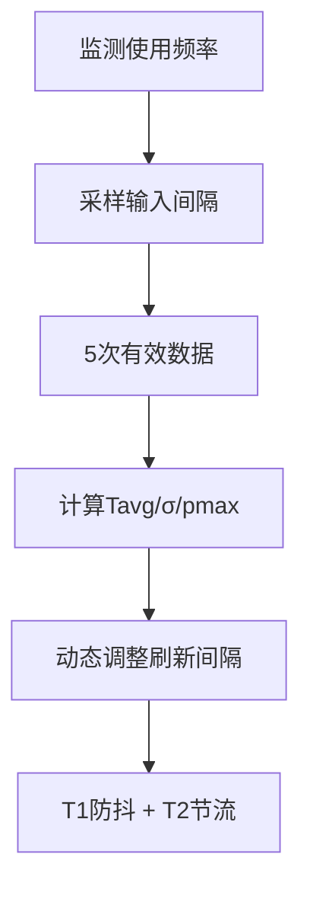

# HAC 自适应刷新

## 功能

HAC（Heuristic Adaptive Control，启发式自适应控制）是 GOTO 的搜索刷新策略模块。它通过**防抖 T1 + 节流 T2** 双层控制，自动学习用户的输入节奏，动态调整刷新延迟，从初始 200ms 收敛到最佳值。



### 核心特性

| 特性 | 说明 |
| --- | --- |
| 双层控制 | 防抖（T1）+ 节流（T2），防止抖动和重复请求 |
| 自动学习 | 根据用户输入间隔的统计分布动态调整 |
| 5 次取样 | 5 次有效数据后开始收敛，避免初期抖动 |
| 退格修正 | 退格比例 E ∈ [0, 0.5]，作为防抖延迟修正系数 |
| 异常过滤 | 单次偏差超过 50% 的数据直接忽略，pmax 取 3 次平均 |

## 设计

### 类设计概述

#### Kotlin 端

| 类 | 职责 |
| --- | --- |
| `SearchOrchestrator` | 可丢弃搜索调度，协调 T1/T2 触发时机 |
| `TypingSpeedTracker` | 双轨制打字速度跟踪 v2，计算 T1/T2 与统计量 |
| `AdaptiveRefreshSettings` | 参数透明化，支持用户自定义与恢复测试数据 |

#### JS 端（preview.html 内联脚本）

| 模块 | 职责 |
| --- | --- |
| `window._hacState` | HAC 状态对象（samples/pmaxSeq/t1/t2/tavg/sigma/pmax/errorRate） |
| `_hacOnKey` | 按键事件监听，记录输入间隔，过滤偏差>50% |
| `_hacCompute` | 核心算法计算入口，计算 T1/T2/Tavg/σ/pmax |
| `_hacSchedule` | 调度器，应用 T1 防抖 + T2 节流控制搜索触发 |
| `_hacRestore` | 启动时从 localStorage 恢复采样数据 |
| `onAdaptiveToggle` | 用户开关切换函数，写入 `goto_adaptive_enabled` |
| `localStorage.goto_hac_state` | 采样数据持久化 |
| `localStorage.goto_adaptive_enabled` | HAC 开关状态持久化 |

### 设计原则

1. **启发式自适应控制（Heuristic Adaptive Control）**：每个用户输入节奏不同，必须个性化学习
2. **5 次取样**：太少容易抖动，太多收敛太慢
3. **上下限钳制**：
   - T1 下限 Tavg×2 保证响应灵敏，上限 400ms 防止异常
   - T2 下限 30ms 保证最低刷新频率，上限 Tavg×1.5 防止间隔过长
4. **标准差感知**：用户输入稳定时 T2 应更小（响应更快）
5. **退格修正**：E 系数让退格频繁的用户得到更长的防抖延迟
6. **异常数据过滤**：偏差>50% 直接忽略，避免污染样本
7. **参数透明**：T1/T2/Tavg/σ/pmax/E 全部在底部参数栏实时显示，支持用户自定义与恢复测试数据

### 类型

**启发式自适应控制算法（Heuristic Adaptive Control, HAC）**

### 设置页交互

- 总开关打开时，自适应参数菜单随卡片自然延展；关闭时自动回缩。
- 只要总开关保持开启，参数菜单在刷新页面、重新进入设置或操作其他模块后仍然常驻。
- “自动检测”开启后，仅在用户真实输入时采样；关闭后停止采样并使用滑杆指定的 T1/T2。
- 面板透明显示最近五次有效间隔、Tavg、pmax、σ、退格修正 E、T1 与 T2。
- 样本不足五次时明确提示剩余数量，并统一使用 200ms。
- 滑动修改任意参数会自动进入手动模式；“恢复测试数据”加载最近一次有效五样本结果，“恢复默认”清空样本并回到 200ms 自动检测。

## 算法

### T1（防抖延迟）

```
T1 = clamp(pmax × (1+E), Tavg×2, 400ms)
```

| 参数 | 含义 |
| --- | --- |
| pmax | 用户最近 5 次输入的最长间隔（取 3 次平均，防抖动） |
| E | 退格修正系数 = min(0.5, 退格数/总按键数) |
| Tavg×2 | 下限：保证响应灵敏（不会比平均速度的 2 倍还慢） |
| 400ms | 上限：限制不会因异常参数导致结果不显示 |

**含义**：
- **标准值 pmax×(1+E)**：最快输入速度叠加退格修正系数
- **下限 Tavg×2**：保证响应灵敏，不会比平均速度的 2 倍还慢
- **上限 400ms**：限制不会因为异常参数导致结果不显示

### T2（节流间隔）

```
T2 = clamp(Tavg + σ, 30ms, Tavg×1.5)
```

| 参数 | 含义 |
| --- | --- |
| Tavg | 用户最近 5 次输入的平均间隔 |
| σ | 标准差，反映用户输入的稳定性 |
| 30ms | 下限：无论多快最少间隔 30ms 触发一次 |
| Tavg×1.5 | 上限：最慢 1.5 倍平均速度就要刷一次 |

**含义**：
- **标准值 Tavg+σ**：平均速度加标准差（波动大则间隔长）
- **下限 30ms**：无论输入多快，最少都要间隔 30ms 触发一次搜索
- **上限 Tavg×1.5**：最慢 1.5 倍平均速度就要刷一次

**为什么需要 Tavg×1.5 封顶**：如果用户进行测试或输入速度波动极大，可能导致标准差 σ 甚至反过来覆盖了 Tavg，所以需要 Tavg×1.5 封顶限制。

### 收敛示例

```
初始状态：T1 = 200ms, T2 = 200ms

5 次输入后（假设间隔：80, 120, 150, 95, 110ms）：
  Tavg = 111 ms
  σ ≈ 23.5 ms
  pmax = 150 ms（3 次平均后）

  E = 0（无退格）
  T1 = clamp(150 × 1.0, 111×2, 400) = clamp(150, 222, 400) = 222ms
  T2 = clamp(111 + 23.5, 30, 111×1.5) = clamp(134.5, 30, 166.5) = 134ms

  → 防抖延迟 222ms, 节流间隔 134ms
```

### 调度逻辑

```
输入触发时:
  if (距离上次触发 < T2):
    delay = T2 - 已过时间
  else:
    delay = T1
  综合延迟 = max(T1, 节流等待时间)
```

### 快速输入直通渲染

当检测到用户输入特别快（连续按键间隔 < 50ms）且当前查询与上一帧高度匹配（字符重叠率 ≥ 80%）时，直接跳过 T1/T2 防抖节流，立即触发渲染：

```
if (lastInterval < 50ms && overlapRatio(query, lastQuery) >= 0.8):
    skipAdaptiveRefresh()    // 直通渲染
    return
```

该路径最大限度提升软件流畅性与跟手感，避免在高频输入场景下因防抖延迟造成"卡顿感"。直通渲染仅在增强模拟智能启用时生效，且不会污染 HAC 采样池。

### 犹豫补偿延迟（Δ_hesitate）

当输入触发以下两类纠错时，在原有防抖公式上叠加一个**犹豫补偿延迟** Δ_hesitate，避免纠错结果被快速后续输入覆盖：

```
综合延迟 = max(T1, 节流等待时间) + Δ_hesitate
```

#### 触发条件

| 触发类型 | 检测条件 | Δ_hesitate 计算 |
| --- | --- | --- |
| 邻位交换（Swap）纠错 | 查询中存在相邻字符的键盘距离 ≤ 1（如 `weixni` → `weixin`） | `min(80ms, swapHits × 40ms)` |
| 高斯按键距离衰减 | 查询长度 ≥ 3 且按键距离序列的标准差触发衰减阈值 | `min(100ms, gaussianDecay × 120ms)` |

#### 计算示例

```
查询 "weixni"（存在 1 处邻位交换 xn→nx）：
  swapHits = 1
  Δ_hesitate = min(80, 1 × 40) = 40ms

查询 "qweert"（存在 2 处邻位交换 + 距离衰减）：
  swapHits = 2, gaussianDecay = 0.6
  Δ_hesitate = min(80, 2 × 40) + min(100, 0.6 × 120) = 80 + 72 = 152ms
```

#### 设计原则

1. **上限钳制**：Δ_hesitate 单次最高 80ms（Swap）或 100ms（高斯衰减），避免过度延迟。
2. **可叠加**：两种触发条件同时满足时，Δ_hesitate 取两者之和，但仍受总体上限约束（≤ 180ms）。
3. **与误操作过滤联动**：Δ_hesitate 期间触发的快速启动视为误操作，与自适应刷新共用重复修正逻辑，不写入学习样本。
4. **不污染采样池**：Δ_hesitate 期间的输入间隔不参与 Tavg/σ/pmax 计算，避免纠错场景拉高基线延迟。


### 性能指标

| 指标 | 实测数值 | 目标 |
| --- | --- | --- |
| 收敛延迟 | 5 次输入后 | 5 次 |
| 权重调整延迟 | 0.010 ms | < 1 ms |
| 初始 T1 | 200 ms | 200 ms |
| 初始 T2 | 200 ms | 200 ms |
| T1 收敛范围 | [Tavg×2, 400ms] | [Tavg×2, 400ms] |
| T2 收敛范围 | [30ms, Tavg×1.5] | [30ms, Tavg×1.5] |

## 边界

### 状态与用户控制

- **冷启动**：有效样本不足 5 次时，T1/T2 使用 200ms，避免参数快速震荡。
- **学习中**：每次真实输入更新 Tavg、σ、pmax 与 E；删除、粘贴和异常停顿分别处理。
- **稳定态**：参数在上下限内收敛，只在输入节奏明显变化时重新调整。
- **手动测试**：显示原始样本和计算结果，可恢复默认值；自动测试必须由用户明确开启。

HAC 只决定“何时刷新”，不会改变匹配结果和排序，因此关闭测试界面不会导致搜索能力失效。

运行开关不是展示项：关闭时搜索采用固定 200ms 防抖；开启后使用 T1 防抖与 T2 节流，并跨搜索会话保留最近五次有效样本。退出搜索只取消挂起任务，不清空已学习参数。

### 运行链路与验收标准

- 输入节奏只由真实按键间隔采样，搜索完成事件不再重复计样；关闭功能时不在后台偷跑学习。
- 清空输入属于状态恢复，绕过防抖并立即撤下旧结果，恢复问候卡片。

| 状态 | 实际行为 | 验收条件 |
| --- | --- | --- |
| 关闭 | 固定使用 200ms 防抖，不采集新的节奏样本 | 连续输入不会改变 T1/T2 |
| 冷启动 | 样本少于 5 个时 T1/T2 均为 200ms | 第 1—4 个有效间隔保持稳定 |
| 开启并收敛 | 最近 5 个有效间隔计算 Tavg、σ、pmax 与退格修正 E | T1 不超过 400ms；T2 不低于 30ms 且不超过 Tavg×1.5 |
| 快速连续输入 | 旧搜索任务可被新输入丢弃，T2 限制刷新频率 | 不出现旧结果覆盖新结果 |

### 异常数据处理

- **单次偏差过滤**：单次偏差超过 50% 的数据直接忽略
- **pmax 平滑**：连续 pmax 变化时取 3 次平均值
- **初始状态**：未满足 5 次有效数据时统一采用 200ms

### 鲁棒性优化

| 边界场景 | 当前处理 | 增强建议 |
| --- | --- | --- |
| 用户极快连续输入（间隔 < 10ms） | T2 下限 30ms 兜底 | 可考虑合并连续按键为单次输入事件 |
| 退格比例超过 50% | E 上限 0.5 钳制 | 已合理，无需调整 |
| 粘贴长文本触发一次性输入 | 不计入采样 | 正确，粘贴不反映真实打字节奏 |
| 样本被异常值污染（如系统卡顿导致 5000ms 间隔） | 偏差 > 50% 过滤 | 已合理 |
| localStorage 存储失败 | 静默降级到 200ms | 已合理，不影响搜索主流程 |
| 用户切换输入法导致节奏突变 | 5 次采样后自动收敛 | 可考虑检测输入法切换事件后重置采样 |
| 搜索会话间参数残留 | 跨会话保留最近 5 次有效样本 | 已合理，符合“学习”语义 |

2026-07-21 回归：冷启动、公式计算、T1 上限、E 上限、T2 上下界均通过自动断言。HAC 只控制刷新时机，不改变匹配分数。

### 与文档联动的展示规则

文档中的刷新示例只展示采样、去抖和边界结果，不伪造用户统计。点击示例时，左侧手机预览可以进入输入状态并显示当前刷新参数；离开页面后恢复原状态。实际 Android 端仍由 Kotlin 执行采样，Page 不复制刷新算法，也不改变 Engine 的匹配分数。

*本文档基于 preview.html v3.1 实现，最后更新于 2026 年 7 月*
