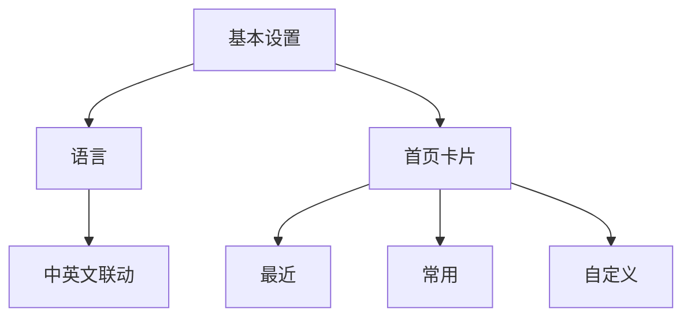

# 基本设置

基本设置只保留影响软件基础行为的选项：语言与首页卡片。语言切换会同步界面文案、内置示例库名称和右侧文档，不产生局部中英文混排。



## 功能

### 首页卡片

首页卡片与搜索框属于同一个搜索工作区。关闭首页卡片时，搜索框位于可用屏幕中心；首次点击后以柔和阻尼上移并展开智能提醒。开启后，最近、常用与自定义卡片可分别启停。

### 语言联动范围

语言不是单页属性。切换中文或英文后，首页提示、应用示例库、设置标签、统计标题、空状态、按钮反馈和右侧文档目录应在同一次状态更新中完成。已输入的搜索内容不被清空，用户无需重新开始当前任务。

### 自定义应用编辑器

自定义卡片的圆形加号会把卡片本体向下延展。编辑器复用设备应用库中的真实应用名称、图标和品牌色；Android 壳通过 `PackageManager` 注入已安装应用后，预览测试图标会被真机图标替换。已添加应用在编辑列表顶部显示，右侧 `×` 可将其从待保存列表移除；未添加应用使用 `+` 加入。所有增删在点击底部“保存”后一次写入，最多保留 12 个应用。

编辑器内部独立滚动，搜索框与底部保存按钮保持同宽，延展区不会突破手机内容边界。

## 设计

### 设计约束

- 搜索框始终是首页唯一功能主体。
- 状态开关只负责开与关，设置卡本身不承担长篇说明。
- 语言状态全局唯一，并持久化到本机。

### 状态持久化

基本设置写入本地偏好。启动时先恢复语言，再恢复首页卡片，最后计算搜索框位置，避免页面先以错误语言或错误高度闪现。重置设置后回到浅色、标准、英文优先的初始体验（适配 GitHub 首次访问的国际化场景）。

## 算法

### 首页卡片规则

“最近”依据统计功能的 24 小时分桶匹配当前时段，“常用”依据激活后的全时段累计频率排序，“自定义”只展示用户明确添加的项目。统计未激活时前两者显示依赖提示；激活后没有有效样本时显示 `NULL`，不使用演示数据伪造活跃度。三个区域均关闭时，首页卡片整体退出布局，搜索框恢复到可用屏幕中心。任何子卡片关闭都不影响搜索能力。

### 默认排序

未输入关键词时，中文应用优先显示并按名称首个汉字的常用字频序排列，拉丁字母应用按 A–Z 排列；混合列表对中文候选设置数量上限，避免单一文字系统挤占整个首屏。输入关键词后改为匹配优先，不再截断命中的文字类型。

中文排序依据采用教育部 2013 年《[通用规范汉字表](https://www.moe.gov.cn/jyb_sjzl/ziliao/A19/201306/t20130601_186002.html)》一级常用字范围，并参考北京大学 CCL 现代汉语语料库的[现代汉语汉字字符频次](https://corpus.pku.edu.cn/statistics/ccl_corpus_statistics.html)。该顺序只用于无搜索条件下的发现排序，不参与 GOTO 搜索相关度计算。

### 设置项优先级与默认值

- 启动恢复顺序：语言 → 首页卡片 → 搜索框位置，三者依次完成后再渲染首页。
- 语言默认值为中文；未读取到本地偏好时回退到中文。
- 首页卡片默认开启“最近”与“常用”，“自定义”默认关闭。
- 自定义应用上限 12 个，超出时按添加时间淘汰最旧项。
- 重置设置后统一回到浅色、标准、中文优先的初始状态。

### 持久化写入冲突处理

设置项写入 localStorage 时可能因存储空间不足、隐私模式拦截或并发写入失败。写入流程包含重试、指数退避与内存兜底。

#### 写入流程

```js
async function persistSetting(key, value) {
  const MAX_RETRY = 3;
  for (let attempt = 0; attempt < MAX_RETRY; attempt++) {
    try {
      localStorage.setItem(key, JSON.stringify(value));
      return { ok: true };
    } catch (e) {
      // 指数退避：100ms、200ms、400ms
      const delay = 100 * Math.pow(2, attempt);
      await new Promise(r => setTimeout(r, delay));
    }
  }
  // 最终失败：回退到内存缓存
  memoryCache[key] = value;
  console.warn('[settings] persist failed, fallback to memory:', key);
  return { ok: false, fallback: 'memory' };
}
```

#### 退避参数

| 重试次数 | 等待时间 | 累计等待 |
|---|---|---|
| 第 1 次失败后 | 100ms | 100ms |
| 第 2 次失败后 | 200ms | 300ms |
| 第 3 次失败后 | 400ms | 700ms |

三次重试均失败后，值写入内存缓存（`memoryCache`），当前会话内仍可读取，但刷新页面后丢失。同时向用户提示一次「设置未能保存，当前会话内有效」。

#### 读回优先级

```js
function readSetting(key, defaultValue) {
  // 1. 优先读内存缓存（最新写入）
  if (key in memoryCache) return memoryCache[key];
  // 2. 其次读 localStorage
  try {
    const raw = localStorage.getItem(key);
    if (raw !== null) return JSON.parse(raw);
  } catch (e) { /* 解析失败继续 */ }
  // 3. 兜底默认值
  return defaultValue;
}
```

### 语言联动重算顺序

切换语言不是单字段更新，而是一组联动项的级联重算。必须按固定顺序执行，避免出现中英文混排或索引错位。

#### 重算流水

```
切换语言 → 清空缓存 → 重新加载 seeds → 重建索引 → 刷新首页卡片
```

```js
async function switchLanguage(lang) {
  // 1. 清空依赖语言的所有缓存
  invalidateCache(['seeds', 'search_index', 'home_cards']);
  // 2. 重新加载对应语言的示例库 seeds
  const seeds = await loadSeeds(lang);
  // 3. 基于新 seeds 重建搜索索引
  const index = buildSearchIndex(seeds);
  // 4. 刷新首页卡片（最近/常用/自定义）
  refreshHomeCards(index);
  // 5. 最后持久化语言选择
  await persistSetting('goto_lang', lang);
  // 6. 触发文档目录与按钮文案更新
  updateI18nUI(lang);
}
```

#### 联动项清单

| 联动项 | 重算依赖 | 是否清空缓存 |
|---|---|---|
| 示例库 seeds | 语言 | 是 |
| 搜索索引 | seeds | 是（间接） |
| 首页卡片 | 索引 + 统计 | 否（统计语言无关） |
| 设置标签 / 按钮文案 | 语言 | 否 |
| 文档目录 | 语言 | 否 |
| 已输入搜索内容 | — | 否（保留，不清空） |

#### 顺序约束

- **清空缓存必须在加载新 seeds 之前**，否则旧 seeds 会被新 seeds 覆盖前残留命中。
- **持久化语言必须在重算之后**，避免刷新页面时读到新语言但索引仍为旧语言。
- **已输入搜索内容不清空**，用户切换语言后无需重新输入，仅候选列表按新索引刷新。

### 自定义应用编辑器去重与排序

自定义应用编辑器在保存时对列表执行去重与排序，保证存储数据一致。

#### 去重算法

按 `packageName` 去重，同一包名只保留最新一次添加（编辑列表中后加入者优先）：

```js
function dedupByPackage(items) {
  const map = new Map();
  // 逆序遍历，让先添加的覆盖后添加的；再正序输出
  for (let i = items.length - 1; i >= 0; i--) {
    if (!map.has(items[i].packageName)) {
      map.set(items[i].packageName, items[i]);
    }
  }
  return Array.from(map.values());
}
```

#### 排序算法

去重后按应用名称的拼音首字母排序，中文与拉丁字母分别处理：

```js
function sortByName(items) {
  return items.slice().sort((a, b) => {
    const la = firstLetterOf(a.name); // 拼音首字母或拉丁首字母
    const lb = firstLetterOf(b.name);
    // 拉丁字母统一排在中文之前（A-Z 在前）
    const aIsLatin = /^[A-Za-z]/.test(la);
    const bIsLatin = /^[A-Za-z]/.test(lb);
    if (aIsLatin && !bIsLatin) return -1;
    if (!aIsLatin && bIsLatin) return 1;
    return la.localeCompare(lb, 'zh-Hans-CN');
  });
}
```

#### 上限裁剪

排序后取前 12 项，超出部分丢弃并向用户提示：

```js
const CUSTOM_APP_MAX = 12;
function finalizeCustomApps(items) {
  const deduped = dedupByPackage(items);
  const sorted = sortByName(deduped);
  if (sorted.length > CUSTOM_APP_MAX) {
    console.warn('[custom] exceeds 12, truncated');
  }
  return sorted.slice(0, CUSTOM_APP_MAX);
}
```

#### 去重与排序示例

输入列表（按添加顺序）：

| 序号 | name | packageName |
|---|---|---|
| 1 | 网易云音乐 | com.netease.cloudmusic |
| 2 | 微信 | com.tencent.mm |
| 3 | 网易云音乐(重复) | com.netease.cloudmusic |
| 4 | 支付宝 | com.eg.android.AlipayGphone |

处理后结果（拼音首字母 W/W/Z，按字典序）：

| 序号 | name | packageName |
|---|---|---|
| 1 | 网易云音乐 | com.netease.cloudmusic |
| 2 | 微信 | com.tencent.mm |
| 3 | 支付宝 | com.eg.android.AlipayGphone |

（去重保留序号 3 的「网易云音乐(重复)」因后添加者优先；实际显示名以最后添加项为准）

## 边界

### 验收要点

- 中英文切换后不存在孤立的旧语言标签。
- 首页卡片开关与实际可见区域一致。
- 关闭全部首页卡片后，搜索框宽度保持不变。
- 刷新页面后状态与刷新前一致。

### 鲁棒性优化

| 边界场景 | 触发条件 | 处理策略 | 兜底表现 |
| --- | --- | --- | --- |
| 设置项值为空或 null | 本地偏好读取失败或字段缺失 | 回退到该项默认值，不抛出异常 | 界面以默认语言与默认卡片状态呈现 |
| 设置项值超出范围 | 自定义应用数 > 12、语言枚举非法等 | 截断到合法区间或丢弃非法值并记录日志 | 保持上次有效状态，不阻塞首页渲染 |
| 设置持久化失败 | 存储空间不足或写入被拦截 | 仅在内存中保留本次会话状态，下次启动回退默认 | 提示用户一次，不影响当前操作 |
| 多个设置项冲突 | 语言为中文但示例库标记为英文等 | 以语言状态为最高优先级重算联动项 | 联动项统一跟随语言，消除混排 |
| 设置项实时生效失败 | 卡片开关切换后布局未刷新 | 触发一次重渲染重试，仍失败则回滚开关状态 | 开关状态与可见区域保持一致 |
| 设置页布局适配异常 | 窄屏、横屏或系统字号过大 | 编辑器独立滚动并约束延展区不突破内容边界 | 保存按钮始终可见且与搜索框同宽 |

> 版本: v4.0 | 最后更新: 2026-07-24
