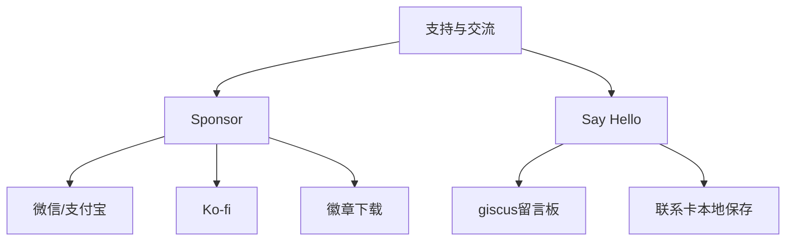

# 支持与交流

> Sponsor 与 Say Hello 已迁移至文档目录最下方的「赞助与联系」页面，以两张独立卡片的形式承载。它们属于 GitHub Pages 展示层，不进入 Android 手机功能界面，也不会占用 GOTO 的唯一搜索入口。

  <button data-preview-action="community" data-preview-target="community-page" data-preview-query="sponsor"><b>01</b><strong>打开 Sponsor</strong><small>跳转到赞助与联系页面，查看微信、支付宝与 Ko-fi 支持方式</small></button>
  <button data-preview-action="community" data-preview-target="community-page" data-preview-query="hello"><b>02</b><strong>打开 Say Hello</strong><small>跳转到赞助与联系页面，填写可选联系卡并进入社区留言板</small></button>

## 功能

### Sponsor

Sponsor 卡片位于「赞助与联系」页面上方，Say Hello 卡片在其下方纵向排列。卡片只保留微信、支付宝、Ko-fi、徽章下载与居中的赞助用途说明，不采集赞助者联系方式。微信与支付宝收款码来自项目根目录的 `收款码` 文件夹；Ko-fi 链接指向 `https://ko-fi.com/longqiyua`。二维码只在用户进入赞助与联系页面时显示。

> 赞助仅用于支持个人开发者持续维护和改进 GOTO 项目。

卡片内的“GOTO 徽章”按钮可下载 GOTO 品牌 SVG 徽章，无需上传联系信息。`feature_community.md` 中的演示按钮会直接跳转到赞助与联系页面。

### Say Hello

留言板采用 giscus，将公开留言保存到项目的 GitHub Discussions。发布与回复由 GitHub 登录和仓库权限负责；GOTO 页面本身不保存公开留言副本。

“我们如何称呼您”和“我们如何联系您”构成一张可选联系卡。联系卡默认只保存在当前设备；只有用户主动复制并粘贴到公开留言时，信息才会进入 GitHub Discussions。

## 设计

### 启用条件

giscus 正式启用需要仓库名、仓库 ID、讨论分类名与分类 ID。GitHub Pages 工作流会在部署时通过 GitHub GraphQL API 读取公开的仓库与 `Announcements` 分类节点 ID，并生成 `Preview/community-config.js`；源码中不保存访问令牌。仓库仍必须启用 Discussions、安装 giscus App，并保留对应分类。若条件不满足，Say Hello 会显示安全的待连接状态，页面其他功能不受影响。

### Pages 与声明联动

Pages 在每次主分支推送、手动触发及每日定时任务中重新生成开源使用声明，并生成 Android 运行时传递依赖报告。声明将应用内依赖、构建工具、网页运行时、字体、数据源和外部服务分开记录；自动报告中的 `Unknown` 或非标准 `LicenseRef` 必须人工核验。

## 算法

本模块以静态展示与第三方服务集成为主，无自定义算法逻辑。giscus 评论的排序、分页与渲染由 giscus 服务端按其公开规则处理；联系卡仅做本地存取，不涉及数据加工或推荐算法。

## 边界

### 隐私边界

- 收款码图片仅作为静态资源展示。
- 可选联系卡默认仅保存在浏览器本地。
- Ko-fi、GitHub 与 giscus 均为第三方服务，打开或使用后适用其各自条款与隐私政策。
- 页面不声称第三方平台对 GOTO 提供合作、授权或背书。

### 鲁棒性优化

| 边界场景 | 触发条件 | 处理策略 | 用户感知 |
| --- | --- | --- | --- |
| giscus 加载失败 | giscus 脚本请求失败或被网络拦截 | 显示待连接状态，保留面板骨架与说明文案 | 留言区显示“等待连接”，不影响 Sponsor 面板 |
| 用户未登录 GitHub | 用户未完成 GitHub 登录或未授权 giscus App | 引导跳转 GitHub 登录，留言入口禁用 | 点击留言后跳转登录页 |
| 联系信息保存失败 | 浏览器禁用 localStorage 或存储空间已满 | 捕获异常并静默降级，不阻塞留言流程 | 联系卡为空，用户需手动重新填写 |
| 二维码图片加载失败 | 收款码图片缺失、路径错误或网络超时 | 显示占位图与文字提示，保留赞助文案 | 二维码区域显示“图片暂不可用” |
| 留言内容为空 | 用户点击发布但内容为空或仅含空白字符 | 拦截发布请求，提示输入有效内容 | 发布按钮无响应并显示提示 |
