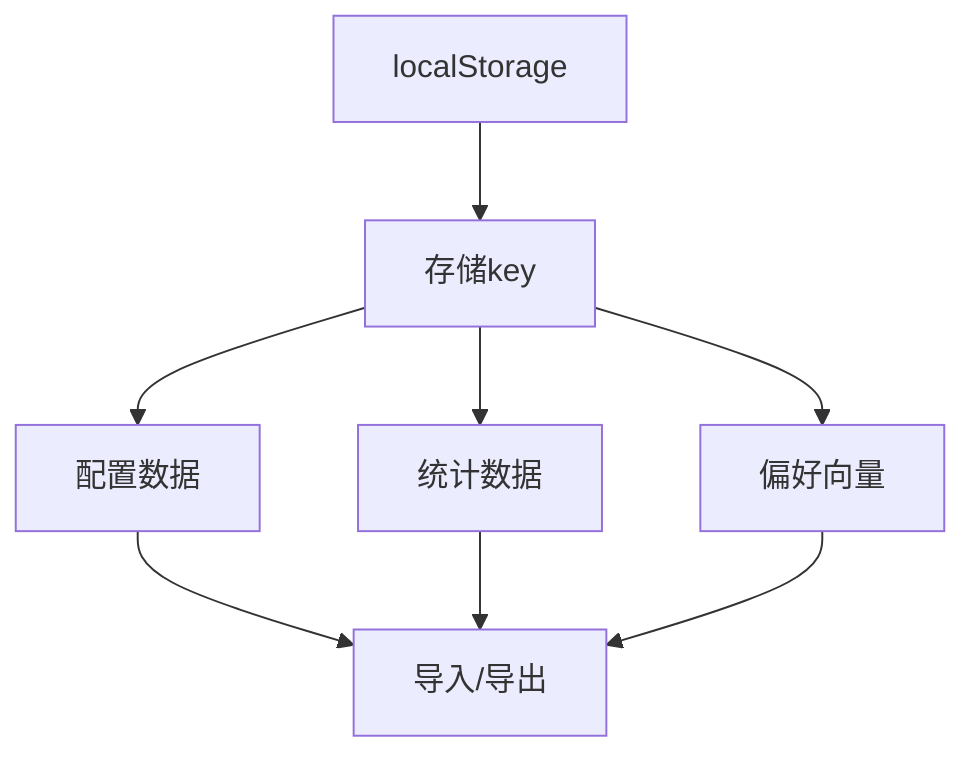
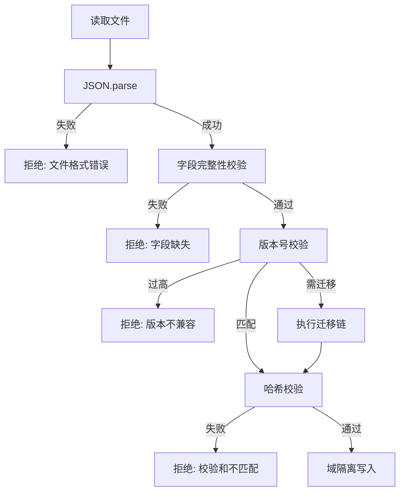
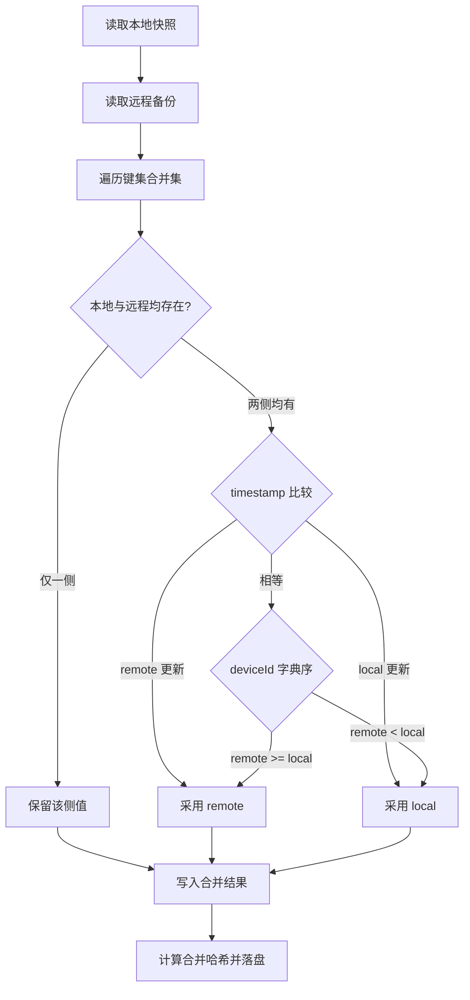

# 数据与配置

## 功能

### 功能定位

数据与配置负责设置、统计、偏好向量和备份。所有数据默认只保存在设备本地；导入前校验，导出时标注格式版本，清除操作按数据域隔离。



设置页中，该模块以四张子卡片形式呈现，命名与界面一致：**导入 / 导出 配置数据**、**导入 / 导出 统计数据**、**导入 / 导出 统计数据向量**、**备份（BETA）**。每张子卡片点击后向下延展对应操作，关闭后收回。模块最底部为「重置设置」按钮，使用强调色样式以区别于普通二级操作。

### 导入 / 导出 配置数据

配置包包含语言、主题、界面风格、强调色、首页卡片、无障碍、进阶功能状态、快捷索引及其他本地偏好。当前格式为 `goto-transfer` v2。

- JSON：标准可回导格式，适合完整迁移。
- TXT：内容与 JSON 相同，便于人工查看和复制。
- CSV：按 `key,value` 展开，可用于审计与表格查看，也支持回导。
- PNG：带 GOTO 标识的可读摘要图，不作为回导文件。

为防止凭据泄露，WebDAV 密码与 S3 密钥不进入配置导出包。旧版只包含 `goto_settings` 的 JSON 仍可兼容导入。

### 导入 / 导出 统计数据

统计包只包含真实发生的本地行为：搜索次数、应用启动、时段桶、快捷索引触发、模拟智能记忆与引擎反馈。预测结果不会冒充历史统计。

导入统计后立即刷新统计页面；清空统计会同步清除晨间、午后、晚间、夜间字符桶以及快捷方式计数，避免刷新后旧数字重新出现。

### 导入 / 导出 统计数据向量

向量工作台支持生成预览、导出 JSON、导入校验和复制向量。导入时检查对象结构、维度和每个数值的有效性，不接受 `NaN`、无穷值或维度不一致的数据。

预览区会展示维度、记忆样本量、最近更新时间以及前 16 个数值，便于人工核对。导出 JSON 只保留精简字段，避免冗余体积。

### 备份（BETA）

备份卡片标 BETA 标签，点击后向下延展选择备份方式，**WebDAV** 与 **S3** 二选一：

- **WebDAV**：填写服务器地址、用户名、密码（或应用专属密码）与远程文件路径，提供「测试 / 备份 / 恢复」三个动作。
- **S3**：填写 Endpoint、Bucket、Region、Access Key 与 Secret Key，同样提供「测试 / 备份 / 恢复」三个动作。

凭据只保存在本机，不进入配置导出包。备份内容是配置与统计的合并快照；恢复时按数据域分别写入，不相互覆盖。

### 重置与清除

- **重置设置**：模块最底部的强调色按钮。恢复界面与功能配置，不伪造统计数据；执行后会重新进入欢迎界面，随后必须且只能进入初始界面，伴随 3s 转圈后恢复默认状态并清空统计数据。
- **清空统计**：仅清除统计、学习记忆和激活统计，保留授权状态与界面配置。
- **导入**：只写入对应数据域，配置文件不能覆盖统计，统计文件也不能覆盖配置。

### 多重授权说明

本项目采用**混合授权模式**，不同资源类型适用不同协议：

| 资源范围 | 适用协议 | 说明 |
|---|---|---|
| 仓库根目录源代码（`.js`/`.html`/`.css`/`.kt` 等） | AGPL-3.0 | 遵循根目录 LICENSE，允许自由使用、修改、分发，但衍生作品须同样开源 |
| `/music` 文件夹内的所有媒体资产（MP3/WAV/OGG/M4A/FLAC/歌词/海报/封面） | CC BY-NC-ND 4.0 | 署名-非商业性使用-禁止演绎；允许在 GOTO 项目演示场景内分发，严禁商业提取、二次混音发行或未署名传播 |
| GOTO 宣传曲（`slot: "easter_egg_2"`） | CC BY-NC-ND 4.0 | 用户绑定 MP3 后自动继承此协议，不得在 GOTO 项目语境之外提取、再分发或商业使用 |

**核心条款**：
- **代码 vs 媒体分离**：`/music/LICENSE` 文件单独声明媒体资产不属于 AGPL 范畴。
- **"火了算我的"原则**：允许社交媒体传播，允许个人修改，但必须保留原始作者声明与来源链接。
- **个人修改限制**：用户可对 `/music` 资产做个人使用范围内的修改，但修改版本**不得公开发布**；如需贡献改进，请提交代码层（AGPL-3.0）的 PR。
- **商业禁区**：严禁任何形式的商业提取、再授权、二次混音后发行或未署名再分发。

详见 [`/music/LICENSE`](../music/LICENSE) 完整条款。

## 设计

### 验收标准

1. JSON、TXT、CSV 导出后可在同版本中回导。
2. 错误格式、空文件、跨数据域文件必须拒绝并给出提示。
3. 导出包包含 `schema`、`version`、`kind`、`exportedAt` 与 `data`。
4. PNG 固定使用 GOTO 品牌标识且只展示摘要，不泄露具体配置值。
5. 清空统计后当前页面和重新加载后的数字均为初始状态。
6. 备份卡片延展后可切换 WebDAV / S3，凭据不入导出包。
7. 重置设置按钮使用强调色样式，且单独位于数据模块最底部。

#### 界面快照 PNG

“截个图，保存一下？”只捕获手机预览区域，并合成固定的 GOTO 标识、生成时间和本地搜索声明。导出过程优先使用可用的页面渲染器；没有外部渲染库时，使用同源样式与 SVG `foreignObject` 本地渲染。输出始终为 PNG，文件名包含生成时间。生成期间按钮进入忙碌状态并阻止重复点击，失败时恢复按钮并显示原因。

重置设置和清空统计的进度覆盖层会在打开瞬间记录当前明暗主题。即使重置随后清除主题配置，覆盖层仍保持执行前的浅色或深色外观，结束后再移除临时主题类，避免处理过程中闪白。

日志下方保留一张独立的金属铭牌小卡，左侧为 `Focus , And More`，右侧为 `Lesong`；两端均使用 Geist 字体，不承载交互或状态。

## 算法

### goto-transfer v2 数据包 schema 校验

导入流程在写入本地之前依次执行**字段完整性校验 → 版本号校验 → 哈希校验**三步，任一步失败立即中止并保留原数据不变。

#### 1. 字段完整性校验

数据包必须包含以下顶层字段，缺失任意一项即拒绝：

| 字段 | 类型 | 必填 | 说明 |
|---|---|---|---|
| `schema` | string | 是 | 固定字符串 `goto-transfer` |
| `version` | string | 是 | 形如 `v2`、`v2.1` 的语义版本 |
| `kind` | string | 是 | 数据域标识：`config` / `stats` / `vector` |
| `exportedAt` | number | 是 | 毫秒级 Unix 时间戳，必须 > 0 |
| `data` | object | 是 | 实际负载，允许为空对象 `{}` |
| `checksum` | string | 否 | SHA-256 十六进制摘要，存在时必校 |

```js
function validateSchema(packet) {
  const required = ['schema', 'version', 'kind', 'exportedAt', 'data'];
  for (const key of required) {
    if (!(key in packet)) {
      return { ok: false, reason: `missing field: ${key}` };
    }
  }
  if (packet.schema !== 'goto-transfer') {
    return { ok: false, reason: `schema mismatch: ${packet.schema}` };
  }
  if (!['config', 'stats', 'vector'].includes(packet.kind)) {
    return { ok: false, reason: `unknown kind: ${packet.kind}` };
  }
  return { ok: true };
}
```

#### 2. 版本号校验

当前实现兼容 `v1`（仅含 `goto_settings` 的旧包）与 `v2` 主版本。校验规则：

- 主版本号等于当前版本 → 直接接受。
- 主版本号低于当前版本 → 触发迁移路径，按 `migrations[]` 顺序逐级升级。
- 主版本号高于当前版本 → 拒绝导入，提示「版本不兼容，需升级」。

```js
const SUPPORTED = { major: 2, minor: 0 };
function parseVersion(v) {
  const m = /^v(\d+)(?:\.(\d+))?$/.exec(v || '');
  if (!m) return null;
  return { major: +m[1], minor: m[2] ? +m[2] : 0 };
}
function checkVersion(v) {
  const pv = parseVersion(v);
  if (!pv) return { ok: false, reason: 'invalid version format' };
  if (pv.major > SUPPORTED.major) return { ok: false, reason: 'version too high' };
  return { ok: true, needMigrate: pv.major < SUPPORTED.major };
}
```

#### 3. 哈希校验

当包内存在 `checksum` 字段时，按以下步骤校验：

1. 取 `data` 字段序列化为规范化 JSON（键名升序、无尾随空格、无 BOM）。
2. 计算 `SHA-256(deterministicJSON(data))` 得到十六进制摘要。
3. 与 `checksum` 字段做大小写不敏感比较，不一致则拒绝。

```js
async function verifyChecksum(packet) {
  if (!packet.checksum) return { ok: true, skipped: true };
  const canon = JSON.stringify(packet.data, Object.keys(packet.data).sort());
  const buf = new TextEncoder().encode(canon);
  const digest = await crypto.subtle.digest('SHA-256', buf);
  const hex = [...new Uint8Array(digest)]
    .map(b => b.toString(16).padStart(2, '0')).join('');
  return { ok: hex.toLowerCase() === packet.checksum.toLowerCase() };
}
```

#### 完整导入流水



### 跨数据域隔离写入

#### 数据域划分

GOTO 将本地数据按用途划分为三个相互独立的数据域，写入时严格隔离：

| 数据域 | localStorage 命名空间 | 内容 | 可被谁覆盖 |
|---|---|---|---|
| 公共层 `config` | `goto_settings`、`goto_accent`、`goto_shortcut_*` | 语言、主题、强调色、快捷索引 | 仅配置导入包 |
| 个人层 `stats` | `goto_stats_*`、`goto_hours_*`、`goto_behavior_*` | 搜索次数、启动次数、时段桶、行为链 | 仅统计导入包 |
| 设备层 `vector` | `goto_vector_*` | 偏好向量、记忆样本 | 仅向量导入包 |

#### 写入权限矩阵

| 导入包 kind | 可写 config | 可写 stats | 可写 vector |
|---|:---:|:---:|:---:|
| `config` | ✅ | ❌ | ❌ |
| `stats` | ❌ | ✅ | ❌ |
| `vector` | ❌ | ❌ | ✅ |
| `backup`(合并快照) | ✅ | ✅ | ✅ |

#### 域隔离检查算法

每次写入前比对导入包 `kind` 与目标 key 的归属域，越界写入直接抛出 `DomainIsolationError`：

```js
const DOMAIN_MAP = {
  config: ['goto_settings', 'goto_accent', 'goto_shortcut_index', 'goto_shortcut_meta'],
  stats:  ['goto_stats_search', 'goto_stats_launch', 'goto_hours_bucket',
           'goto_behavior_chain', 'goto_shortcut_hits'],
  vector: ['goto_vector_main', 'goto_vector_memory', 'goto_vector_meta']
};
function assertDomain(kind, key) {
  const allowed = DOMAIN_MAP[kind];
  if (!allowed || !allowed.includes(key)) {
    throw new DomainIsolationError(
      `kind=${kind} 不得写入 key=${key}（域隔离违规）`);
  }
}
```

备份恢复作为唯一允许跨域写入的入口，内部仍按 `config → stats → vector` 顺序分段提交，任一段失败回滚该段，不影响其他段：

```js
async function restoreBackup(snapshot) {
  const stages = ['config', 'stats', 'vector'];
  const applied = [];
  for (const kind of stages) {
    try {
      await writeDomain(kind, snapshot[kind]);
      applied.push(kind);
    } catch (e) {
      await rollbackDomain(applied); // 仅回滚已成功段
      throw e;
    }
  }
}
```

### 向量数据校验

向量导入时执行四项校验，全部通过才写入 `goto_vector_main`：

#### 1. 维度校验（512 维）

偏好向量固定为 512 维，与生成模型输出对齐。维度不匹配直接拒绝：

```js
function checkDimension(vec) {
  if (!Array.isArray(vec)) return { ok: false, reason: 'not array' };
  if (vec.length !== 512) {
    return { ok: false, reason: `expected 512, got ${vec.length}` };
  }
  return { ok: true };
}
```

#### 2. NaN / Infinity 检测

每个分量必须是有限实数，`NaN`、`+Infinity`、`-Infinity` 均拒绝：

```js
function checkFinite(vec) {
  for (let i = 0; i < vec.length; i++) {
    const v = vec[i];
    if (Number.isNaN(v)) return { ok: false, reason: `NaN at [${i}]` };
    if (!Number.isFinite(v)) return { ok: false, reason: `Infinity at [${i}]` };
  }
  return { ok: true };
}
```

#### 3. 归一化检查

向量应落在单位球面附近，L2 范数 ∈ [0.9, 1.1] 视为合法，超出区间则告警但允许导入（由调用方决定是否归一化）：

```js
function l2Norm(vec) {
  let s = 0;
  for (const v of vec) s += v * v;
  return Math.sqrt(s);
}
function checkNormalized(vec) {
  const n = l2Norm(vec);
  if (n === 0) return { ok: false, reason: 'zero vector' };
  return { ok: true, norm: n, warn: n < 0.9 || n > 1.1 };
}
```

#### 4. fp32 精度校验

导出向量以 fp32 存储，导入时检测是否有超出 fp32 表示范围的值（绝对值 > 3.4e38）或非规格化下溢：

```js
const FP32_MAX = 3.4028235e38;
const FP32_MIN_NORMAL = 1.17549435e-38;
function checkFp32(vec) {
  for (let i = 0; i < vec.length; i++) {
    const v = Math.abs(vec[i]);
    if (v > FP32_MAX) return { ok: false, reason: `fp32 overflow at [${i}]` };
    if (v > 0 && v < FP32_MIN_NORMAL) {
      return { ok: false, reason: `fp32 denormal at [${i}]` };
    }
  }
  return { ok: true };
}
```

#### 校验流水汇总

| 校验项 | 失败处置 | 是否可继续 |
|---|---|---|
| 维度 ≠ 512 | 拒绝 | 否 |
| NaN / Infinity | 拒绝 | 否 |
| L2 范数越界 | 告警 + 自动归一化 | 是 |
| fp32 溢出/下溢 | 拒绝 | 否 |

### 备份快照合并算法

备份内容是配置与统计的合并快照，恢复时若本地已存在数据则触发合并。合并采用 **LWW（Last-Write-Wins）** 策略，依据 `timestamp` 裁决。

#### 裁决规则

1. **主裁决：timestamp**。对同一 key，比较本地与备份的 `timestamp` 字段，取较大者。
2. **次裁决：deviceId 字典序**。当 timestamp 完全相等时，按 `deviceId` 字典序升序，取后者（字典序更大者）胜出，保证幂等。
3. **新增项**：仅存在于一侧的条目直接保留。

```js
function mergeEntry(local, remote) {
  if (!local) return remote;
  if (!remote) return local;
  if (remote.timestamp > local.timestamp) return remote;
  if (remote.timestamp < local.timestamp) return local;
  // timestamp 相等，按 deviceId 字典序
  return remote.deviceId >= local.deviceId ? remote : local;
}
```

#### 合并冲突解决流程



#### 合并示例

| key | local | remote | 合并结果 | 裁决依据 |
|---|---|---|---|---|
| `goto_accent` | ts=1000, dev=B | ts=2000, dev=A | remote | timestamp 2000 > 1000 |
| `goto_theme` | ts=3000, dev=A | ts=3000, dev=B | local | ts 相等，dev A < B 取本地（字典序大者） |
| `goto_stats_launch` | ts=1500, dev=C | 不存在 | local | 单侧保留 |
| `goto_shortcut_index` | 不存在 | ts=1800, dev=D | remote | 单侧保留 |

合并完成后计算合并结果的 SHA-256 并写入 `goto_backup_meta.lastMergeHash`，用于下次合并时检测中间是否被篡改。

### PNG 本地渲染流程

界面快照 PNG 不依赖第三方渲染库，完整流程基于浏览器原生 API：

```
SVG foreignObject → Canvas → toBlob → 下载
```

#### 执行步骤

1. **构造 SVG**：创建一个 `<svg>` 元素，内嵌 `<foreignObject>`，将目标 DOM 的 `outerHTML` 与同源 `<style>` 文本注入 `foreignObject` 内。

```js
function buildSvg(targetNode, w, h) {
  const svgNS = 'http://www.w3.org/2000/svg';
  const svg = document.createElementNS(svgNS, 'svg');
  svg.setAttribute('width', w);
  svg.setAttribute('height', h);
  svg.setAttribute('xmlns', svgNS);
  const fo = document.createElementNS(svgNS, 'foreignObject');
  fo.setAttribute('width', '100%');
  fo.setAttribute('height', '100%');
  const style = document.createElementNS(svgNS, 'style');
  style.textContent = collectInlineStyles(); // 收集同源样式
  const container = document.createElement('div');
  container.setAttribute('xmlns', 'http://www.w3.org/1999/xhtml');
  container.appendChild(targetNode.cloneNode(true));
  fo.appendChild(style);
  fo.appendChild(container);
  svg.appendChild(fo);
  return svg;
}
```

2. **序列化为 data URL**：`new XMLSerializer().serializeToString(svg)` 后转 `encodeURIComponent`，拼成 `data:image/svg+xml;charset=utf-8,...`。

3. **绘制 Canvas**：新建 `Image`，`src` 指向 data URL，`onload` 后绘制到 `canvas.getContext('2d')`。

```js
async function svgToCanvas(svg, w, h) {
  const url = 'data:image/svg+xml;charset=utf-8,' +
              encodeURIComponent(new XMLSerializer().serializeToString(svg));
  const img = new Image();
  img.crossOrigin = 'anonymous';
  await new Promise((res, rej) => {
    img.onload = res; img.onerror = rej; img.src = url;
  });
  const canvas = document.createElement('canvas');
  canvas.width = w; canvas.height = h;
  const ctx = canvas.getContext('2d');
  ctx.fillStyle = '#ffffff';
  ctx.fillRect(0, 0, w, h);
  ctx.drawImage(img, 0, 0);
  return canvas;
}
```

4. **合成 GOTO 标识**：在 Canvas 右下角绘制固定品牌水印（来自内联 SVG 路径），左下角写入生成时间。

5. **toBlob → 下载**：

```js
canvas.toBlob((blob) => {
  const a = document.createElement('a');
  a.href = URL.createObjectURL(blob);
  a.download = `goto-snapshot-${stamp()}.png`;
  a.click();
  URL.revokeObjectURL(a.href);
}, 'image/png');
```

#### 边界处理

| 场景 | 处理 |
|---|---|
| `foreignObject` 不支持（旧 WebView） | 回退到 `html2canvas` 兜底，仍失败则提示 |
| 跨域图片污染 Canvas | 渲染前剥离所有跨域 ``，避免 `toBlob` 抛 SecurityError |
| 渲染期间按钮重复点击 | 进入忙碌态后 `disabled=true`，完成或失败后恢复 |
| 输出过大 | 限制 Canvas 最大边 4096px，超出按比例缩放 |

### 版本兼容性回滚算法

当检测到导入包 schema 版本与当前不匹配且无法迁移时，触发回滚流程，确保本地数据可恢复。

#### 回滚流程

```
检测版本不匹配 → 备份当前数据 → 写入 .backup/ → 校验哈希 → 回滚到 .backup/
```

#### 详细步骤

1. **检测不匹配**：在 schema 校验阶段若 `version.major > SUPPORTED.major`，标记为不可导入。

2. **备份当前**：将当前对应数据域的全部 key 读取出来，序列化为 JSON，写入 `localStorage['goto_backup_' + kind + '_' + Date.now()]`，同时写入 `.backup/` 命名空间索引。

```js
function backupCurrent(kind) {
  const keys = DOMAIN_MAP[kind];
  const snap = {};
  for (const k of keys) snap[k] = localStorage.getItem(k);
  const payload = {
    kind, capturedAt: Date.now(),
    deviceId: getDeviceId(),
    checksum: sha256Hex(JSON.stringify(snap)),
    data: snap
  };
  const slot = `goto_backup_${kind}_${payload.capturedAt}`;
  localStorage.setItem(slot, JSON.stringify(payload));
  appendBackupIndex(kind, slot);
  return slot;
}
```

3. **写入 .backup/ 索引**：维护 `goto_backup_index`，记录最近 5 个备份槽位，超出按时间淘汰最旧。

4. **校验哈希**：重新读取刚写入的备份，重算 checksum 与存储值比对，不一致则删除该槽位并抛出 `BackupCorruptError`。

5. **回滚到 .backup/**：当导入失败已部分写入时，从 `.backup/` 读取最近一次槽位，逐 key 恢复：

```js
async function rollbackToBackup(kind) {
  const slot = latestBackupSlot(kind);
  if (!slot) throw new Error('no backup available');
  const payload = JSON.parse(localStorage.getItem(slot));
  const recheck = sha256Hex(JSON.stringify(payload.data));
  if (recheck !== payload.checksum) {
    throw new BackupCorruptError(slot);
  }
  for (const [k, v] of Object.entries(payload.data)) {
    if (v === null) localStorage.removeItem(k);
    else localStorage.setItem(k, v);
  }
}
```

#### 回滚决策表

| 触发场景 | 是否备份 | 是否回滚 | 用户提示 |
|---|---|---|---|
| 版本过高，未写入 | 是（预防性） | 否 | 版本不兼容，已保留原数据 |
| 迁移中途失败 | 已有备份 | 是 | 迁移失败，已回滚至原状态 |
| 哈希校验失败 | 已有备份 | 是 | 校验失败，已回滚 |
| 域隔离违规 | 否 | 否 | 跨域写入已拒绝，未影响原数据 |
| 备份槽位损坏 | — | 否（无可用备份） | 无可用备份，保持当前状态并告警 |

## 边界

### 鲁棒性优化

| 边界场景 | 触发条件 | 处理策略 | 用户反馈 |
| --- | --- | --- | --- |
| 导出数据为空 | 对应数据域无任何记录 | 仍生成含 `schema`/`version`/`kind` 的最小包，`data` 置空 | 提示“无可导出数据”，允许生成空包 |
| 导入文件格式错误 | JSON 解析失败或缺少必备字段 | 拒绝写入，原数据保持不变 | 提示“文件格式错误，已拒绝导入” |
| 导入数据版本不兼容 | `version` 高于当前版本或不在兼容范围 | 拒绝导入并记录版本号 | 提示“版本不兼容，需升级或使用兼容版本” |
| 备份文件损坏 | WebDAV / S3 恢复时校验或解包异常 | 中止恢复，不覆盖任何本地数据域 | 提示“备份文件损坏，恢复已中止” |
| 数据迁移失败 | 跨数据域写入冲突或导入中断 | 按数据域回滚，保持各域隔离 | 提示“迁移失败，已回滚至原状态” |
| 导出数据过大 | 导出包体积超过阈值 | 精简非必要字段，向量仅保留精简字段 | 提示“数据量较大，已精简导出” |
