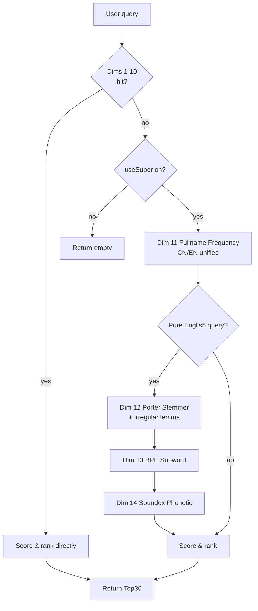

# HyperFuzzy Match Engine

## Function

HyperFuzzy is GOTO's core retrieval layer. It searches the local app library through parallel exact-name, prefix, substring, pinyin, initials, English, T9, keyboard-neighbor, unordered-character, package, and meta-tag signals. The top 30 candidates are ranked by a combined score.

## Design

### Pipeline

1. Normalize query and detect QWERTY or T9 input.
2. Query all enabled match dimensions in parallel; no dimension replaces another.
3. Apply keyboard-distance penalties and typo tolerance.
4. Add recent-use, launch-frequency, shortcut, and local preference corrections.
5. Deduplicate, explain the winning path, and return the highest scores.

The engine uses a 64-entry, five-minute cache and runs fully offline. Exact matches remain dominant; meta-tag matches deliberately rank after direct lexical evidence.

### Result surface rules

- Idle, greeting, and result states share one width. State changes affect only vertical position and height.
- Short result sets size to their content. Long sets extend to the bottom of the phone content area and scroll within the same surface.
- App icons use fixed-size slots. If no usable icon exists, the slot remains neutral gray instead of displaying generated letters or symbols.
- The indexed-result count stays at the bottom of the search card and remains separate from scrollable result rows.
- The outer search card owns the visual boundary; the result area does not add another large background layer.

## Algorithm

### Candidate and adjacent-swap rules

1. App names, English names, pinyin, abbreviations, categories, and tags form a local bilingual dictionary for mixed Chinese-English queries.
2. Adjacent-swap matching is the lowest-priority fallback. A candidate is rejected immediately when it shares no characters with the query.
3. The rule activates only when one adjacent character swap produces a match; a loose common subsequence cannot trigger a result by itself.
4. Keyboard distance is a deduction in the candidate index: farther keys lose more points. Adjacent-swap scores remain below exact, prefix, substring, pinyin, category, and tag matches.
5. Candidates are sorted by final score and capped at 30. Overflow stays scrollable inside the result surface.

## Boundary

### Acceptance

- Supports exact, prefix, contains, pinyin, English, T9, typo, and unordered inputs.
- T9 continues to combine with all other enabled signals.
- Never returns more than 30 results; stable ties preserve deterministic order.

### Runtime path and acceptance

The master switch gates the fuzzy-only branches without disabling exact, prefix, or substring retrieval. With it enabled, unordered input such as `信微` can recall WeChat and reports the winning explanation. With it disabled, the same fuzzy-only candidate is removed while direct lexical matches continue to work.

Regression coverage includes enable/disable isolation, unordered matching, deterministic ranking, result limits, and cache-safe switching.

### Robustness Optimization

| Edge Case | Handling |
|----------|----------|
| Empty query input | Returns to the idle/greeting state; no match dimensions are queried. |
| Pure numeric input | Routed through the T9 path and combined with all other enabled signals. |
| Overly long query (>40 chars) | Query is processed but results remain capped at 30; no extra candidates are surfaced. |
| Repeated character input (e.g., "aaaa") | Treated as a normal query; deduplication ensures each candidate appears once. |
| No match results | Empty result state is shown without falling back to unrelated candidates. |
| Input method switch mid-input | Query is re-normalized and all enabled dimensions are re-queried on the next refresh. |
| Special character input | Stripped or ignored during normalization; non-matching characters do not block other dimensions. |
| localStorage storage failure | Cache falls back to fresh computation; the 64-entry in-memory cache keeps retrieval working. |

## Multi-Dimensional Parallel Search (Independent Event Union)

### Design Principle

Traditional multi-dimensional matching uses a "weighted fusion" strategy where each dimension's score is linearly combined and then sorted. This has one issue: **a single strong dimension dominates the results** — for example, candidates with a full-name match suppress other dimensions' high-potential candidates.

GOTO uses an **independent event union** strategy: each matching dimension independently computes hit events, generates an independent candidate set, and finally takes the union, merging by "primary hit dimension + secondary hit overlay".

### Union Merge Algorithm

```text
for each dimension dim in [byInitial, byT9, byPrefix, byChar, byPinyin, byAppId]:
    candidates[dim] = fuzzySearch_dim(query, dim)

union = {}
for each dim:
    for each candidate in candidates[dim]:
        if candidate.app in union:
            union[candidate.app].secondaryHits.push(dim)
        else:
            union[candidate.app] = {
                primaryDim: dim,
                primaryScore: candidate.score,
                secondaryHits: []
            }

// final score = primary hit score + secondary hit weighted overlay
finalScore = primaryScore + sum(secondaryHit.dim.weight × 0.3)
```

### Advantages

| Comparison | Weighted Fusion | Independent Event Union (GOTO) |
| --- | --- | --- |
| Single-dimension dominance | Yes, strong dims suppress weak ones | No, each dim produces candidates independently |
| Cross-dimension recall | Low, only high-total-score candidates appear | High, any dim hit enters the candidate pool |
| Sort stability | Sensitive to single-dim weight tuning | Primary dim sets the base score; secondary hits only apply minor correction |
| Result diversity | Biased toward one match mode | Covers pinyin, T9, prefix, char and other input habits |

## Search Cycle Recording & Misfire Filtering

### Cycle Definition

**One search cycle** = user starts typing a query → taps to launch an app. This cycle is the smallest unit GOTO uses to learn user search habits.

### Cycle Recording Flow

```text
1. User types query
2. Engine records pendingQuery = query, searchTs = Date.now()
3. User taps to launch app
4. Engine computes the cycle:
   cycleDuration = Date.now() - searchTs
   if (cycleDuration < MISFIRE_THRESHOLD):
       // misfire, do not write into learning
       misfireCount++
       return
5. Write cycle data:
   - query content
   - launched app
   - primary hit dimension (which fuzzy match mode contributed most)
   - cycle duration
```

### Misfire Filtering

| Trigger Condition | Handling |
| --- | --- |
| Cycle duration < 400 ms (extremely short search→launch) | Treated as misfire, not written into learning samples |
| Two consecutive launches < 400 ms apart | The second is treated as misfire, sharing the repetition-correction logic with adaptive refresh |
| Cycle duration > 30 s | Treated as user distraction, not written into mode-frequency stats, but launch record is kept |

### Multi-Cycle Statistics & Mode Frequency Boost

The backend algorithm continuously records **which fuzzy match mode contributed most** (primary hit dimension) in each cycle. After multi-cycle statistics, high-frequency modes get an appropriate weight boost:

```text
// statistics run every N cycles (default N=10)
for each mode in [byInitial, byT9, byPrefix, byChar, byPinyin, byAppId]:
    modeFrequency[mode] = count(cycles where primaryDim == mode)

// weight boost: high-frequency +10%, low-frequency -5%
for each mode:
    if modeFrequency[mode] > avg(frequency) × 1.2:
        mode.weight *= 1.1    // high-frequency boost
    elif modeFrequency[mode] < avg(frequency) × 0.8:
        mode.weight *= 0.95   // low-frequency decay
```

This mechanism lets the engine gradually adapt to user input habits: users who prefer pinyin initials see initial-match weight rise over time; users who prefer T9 see T9-match weight rise.

### Linked with Adaptive Refresh

- **Fast-input detection**: When input is detected to be extremely fast (interval < 50 ms) and highly matching, adaptive refresh is bypassed and direct rendering is triggered.
- **Shared misfire filtering**: The misfire filtering logic of search cycles shares the same thresholds and processing path as the "repetition correction" of adaptive refresh, preventing short-term mis-touches from polluting learning samples.

## v3.6 English Offline-Intelligence Boost (Porter Stemmer / BPE Subword / Soundex / Fullname Frequency)

### Motivation

Before v3.6 the fuzzy engine was Chinese-friendly (pinyin, initials, T9, unordered, adjacent-swap) but English queries still had gaps:

- Searching `Running` did not find `Run` (tense/plural not normalized)
- Searching `Better` did not find `Good` (irregular forms not handled by rules)
- Searching `GOTO-izing` did not find `GOTO` (compound / out-of-vocabulary)
- Searching `Smyth` did not find `Smith` (same sound, different spelling)

v3.6 adds four lightweight pure algorithms (no external NLP dependency) that run in parallel with the existing 10 dimensions. They only participate as fallback recall channels when `useSuper` (enhanced matching) is on and no other dimension has hit, so exact/prefix/contains priority is unchanged.

### Algorithm Overview

| Dim | Algorithm | Language | Trigger | Score | Solves |
| --- | --- | --- | --- | --- | --- |
| 11 Fullname Frequency | Char histogram + cosine | CN/EN unified | No hit, query≥3 chars, sim≥0.65 | 120~260 | Same chars, fully different order |
| 12 Stemmer / Lemma | Porter Stemmer + irregular lemma | English | Pure EN, query≥3 chars | 320 | Tense / plural / irregular forms |
| 13 BPE Subword | Longest-match subword + Jaccard | English | Pure EN, query≥4 chars, sim≥0.5 | 80~180 | OOV compound "analogy" |
| 14 Soundex Phonetic | Phonetic code (leading letter + 3 digits) | English | Pure EN, query≥2 chars | 240 | Same sound, different spelling |

### Dimension 11: Fullname Frequency Match (char histogram + cosine)

Complements dim 8 (fullname disorder = char existence). Dim 8 only checks "are all chars present"; this dimension further compares char frequency distributions via cosine similarity.

```
hist(s) = { ch: count(ch) for ch in s }
cosine(a, b) = (Σ a[k]·b[k]) / (||a|| · ||b||)
```

| Query | Target | Dim 8 (disorder) | Dim 11 (frequency) |
| --- | --- | --- | --- |
| `信微` | `微信` | hit (all chars present) | 100% (identical histograms) |
| `google` | `gogle` | hit (all chars present) | 96% (extra g) |
| `abc` | `abcc` | hit (all chars present) | 94% (extra c) |
| `abc` | `aabbcc` | hit (all chars present) | 100% (same ratio 1:1:1) |

> **Cosine property**: cosine measures the *ratio* similarity of character distributions, so strings with identical ratios (e.g. `abc` and `aabbcc` both 1:1:1) score 100%. This complements dim 8 (which only checks char existence) — neither dim 8 nor cosine can distinguish ratio-preserving strings on its own, but combined with the 50% length filter they cover most typo / disorder scenarios.

**Length filter**: at most 50% length difference is tolerated, so `ab` cannot hit `aabbccdd`. Similarity 0.65~1.0 maps linearly to 120~260 score — below disorder (400) but above BPE (80~180).

### Dimension 12: Porter Stemmer + Irregular Lemma

**Porter Stemmer** is the classic pure-rule English stemming algorithm (a few hundred lines, zero external deps). It normalizes tenses and plurals back to the root through 5 steps of suffix rules:

```
Step 1a:  cats → cat,  ponies → poni,  caresses → caress
Step 1b:  running → run,  happily → happili (feed unchanged)
Step 1c:  happy → happi
Step 2:   relational → relate,  organization → organize
Step 3:   traditional → tradit,  electronic → electron
Step 4:   revival → reviv,  allowance → allow
Step 5:   controll → control,  roll → roll
```

> **Porter Stemmer aggressiveness**: the algorithm over-normalizes some words (e.g. `traditional` → `tradit` rather than `tradition`), a known property of the classic Porter algorithm. Since this dimension only participates as a fallback recall channel when dims 1-10 all miss, and both query and app names go through the same normalization, over-stemming does not affect correctness — a hit requires both sides to produce the same stem.

**Irregular lemma**: Porter cannot handle strong-verb / adjective changes, so a 60+ entry lemma dictionary is maintained:

```
better → good     went → go       was/were/been → be
had/has → have    did/done → do   ate/eaten → eat
ran/runs → run    came → come     took/taken → take
made → make       saw/seen → see  gave/given → give
found → find      told → tell     thought → think
bought → buy      caught → catch  taught → teach
flew/flown → fly  drove → drive   rode/ridden → ride
```

**Combined lemma** `_lemma(word)`: irregular dict first, otherwise Porter Stemmer. Searching `Better` normalizes to `good`, compared against each app's English/tag lemma set; a hit scores 320 (above Soundex 240, below exact 1000).

### Dimension 13: BPE Subword Vectors (Byte-Pair Encoding)

**Principle**: English words are built from 26 letters, so storing subword vectors is 10× smaller than storing full-word vectors:

| Storage | Size | Coverage |
| --- | --- | --- |
| 50k full-word vectors | ≈ 20 MB | In-vocab only |
| 5k BPE subword units | ≈ 2 MB | In-vocab + OOV compounds |

**Implementation**: an 80+ entry high-frequency subword table (suffixes / prefixes / roots) is pre-built; words are tokenized by longest match:

```
BPE_VOCAB = ['tion','ation','ment','ness','able','ive','ize','ate',
             'un','re','pre','dis','sub','super','over','under',
             'go','run','play','work','search','find','open','file',
             'com','pro','con','trans','inter','port','form','struct', ...]

tokenize('GOTO-izing') → ['go', 't', 'o', 'iz', 'ing']
tokenize('searchable') → ['search', 'able']
```

**Similarity**: Jaccard between the query's subword set and the app's English/tag subword set. Threshold 0.5; 0.5~1.0 maps to 80~180. Enables "analogy" — typing `GOTO-izing` still hits `GOTO` through the subword `go`.

### Dimension 14: Soundex Phonetic Algorithm (sound-based lookup)

**Principle**: many English words sound alike but are spelled differently. Soundex encodes a word as "leading letter + 3 digits":

```
Rules:
  Keep the leading letter (uppercase)
  B/F/P/V → 1     C/G/J/K/Q/S/X/Z → 2
  D/T → 3         L → 4
  M/N → 5         R → 6
  A/E/I/O/U/H/W/Y → 0 (not encoded but act as separators)
  Collapse adjacent identical codes
  Pad to 4 chars with 0
```

**Classic examples**:

| Word | Soundex |
| --- | --- |
| Smith | S530 |
| Smyth | S530 |
| Robert | R163 |
| Rupert | R163 |
| Jackson | J250 |
| Jacksin | J250 |

**Implementation**: query and app English/tags are encoded separately; an exact code match is a hit (240). When the user vaguely remembers the sound but cannot spell it (e.g., `Google` mistyped as `Gogle`, both `G240`), Soundex rescues the lookup.

### Trigger & Priority



**Key constraints**:
- Dims 11-14 only participate when dims 1-10 all miss, preserving exact/prefix/contains priority
- Dims 12-14 only fire on pure-English queries (`/^[a-z]+$/`)
- All app-side lemma / BPE / Soundex results are cached on the app object (`_lemmaSet` / `_bpeSet` / `_soundexSet`) to avoid recomputation
- Cache invalidation is triggered by `recordSelection` / `applySelfHealing` / `addBlockFlag` / `removeBlockFlag` / `saveRuleWeights` / `buildSearchIndex`

### Cooperation with Simulated Intelligence

| Point | Description |
| --- | --- |
| Preference boost | Multi-cycle stats track the high-frequency match dim; a hit on it gets +8% |
| Period top 5 | After a hit, results still receive period-top-5 weighting |
| Jaccard correction | All dim 11-14 hits participate in the Jaccard second-pass correction (+20% cap) |
| Misfire filter | Cycles < 400 ms are treated as misfire and not written into mode-frequency stats |

### Performance

| Metric | Value | Note |
| --- | --- | --- |
| Porter Stemmer per call | < 5 μs | Pure-rule, no deps |
| BPE tokenize per call | < 2 μs | Longest-match, 80+ subwords |
| Soundex per call | < 1 μs | Single scan |
| Fullname frequency per call | < 8 μs | Histogram + cosine |
| App-side cache hit rate | 99%+ | lemma/BPE/Soundex cached after first compute |
| Overall search latency (with new dims) | < 10 ms | Still far below the 50 ms threshold |

*This document reflects goto-engine.js v3.6 (four-dimensional trie, Gaussian-kernel keyboard distance, adjacent-swap / fullname-disorder, multi-dim cache, substring / pinyin-word / unordered-tolerance / phrase-segment enhancements, Porter Stemmer, BPE subword vectors, Soundex phonetic, fullname-frequency match). Last updated July 2026.*
