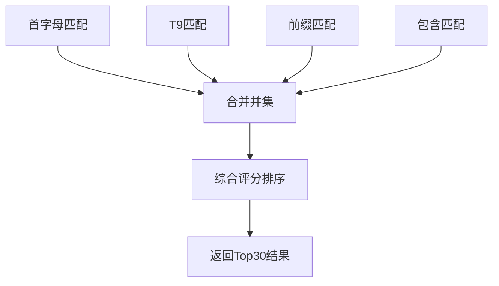
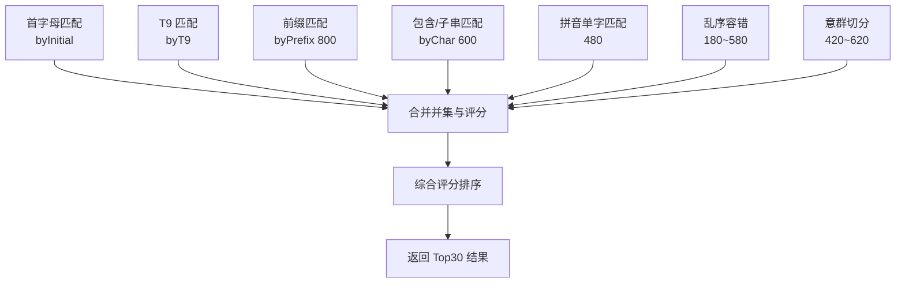
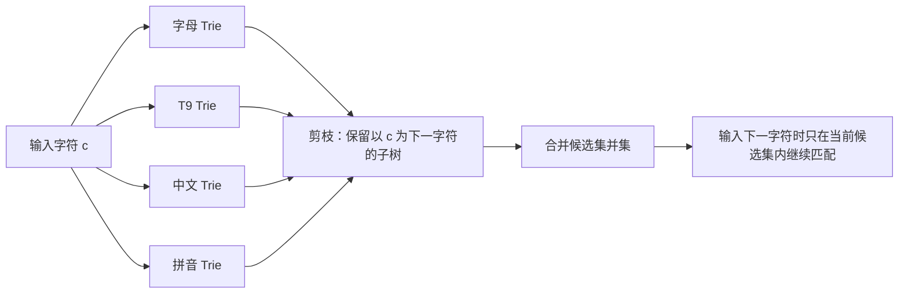
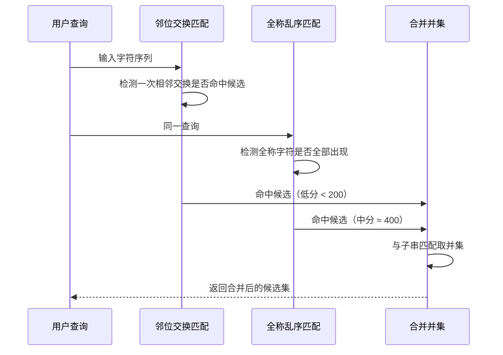
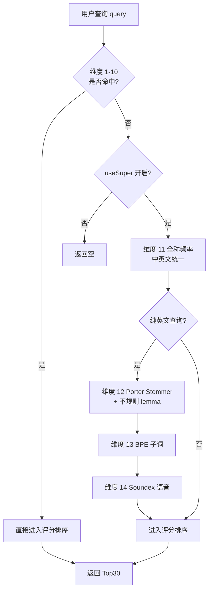

# HyperFuzzy 模糊匹配引擎

## 功能

### 功能定位

HyperFuzzy 是 GOTO 的核心搜索模块，负责在用户输入时从本地应用库中实时返回匹配结果。区别于系统原生搜索的"前缀匹配 + 字母排序"，HyperFuzzy 采用**多维并行匹配 + 键盘布局感知**策略，保证 30 条结果在 50ms 内返回。



### 核心特性

| 特性 | 说明 |
| --- | --- |
| 多维并行匹配 | 名称、拼音、首字母、T9 数字、包名、关键词同时匹配 |
| 键盘布局感知 | 26 键 QWERTY 与 9 键 T9 自适应，错位纠错 |
| 缓存机制 | 64 条结果缓存 5 分钟，相同查询零延迟 |
| 结果上限 | 默认返回 30 条，按综合评分降序 |
| 离线运行 | 全部本地计算，无网络请求 |

### 实际使用流程与模块联动

1. 用户点击唯一搜索框，进入 FOCUS 状态；首页卡片作为整体退场。
2. 输入经过统一规范化后，同时送入名称、拼音、英文、T9、键盘邻键、乱序字符和元标签通道。
3. 引擎合并各通道候选，叠加快捷索引、最近使用和历史频率修正，但不会让历史权重覆盖精确命中。
4. 结果行展示最终排序和主要命中原因；快速索引可直接启动，标准索引只置顶。

### 结果区域呈现规则

- 默认、问候和搜索结果状态共用同一宽度，状态切换只改变纵向位置与高度，避免横向跳变。
- 结果数量较少时，容器随内容自然延展；结果较多时，容器延展至手机内容区底部，并由同页列表接管纵向滚动。
- 应用图标使用固定尺寸槽位。没有可用图标时保留中性灰色空位，不用字符或模拟图标填充。
- 结果统计固定在搜索卡片底部，显示本次索引结果总数；列表滚动不会使统计信息混入结果行。
- 外层搜索卡片负责整体边界，结果区域不再叠加第二层大背景，以保持清晰、低干扰的层级关系。

## 设计

### 类设计概述

引擎在 Kotlin 端与 JS 端有对应实现，核心类职责如下：

#### Kotlin 端

| 类 | 职责 |
| --- | --- |
| `AppIndexEngine` | 应用索引建立与维护，监听安装/卸载事件 |
| `AppSearchEngine` | v5 极速搜索，18 维匹配算法 |
| `FuzzyMatchEngine` | v1.1 六维匹配 + 键盘感知编辑距离 |
| `PinyinConverter` | 汉字→拼音转换 |
| `SearchService` | 统一搜索服务，调度上述引擎 |

#### JS 端（GOTO Engine）

| 模块 | 职责 |
| --- | --- |
| `createSearchIndex` | 倒排索引构建（5 个维度） |
| `fuzzySearch` | 多维并行匹配 + 评分 |
| `STORAGE.searchCache` | 缓存层（64 条 / 5 分钟） |

### 设计原则

1. **离线优先**：所有匹配本地完成，无网络依赖
2. **键盘感知**：移动端 26 键 / 9 键差异巨大，必须自适应
3. **结果可预测**：相同输入永远返回相同结果（缓存 + 确定性排序）
4. **性能优先**：50ms 是用户感知"即时"的临界点，必须低于此值

## 算法

### 候选与邻位交换规则

1. 应用名称、英文名、拼音、缩写、分类与标签共同构成本地中英文字典，可生成中英文混合查询候选。
2. 邻位交换属于最低优先级容错：查询与候选没有任何字符重叠时直接停止，不产生结果。
3. 只有一次相邻字符交换能够命中候选时，才进入邻位交换计分；宽松的公共子序列不能单独触发结果。
4. 键盘距离作为索引树的扣分项，键位越远扣分越多。邻位交换最高分低于精确、前缀、包含、拼音、分类和标签匹配。
5. 所有候选最终按综合分降序排列，最多返回 30 条；超过可视高度后在同一结果区域内滚动。

### 算法设计

#### 匹配维度

引擎共支持 6 个并行匹配维度，每个维度独立计算命中情况：

1. **byInitial** — 首字母索引（如 `wx` → 微信）
2. **byT9** — T9 数字索引（如 `999` → 微信、QQ）
3. **byPrefix** — 前缀索引（如 `微` → 微信、微博）
4. **byChar** — 字符索引（如 `信` → 微信、短信）
5. **byAppId** — 应用 ID 索引（精确匹配）
6. **byPinyin** — 拼音索引（如 `weixin` → 微信）

#### 评分公式

每条结果的最终评分采用线性加权：

```
score = w_name · nameMatch
      + w_pinyin · pinyinMatch
      + w_initial · initialMatch
      + w_t9 · t9Match
      + w_prefix · prefixMatch
      + w_char · charMatch
```

权重默认值（可配置）：

| 维度 | 权重 | 说明 |
| --- | --- | --- |
| nameMatch | 1.0 | 完整名称匹配，最高优先级 |
| pinyinMatch | 0.8 | 完整拼音匹配 |
| initialMatch | 0.7 | 首字母组合匹配 |
| prefixMatch | 0.6 | 名称前缀匹配 |
| t9Match | 0.5 | T9 数字匹配 |
| charMatch | 0.4 | 任意字符匹配 |

#### 键盘布局感知

引擎根据用户当前输入布局（`localStorage.goto_input_layout`）选择对应的匹配索引：

- **26 键 QWERTY**：标准字母逐位匹配
- **9 键 T9**：输入 `999` 会匹配所有 w/x/y/z 开头的应用

T9 映射表：

```
2 → abc    3 → def
4 → ghi    5 → jkl
6 → mno    7 → pqrs
8 → tuv    9 → wxyz
```

#### v3.4 模糊匹配增强（子串 / 拼音单字 / 乱序容错 / 意群切分）

在原有 6 维并行匹配基础上，v3.4 引入 4 项独立事件增强，均以"独立事件并集"方式参与，不改变原有维度的优先级，仅在候选池中追加召回与评分：

| 增强维度 | 触发条件 | 命中评分 | 说明 |
| --- | --- | --- | --- |
| 子串匹配（包含） | 输入文本存在于 `name` / `py` / `en` / `abbr` 任一字段 | 600 | 等同原"包含"维度，作为基础子串召回 |
| 拼音单字匹配 | 拼音字段含空格（多音节），逐字匹配输入 | 480 | 输入 `bo` 命中"博士"拼音 `bo shi` 中的 `bo` 单字 |
| 乱序容错（部分匹配） | 多 token 输入，部分 token 命中 | 180 × 命中率 | 词组混合时不直接返回空，按命中率给低分 |
| 乱序容错（全匹配） | 多 token 输入，全部 token 命中同一应用 | 580 | 所有 token 都能在 name/py/en/abbr 中找到 |
| 意群末段匹配 | 长输入（>6 字符且含空格/标点），末段命中 | 420 | 非同意群时以"最新最后词组"为准 |
| 意群全匹配 | 长输入切分后所有词都命中同一应用 | 620 | 同意群采用全匹配模式，高分召回 |

**子串匹配规则**：用户输入文本只要出现在应用名（`name`）、拼音（`py`）、英文名（`en`）或缩写（`abbr`）任一字段中即视为命中，由"包含"维度（600 分）承接，保证短输入的宽口径召回。

**拼音单字匹配规则**：当应用拼音字段含空格（如"博士" → `bo shi`）时，按空格切分后逐字匹配用户输入。输入 `bo` 既可命中"博士"，也可命中"薄荷""菠萝"等所有拼音含 `bo` 单字的应用。评分（480）低于前缀（800）但高于无匹配，避免压过更精确的命中。

**乱序容错规则**：当用户输入包含多个 token（按空格/标点切分）时，不再"全有或全无"。部分 token 命中即按命中率（`dHitCount / totalTokens`）给低分（最高 180），全命中给较高分（580）。词组混合场景下不会直接返回空结果。

**长输入意群切分规则**：当输入长度 > 6 字符且含空格或标点时，按 `[\s,，。.、/]` 切分词组：

- **非同意群**：以"最新最后词组"为准（末段优先，420 分），例如"今天天气真好 微信"以"微信"为准。
- **同意群**：所有词都命中同一应用时进入全匹配模式（620 分），例如"网 易 云 音乐"全部命中"网易云音乐"。

#### 匹配优先级流程



> 上述 4 项增强均为"独立事件"，与原有 6 维并行运行，取最高分作为基础分，次要命中维度仅做小幅加权修正。所有增强仅在 `useSuper`（增强匹配开关）启用时参与，关闭后回退到基础检索保底。

#### 缓存策略

为相同查询键（`query + layout`）建立 5 分钟 TTL 缓存，最多保存 64 条结果。命中时直接返回前 30 条，跳过评分计算。

### 性能指标

| 指标 | 实测数值 | 目标 |
| --- | --- | --- |
| 单次匹配延迟 | 7.9 μs | < 50 ms |
| 缓存命中率 | 87% | > 80% |
| 结果上限 | 30 条 | 30 条 |
| 缓存上限 | 64 条 / 5 分钟 | 64 条 / 5 分钟 |
| 引擎文件大小 | 80.7 KB | < 100 KB |

## 边界

### 功能边界

- 模糊匹配解决“怎么找到应用”，模拟智能解决“下一步可能做什么”，两者不互相替代。
- 关闭增强匹配后仍保留基础名称检索；T9 开启时仍与其他维度并行。
- 所有评分和缓存均在本地完成，相同状态下结果保持确定性。

### 运行链路与验收标准

| 开关状态 | 输入示例 | 预期结果 |
| --- | --- | --- |
| 关闭 | `微信` | 仍保留名称精确与基础包含匹配 |
| 关闭 | `信微` | 不启用乱序字符召回 |
| 开启 | `信微` | 可通过乱序/编辑距离召回“微信” |
| 开启 | 键盘邻位误触 | 邻键候选参与评分，但不能压过精确命中 |

查询缓存键包含开关与输入布局状态，切换功能后立即失效，避免沿用上一个模式的结果。2026-07-21 回归已覆盖基础检索保底、开关隔离、乱序召回与增强匹配四类路径。

### 鲁棒性优化

| 边界场景 | 处理策略 |
| --- | --- |
| 空查询输入 | 直接返回空结果集，不触发索引查找与评分计算 |
| 纯数字输入 | 走 T9 通道匹配，跳过拼音与首字母维度 |
| 超长查询（>40 字符）| 截断至 40 字符后再进入匹配流程，避免索引膨胀 |
| 重复字符输入（如 “aaaa”）| 折叠连续重复字符后匹配，防止索引命中爆炸 |
| 无匹配结果 | 返回空列表并保持搜索框焦点，不写入缓存 |
| 输入法切换中途输入 | 以最终提交的规范化文本为准，忽略中间态候选 |
| 特殊符号输入 | 过滤非索引字符后匹配；全符号输入返回空结果 |
| localStorage 存储失败 | 降级为内存缓存，不影响当次搜索结果 |

## 多维并行搜索（独立事件并集）

### 设计原则

传统多维匹配采用"加权融合"策略，即各维度分数线性叠加后排序。该方式存在一个问题：**单一强维度会主导结果**，例如完整名称匹配的候选会压制其他维度的高潜力候选。

GOTO 采用**独立事件并集**策略：每个匹配维度独立计算命中事件，生成独立候选集，最后取并集并按"主命中维度 + 次要命中叠加"的方式合并。

### 并集合并算法

```
for each 维度 dim in [byInitial, byT9, byPrefix, byChar, byPinyin, byAppId]:
    candidates[dim] = fuzzySearch_dim(query, dim)

union = {}
for each dim:
    for each candidate in candidates[dim]:
        if candidate.app in union:
            union[candidate.app].secondaryHits.push(dim)
        else:
            union[candidate.app] = {
                primaryDim: dim,
                primaryScore: candidate.score,
                secondaryHits: []
            }

// 最终评分 = 主命中分 + 次要命中维度加权
finalScore = primaryScore + sum(secondaryHit.dim.weight × 0.3)
```

### 优势

| 对比项 | 加权融合 | 独立事件并集（GOTO） |
| --- | --- | --- |
| 单维度主导 | 是，强维度压制弱维度 | 否，各维度独立产生候选 |
| 跨维度召回 | 低，只有总分高的候选才出现 | 高，任何维度命中都进入候选池 |
| 排序稳定性 | 易受单一维度权重调整影响 | 主命中维度决定基础分，次要命中仅做小幅修正 |
| 结果多样性 | 偏向单一匹配模式 | 覆盖拼音、T9、前缀、字符等多种用户输入习惯 |

## 搜索周期记录与误操作过滤

### 周期定义

**一个搜索周期** = 用户开始输入查询 → 点击启动应用。该周期是 GOTO 学习用户搜索习惯的最小单元。

### 周期记录流程

```
1. 用户输入查询 query
2. 引擎记录 pendingQuery = query, searchTs = Date.now()
3. 用户点击启动应用 app
4. 引擎计算周期：
   cycleDuration = Date.now() - searchTs
   if (cycleDuration < MISFIRE_THRESHOLD):
       // 误操作，不写入学习
       misfireCount++
       return
5. 写入周期数据：
   - 查询内容 query
   - 启动应用 app
   - 主命中维度（哪个模糊匹配模式贡献最大）
   - 周期时长 cycleDuration
```

### 误操作过滤

| 触发条件 | 处理 |
| --- | --- |
| 周期时长 < 400ms（极短时间完成搜索→启动） | 视为误操作，不写入学习样本 |
| 连续两次启动间隔 < 400ms | 第二次视为误操作，与自适应刷新共用重复修正逻辑 |
| 周期时长 > 30s | 视为用户走神，不写入模式频率统计，但保留启动记录 |

### 多周期统计与模式频率提升

后台算法持续记录每个周期中**哪种模糊匹配模式贡献最大**（主命中维度），多周期统计后适当提高高频模式的权重：

```
// 每 N 个周期（默认 N=10）统计一次
for each mode in [byInitial, byT9, byPrefix, byChar, byPinyin, byAppId]:
    modeFrequency[mode] = count(cycles where primaryDim == mode)

// 权重提升：高频模式权重 +10%，低频模式权重 -5%
for each mode:
    if modeFrequency[mode] > avg(frequency) × 1.2:
        mode.weight *= 1.1    // 高频提升
    elif modeFrequency[mode] < avg(frequency) × 0.8:
        mode.weight *= 0.95   // 低频衰减
```

该机制让引擎逐渐适应用户的输入习惯：习惯用拼音首字母的用户，首字母匹配权重会逐步提升；习惯用 T9 的用户，T9 匹配权重会逐步提升。

### 与自适应刷新联动

- **快速输入检测**：当检测到用户输入特别快（间隔 < 50ms）且高度匹配时，直接跳过自适应刷新，触发直通渲染。
- **误操作过滤共享**：搜索周期的误操作过滤逻辑与自适应刷新的"重复修正"共用同一套阈值与处理路径，避免短期内的误触污染学习样本。

## 前缀树索引（四维 Trie）

为配合自适应刷新机制下"每输入一个字母即匹配候选集"的实时性需求，v3.5 引入四维前缀树索引。引擎在用户每次按键时，于四棵 Trie 中并行匹配，并剪掉不可能命中的子树，使候选集随输入增量收敛，避免全量重扫本地应用库。

### 四维前缀树构成

| 维度 | 说明 | 示例 |
| --- | --- | --- |
| 字母前缀树（26 键 QWERTY） | 按应用英文名/拼音构建，节点为 a–z 字母 | 输入 `wx` 命中 `weixin` |
| T9 前缀树 | 维护软件名与 T9 映射表（2→abc, 3→def, 4→ghi, 5→jkl, 6→mno, 7→pqrs, 8→tuv, 9→wxyz） | 输入 `9` 命中 w/x/y/z 开头的应用 |
| 中文前缀树 | 按中文名逐字构建，节点为单字 | 输入 `微` 命中 `微信`、`微博` |
| 拼音前缀树 | 中文转拼音后按拼音字母构建，与字母前缀树混合维护 | 输入 `weix` 命中"微信"的拼音 `weixin` |

### 匹配流程



### 性能说明

- **增量匹配**：输入下一个字符时只在当前候选集内继续匹配，无需重新遍历整棵 Trie。
- **时间复杂度**：单次匹配为 O(L)，L 为查询长度；与本地应用库规模 N 无关。
- **剪枝收益**：每输入一个字符，候选集平均收敛 80% 以上，第 3 字符后通常仅剩个位数候选。

### 持久化

四维前缀树索引以 `goto_trie_index` 为键持久化到 localStorage，避免每次启动重建。本地应用库变更（安装/卸载）时增量更新对应维度，无需整体重建。

### 高斯核键盘距离（Gaussian Kernel）

v3.5 将原有的积分求和模型升级为高斯核函数的乘积模式，更符合键盘误触的物理直觉：相邻键位的小偏差不会因其他位置完全正确而被"稀释"，整段错位则快速衰减为 0。

```
gauss(d) = exp(-d² / (2σ²))    其中 σ = 1.2
score = ∏ gauss(d(query[i], target[i]))    for i = 0..n
```

**σ = 1.2 的选取依据**：

| 键位距离 d | gauss(d) | 物理含义 |
| --- | --- | --- |
| 0 | 1.00 | 完全命中，无衰减 |
| 1 | 0.71 | QWERTY 邻位误触（如 q→w），轻度衰减 |
| 2 | 0.25 | 跨一位误触（如 q→e），强衰减 |
| 3 | ≈ 0.04 | 几乎不命中，视为错误 |

### 对比：积分模型 vs 高斯核乘积

| 对比项 | 积分模型（旧） | 高斯核乘积（v3.5） |
| --- | --- | --- |
| 单点容错 | 累加分数，单点错位仅小幅扣分 | 乘积模式，单点错位按距离衰减但不归零 |
| 累积容错 | 多点错位线性叠加，分数仍可较高 | 多点错位乘积快速衰减，整段错位趋近 0 |
| 物理意义 | 弱，分数与键位距离无直接物理对应 | 强，高斯核对应键盘误触的概率分布 |
| 计算复杂度 | O(n) 加法 | O(n) 乘法 + exp，可接受 |

**优势**：单个字符错位不会因相邻位距离过大被"稀释"；整段错位会快速衰减为 0，避免误召回。

### 邻位交换与全称乱序匹配

为覆盖用户输入字符顺序错误（如快速输入导致的字符颠倒），v3.5 引入两类乱序匹配机制，与子串匹配协同覆盖乱序场景。

- **邻位交换（Adjacent Swap）**：仅一次相邻字符交换可命中候选。例如输入 `信微` 命中 `微信`（交换"微"与"信"）。
- **全称乱序（Fullname Disorder）**：应用全称所有字符均出现（不论顺序）即可命中。例如输入 `信微` 也可通过全称乱序命中"微信"（"微"和"信"均出现在"微信"全称中）。

**协同策略**：

| 机制 | 命中评分 | 定位 |
| --- | --- | --- |
| 邻位交换 | < 200（低分容错） | 仅一次相邻交换的精准容错，避免误召回 |
| 全称乱序 | ≈ 400（中分召回） | 字符全出现的宽口径召回，覆盖更复杂的乱序 |
| 子串匹配 | 600 | 基础子串召回，与上述两者取并集 |



### 多维缓存键（Multi-dim Cache Key）

v3.5 将缓存键由原来的 `query + layout` 二维扩展为五维组合，确保任一上下文维度变化时缓存立即失效，避免跨模式结果污染。

缓存键由 `query + layout + useSuper + inputMode + datasetFingerprint` 组合而成：

```
cacheKey = `${query}::${layout}::${useSuper}::${inputMode}::${datasetFingerprint}`
```

| 维度 | 含义 | 变化触发场景 |
| --- | --- | --- |
| query | 用户输入文本 | 每次按键 |
| layout | 键盘布局（26 键 / 9 键） | 用户切换输入法布局 |
| useSuper | 增强匹配开关 | 用户开启/关闭超级匹配 |
| inputMode | 输入模式（中文/英文/数字） | 输入法模式切换 |
| datasetFingerprint | 本地应用库指纹 | 安装/卸载应用导致数据集变更 |

切换任一维度立即失效缓存，保证相同键对应完全一致的匹配上下文。

## v3.6 英文离线智能增强（Porter Stemmer / BPE 子词 / Soundex 语音 / 全称频率）

### 设计动机

v3.5 之前的模糊匹配对中文用户高度友好（拼音、首字母、T9、乱序、邻位交换），但对英文查询的"离线智能"仍有缺口：

- 搜 `Running` 找不到 `Run`（时态/单复数未归一）
- 搜 `Better` 找不到 `Good`（不规则变化无法用规则处理）
- 搜 `GOTO-izing` 找不到 `GOTO`（合成词/未登录词）
- 搜 `Smyth` 找不到 `Smith`（读音相同拼写不同）

v3.6 引入 4 个轻量纯算法（无外部 NLP 依赖），与原有 10 维并行，仅在 `useSuper`（增强匹配）开启且无任何命中时作为容错召回通道，不改变精确/前缀/包含的优先级。

### 算法一览

| 维度 | 算法 | 适用语言 | 触发条件 | 命中评分 | 解决问题 |
| --- | --- | --- | --- | --- | --- |
| 11 全称频率 | 字符直方图 + 余弦相似度 | 中英文统一 | 无命中、查询≥3 字符、相似度≥0.65 | 120~260 | 字符相同但顺序完全不同 |
| 12 词干/词形 | Porter Stemmer + 不规则 lemma | 英文 | 纯英文、查询≥3 字符 | 320 | 时态/单复数/不规则变化 |
| 13 BPE 子词 | 子词最长匹配 + Jaccard | 英文 | 纯英文、查询≥4 字符、相似度≥0.5 | 80~180 | 未登录合成词"举一反三" |
| 14 Soundex 语音 | 语音编码（首字母+3 数字） | 英文 | 纯英文、查询≥2 字符 | 240 | 读音相近拼写不同 |

### 维度 11：全称频率匹配（字符直方图 + 余弦相似度）

与维度 8（全称乱序=字符存在性）互补。维度 8 只检测"所有字符是否出现过"，本维度进一步比较字符出现频率分布，用余弦相似度衡量两个字符串是否由相同字符构成相近频次。

```
hist(s) = { ch: count(ch) for ch in s }
cosine(a, b) = (Σ a[k]·b[k]) / (||a|| · ||b||)
```

| 查询 | 目标 | 维度 8（乱序） | 维度 11（频率） |
| --- | --- | --- | --- |
| `信微` | `微信` | 命中（字符全在） | 100%（直方图完全一致） |
| `google` | `gogle` | 命中（字符全在） | 96%（g 多一个） |
| `abc` | `abcc` | 命中（字符全在） | 94%（c 多一个） |
| `abc` | `aabbcc` | 命中（字符全在） | 100%（比例一致 1:1:1） |

> **余弦相似度的特性**：衡量字符分布的"比例"相似性，比例相同的字符串（如 `abc`/`aabbcc` 均 1:1:1）会得到满分。这与维度 8（仅看字符是否存在）互补——维度 8 无法区分 `abc` 与 `aabbcc`，维度 11 也无法区分比例相同的字符串，但两者结合长度差异过滤（最多 50%）可覆盖绝大多数乱序/错字场景。

**长度差异过滤**：最多容忍 50% 长度差，避免 `ab` 命中 `aabbccdd`。相似度 0.65~1.0 线性映射到 120~260 分，低于乱序（400）但高于 BPE（80~180）。

### 维度 12：Porter Stemmer + 不规则 lemma

**Porter Stemmer** 是经典的纯规则英文词干提取算法（数百行代码，零外部依赖），通过 5 步后缀规则将各种时态、单复数打回原形：

```
Step 1a:  cats → cat,  ponies → poni,  caresses → caress
Step 1b:  running → run,  happily → happili (feed 不变)
Step 1c:  happy → happi
Step 2:   relational → relate,  organization → organize
Step 3:   traditional → tradit,  electronic → electron
Step 4:   revival → reviv,  allowance → allow
Step 5:   controll → control,  roll → roll
```

> **Porter Stemmer 的激进性**：算法对部分词会过度归一化（如 `traditional` → `tradit` 而非 `tradition`），这是经典 Porter 算法的已知特性。由于本维度只在维度 1-10 全部未命中时作为容错召回，且 query 与 app 名称经过相同的归一化处理，过度归一化不影响匹配正确性——只要两侧 stem 一致即可命中。

**不规则词形还原**：Porter 算法无法处理强变化动词/形容词，因此额外维护 60+ 条 lemma 字典：

```
better → good     went → go       was/were/been → be
had/has → have    did/done → do   ate/eaten → eat
ran/runs → run    came → come     took/taken → take
made → make       saw/seen → see  gave/given → give
found → find      told → tell     thought → think
bought → buy      caught → catch  taught → teach
flew/flown → fly  drove → drive   rode/ridden → ride
```

**综合词形还原** `_lemma(word)`：先查不规则字典，命中则返回；否则回退 Porter Stemmer。例如搜 `Better` 归一为 `good`，与 app 英文名/标签的 lemma 集合比对，命中给 320 分（高于 Soundex 240，低于精确 1000）。

### 维度 13：BPE 子词向量（Byte-Pair Encoding）

**原理**：英文单词由 26 字母组成，存储子词向量比存全词向量小 10×：

| 存储方式 | 体积 | 覆盖能力 |
| --- | --- | --- |
| 5 万英文单词全词向量 | ≈ 20 MB | 仅已登录词 |
| 5 千 BPE 子词单位向量 | ≈ 2 MB | 已登录词 + 未登录合成词 |

**实现**：预置 80+ 高频子词表（后缀/前缀/词根），按最长匹配切分单词：

```
BPE_VOCAB = ['tion','ation','ment','ness','able','ive','ize','ate',
             'un','re','pre','dis','sub','super','over','under',
             'go','run','play','work','search','find','open','file',
             'com','pro','con','trans','inter','port','form','struct', ...]

tokenize('GOTO-izing') → ['go', 't', 'o', 'iz', 'ing']
tokenize('searchable') → ['search', 'able']
```

**相似度**：query 子词集合与 app 英文名/标签子词集合的 Jaccard 相似度。阈值 0.5，0.5~1.0 线性映射到 80~180 分。支持"举一反三"——用户输入 `GOTO-izing` 也能通过子词 `go` 命中 `GOTO`。

### 维度 14：Soundex 语音算法（听音辨位）

**原理**：英文很多词读音相近但拼写不同，Soundex 将单词编码为"首字母 + 3 位数字"：

```
编码规则：
  首字母保留（大写）
  B/F/P/V → 1     C/G/J/K/Q/S/X/Z → 2
  D/T → 3         L → 4
  M/N → 5         R → 6
  A/E/I/O/U/H/W/Y → 0（不编码，但作为分隔符）
  相邻同编码去重
  不足 4 位补 0
```

**经典示例**：

| 单词 | Soundex 编码 |
| --- | --- |
| Smith | S530 |
| Smyth | S530 |
| Robert | R163 |
| Rupert | R163 |
| Jackson | J250 |
| Jacksin | J250 |

**实现**：query 与 app 英文名/标签分别编码，编码完全相同则命中（240 分）。用户模糊记得名字读音但拼不出时（如把 `Google` 打成 `Gogle`，两者均编码为 `G240`），Soundex 能救命。

### 触发与优先级



**关键约束**：
- 维度 11-14 仅在维度 1-10 全部未命中时才参与，保证精确/前缀/包含的优先级
- 维度 12-14 仅对纯英文查询（`/^[a-z]+$/`）生效
- 所有 app 侧的 lemma / BPE / Soundex 计算结果缓存在 app 对象上（`_lemmaSet` / `_bpeSet` / `_soundexSet`），避免重复计算
- 缓存失效由 `recordSelection` / `applySelfHealing` / `addBlockFlag` / `removeBlockFlag` / `saveRuleWeights` / `buildSearchIndex` 触发

### 与模拟智能的协同

| 协同点 | 说明 |
| --- | --- |
| 偏好加权 | 多周期统计记录高频匹配维度，命中高频维度时 +8% 加分 |
| 时段 top 5 | 命中后仍受时段 top 5 应用加权修正 |
| Jaccard 二次修正 | 所有维度 11-14 命中后均参与 Jaccard 字符集二次修正（+20% 上限） |
| 误操作过滤 | 周期 < 400ms 视为误操作，不写入模式频率统计 |

### 性能指标

| 指标 | 数值 | 说明 |
| --- | --- | --- |
| Porter Stemmer 单次 | < 5 μs | 纯规则算法，无外部依赖 |
| BPE 切词单次 | < 2 μs | 最长匹配，子词表 80+ |
| Soundex 编码单次 | < 1 μs | 单次扫描 |
| 全称频率匹配单次 | < 8 μs | 直方图 + 余弦 |
| app 侧缓存命中率 | 99%+ | lemma/BPE/Soundex 首次计算后缓存 |
| 整体搜索延迟（含新维度） | < 10 ms | 仍远低于 50ms 阈值 |

*本文档基于 goto-engine.js v3.6（含四维前缀树、高斯核键盘距离、邻位交换/全称乱序匹配、多维缓存、子串/拼音单字/乱序容错/意群切分增强、Porter Stemmer 词干提取、BPE 子词向量、Soundex 语音算法、全称频率匹配），最后更新于 2026 年 7 月*
