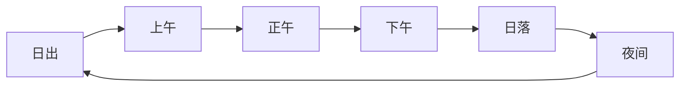
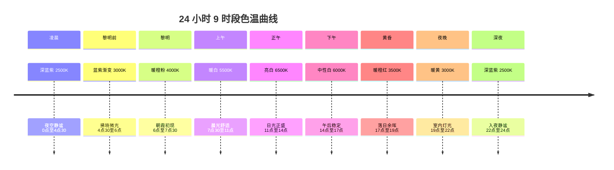
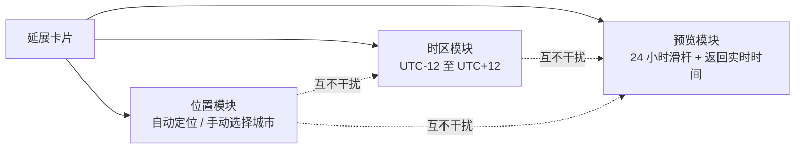

# 光感模式

> 光感模式是一套独立材质系统，不是“自动深色模式”。它使用位置、时区和一天中的时刻共同决定明暗、色温、陶瓷质感参数与光源方向；陶瓷亮面会随当地太阳方位移动。
>
> **v1.6 定档**：光感模式正式采用"陶瓷质感（Ceramic Texture）"设计系统，全局弃用传统毛玻璃（`backdrop-filter: blur`），统一为温润釉面效果。



<button class="doc-inline-demo" data-preview-action="settings" data-preview-target="lightSenseCard">在左侧打开光感模式</button>

<div class="doc-story-flow">
  <button data-preview-action="light-sense-preview" data-preview-target="lightSenseCard" data-preview-query="390"><b>06:30</b><span><strong>清晨</strong><small>浅色陶瓷开始升温，亮面从低位进入</small></span></button>
  <button data-preview-action="light-sense-preview" data-preview-target="lightSenseCard" data-preview-query="720"><b>12:00</b><span><strong>正午</strong><small>亮度与透明度最高，正文仍保持清晰</small></span></button>
  <button data-preview-action="light-sense-preview" data-preview-target="lightSenseCard" data-preview-query="1110"><b>18:30</b><span><strong>日落</strong><small>暖色环境光增强，但不形成黄屏</small></span></button>
  <button data-preview-action="light-sense-preview" data-preview-target="lightSenseCard" data-preview-query="1380"><b>23:00</b><span><strong>深夜</strong><small>切入深色陶瓷表面，文字自动反色</small></span></button>
</div>

## 功能

### 功能定位

光感模式是 GOTO 的视觉舒适层。它在**原有卡片设计 + 日照时段色温**基础上调节颜色与亮度，让 UI 在不同时间呈现不同的视觉温度。它不叠加另一套卡片或全屏泛光层。

在设置结构中，光感模式与超级语音共同归入一级分类“拓展”。两者是相互独立的功能卡：光感模式可展开位置、时区、日照与色温参数；超级语音当前仅展示开发状态。

延展菜单采用单列参数面板。位置与时区、日出日落、24 小时色温和四档预设各自成组，不使用拖拽装饰点或重复背景层；关闭按钮只负责收回菜单，不改变光感开关状态。

### 核心特性

| 特性 | 说明 |
| --- | --- |
| 原卡片色温适配 | 保留当前扁平/拟态卡片，只调整现有颜色令牌与亮度 |
| 日照时段色温 | 7 时段分段计算色温（深夜 / 日出前 / 清晨 / 白天 / 下午 / 日落 / 夜间） |
| 4 档预设 | 凝冷 6500K / 自然 5500K / 暖光 3400K / 烛火 2700K |
| 自动开关 | 开启后跟随日照自动调节，关闭后锁定档位 |
| 太阳方位亮面 | 优先使用系统定位的纬度/经度计算太阳高度角与方位角，驱动 `--light-angle`；无权限时以时区经度和中纬度近似 |
| 权限回退 | 打开进阶设置或光感模式时通过系统定位权限请求；拒绝、超时或浏览器不支持时保留手动时区，不阻塞使用 |
| 不明显偏黄 | 暖色饱和度严格钳制，杜绝 f.lux 式的"黄屏" |

### 任意时刻预览

用户可以选择 UTC-12 至 UTC+12 的时区，也可以通过系统权限授权位置计算日出日落与太阳方位。光感模式内部始终以所选时区的 24 小时分钟刻度计算明暗；12/24 小时设置只格式化智能提醒卡片的时钟文本，不参与材质计算。时间滑杆允许主动预览 00:00 至 23:59 的任意时刻；“返回实时时间”会恢复所选时区的当前时间。

### 位置、权限与亮面方向

开启进阶设置或打开光感模式时，Page 会调用系统 Geolocation API 发起一次原生权限请求。用户允许后保存纬度、经度和时区偏移，仅用于本地日照计算；用户拒绝、定位超时或运行环境没有定位能力时，不弹自定义拦截对话框，而是切换到时区近似：以时区对应经度（UTC 偏移 × 15°）和中纬度模型估算太阳路径。两种路径都能继续使用光感模式，手动时区仍然可以覆盖自动时区。

太阳位置采用轻量 NOAA 近似计算太阳高度角与方位角。方位角被映射为 CSS `--light-angle`，从而让玉石/陶瓷表面的顶部高光、低位暖光和极轻泛光朝向当地光源；它不会改变卡片几何、文字对比度或交互位置。预览时刻也会使用同一套计算，因此文档左侧的时间演示与真实运行状态保持一致。

## 设计

### 陶瓷质感设计系统（v1.6 定档）

光感模式全局弃用传统毛玻璃（`backdrop-filter: blur`），统一采用"陶瓷质感"——通过 135° 渐变背景、精细内阴影、极轻外投影模拟温润釉面效果，避免塑料感与液态玻璃的过度反光。

#### 材质定义

| 属性 | 值 | 说明 |
| --- | --- | --- |
| 背景 | 135° 渐变 | `linear-gradient(135deg, var(--surface), var(--surface-alt))` |
| 顶部高光 | 1px inset | `box-shadow: 0 1px 0 rgba(255,255,255,0.45) inset` |
| 底部暗影 | 1px inset | `box-shadow: 0 -1px 0 rgba(0,0,0,0.03) inset` |
| 外投影 | 极轻 | `0 4px 14px rgba(12,14,20,0.05)` |
| 边框 | 半透明 | `color-mix(in srgb, var(--ink) 6%, transparent)` |
| backdrop-filter | none | 弃用毛玻璃模糊 |

#### 样式隔离机制

通过 `.light-sense` 类前缀结合 `light-sense-light` / `light-sense-dark` 双变体实现状态隔离：

```css
/* 光感模式样式始终在标准模式基础上叠加修改，而非独立重写 */
body.light-sense .search-card,
body.light-sense .slot-card,
body.light-sense .section-card,
body.light-sense .sub-card,
body.light-sense .result-row,
body.light-sense .sc-ready-hint {
  background: var(--surface) !important;
  color: var(--ink) !important;
  border-color: color-mix(in srgb, var(--ink) 6%, transparent) !important;
  box-shadow: 0 1px 0 rgba(255,255,255,0.45) inset,
              0 -1px 0 rgba(0,0,0,0.03) inset,
              0 4px 14px rgba(12,14,20,0.05) !important;
  backdrop-filter: none !important;
  -webkit-backdrop-filter: none !important;
}
```

#### 统一覆盖范围

| 组件 | 陶瓷质感应用 | 备注 |
| --- | --- | --- |
| `.search-card` | ✓ | 搜索框卡片 |
| `.slot-card` | ✓ | 首页卡片槽位 |
| `.section-card` | ✓ | 设置页分区卡片 |
| `.sub-card` | ✓ | 设置页子卡片 |
| `.result-row` | ✓ | 搜索结果行 |
| `.sc-ready-hint` | ✓ | 智能提示卡片 |
| `.doc-tree-bottom-btn` | ✓ | 目录底部 GOTO Music 按钮 |

#### 搜索框规范

光感模式下搜索框采用陶瓷/玉石质感，去除突兀白边：
- 边框使用 `color-mix(in srgb, var(--ink) 6%, transparent)` 而非 `var(--line-strong)`
- 继承标准模式 `padding: 0` 保证左右边界对齐
- 不使用 `backdrop-filter: blur`，避免塑料感

#### 返回按钮全局通用

设置二级页面左上角返回按钮在标准模式与光感模式下样式完全统一：
- `.bp-icon-arrow` 使用 `inline-flex` 垂直居中
- SVG 通过 CSS 控制 `width: 13px; height: 13px` 而非硬编码属性
- 采用线条外框风格，不随模式变化

### 时间过渡均匀化算法（v1.6 优化）

#### 核心变量：`--daylight-intensity`

基于色温亮度动态计算，作为光感模式颜色过渡的全局驱动变量：

```
--daylight-intensity = f(hour, sunrise, sunset, preset)
```

#### 关键帧优化

`LIGHT_SENSE_COLOR_KEYFRAMES` 关键帧针对 18:00（日落）和 13:30（午后）附近的颜色过渡进行均匀化处理：
- 调整 RGB 值和 warmth 参数
- 配合 `cubic-bezier(0.4, 0, 0.2, 1)` 缓动函数消除突变跳变
- 任意相邻时段的颜色变化必须满足视觉连续性

#### 六时段映射

| 时段 | 时间范围 | 与其他模块联动 |
| --- | --- | --- |
| 清晨 | 05:00 – 08:00 | 智能提示卡片问候语、首页最近卡片 |
| 上午 | 08:00 – 12:00 | 智能提示卡片问候语、首页最近卡片 |
| 中午 | 12:00 – 14:00 | 智能提示卡片问候语、首页最近卡片 |
| 下午 | 14:00 – 18:00 | 智能提示卡片问候语、首页最近卡片 |
| 晚上 | 18:00 – 24:00 | 智能提示卡片问候语、首页最近卡片 |
| 凌晨 | 00:00 – 05:00 | 智能提示卡片问候语、首页最近卡片 |

> 六时段划分与智能提示卡片分时段问候语、首页最近卡片时段判定完全一致，确保模块间联动一致性。

### 视觉约束

- 白天使用浅色陶瓷质感，夜晚使用深色陶瓷质感。
- 日出、正午、日落和深夜具有不同色温与光源方向。
- 所有卡片保持与标准模式相同的宽度、位置和交互层级。
- 字体颜色随背景反色，优先保证可读性。
- 炫光只描述环境光，不覆盖正文，不承担按钮状态表达。
- 陶瓷质感的内阴影和外投影不随色温变化，仅背景色温变化。

### 类设计概述

光感模式主要在 preview.html 端实现，通过 CSS 变量驱动全局视觉变化：

| 模块 | 职责 |
| --- | --- |
| `body.light-sense` | 全局光感模式开关类 |
| `body.light-sense.light-sense-light` | 光感浅色变体（白天） |
| `body.light-sense.light-sense-dark` | 光感深色变体（夜晚） |
| `--daylight-intensity` | 日照强度变量（v1.6 新增，驱动颜色过渡） |
| `--glass-blur-x / -y` | 陶瓷质感模糊半径（v1.6 已弃用，保留兼容） |
| `--glass-saturate` | 饱和度（v1.6 已弃用，保留兼容） |
| `--glass-brightness` | 亮度（v1.6 已弃用，保留兼容） |
| `--glass-opacity` | 不透明度（v1.6 已弃用，保留兼容） |
| `--glass-grayscale` | 灰度系数（v1.6 已弃用，保留兼容） |
| `--color-temp-r/g/b` | 色温 RGB 分量 |
| `--ambient-warmth` | 环境暖度系数 |
| `LIGHT_SENSE_COLOR_KEYFRAMES` | 颜色过渡关键帧（v1.6 优化，消除 18:00/13:30 跳变） |
| `_applyColorTempVars(hour)` | 色温变量计算入口 |
| `_applyGlassVarsBySunPosition(hour, sunrise, sunset)` | 陶瓷质感参数计算入口（v1.6 重构） |

### 设计原则

1. **沿用原有卡片**：不新建或叠加第二层卡片，只调整现有背景令牌、亮度与色温
2. **暖色但不偏黄**：暖色饱和度严格钳制在 0.32 以下，杜绝 f.lux 式的"黄屏"
3. **用户可控**：4 档预设 + 自动开关，用户可以锁定喜欢的色温
4. **日照跟随**：自动模式下，色温随一天中的时间自然变化
5. **平滑过渡**：所有色温变化通过 CSS 变量 + 1.6s 弹性动画平滑过渡

## 算法

### 色温档位预设

| 档位 | 色温 (K) | 暖度 | RGB |
| --- | --- | --- | --- |
| 凝冷 | 6500 | 0.18 | (232, 240, 252) |
| 自然 | 5500 | 0.32 | (250, 246, 238) |
| 暖光 | 3400 | 0.50 | (255, 234, 206) |
| 烛火 | 2700 | 0.68 | (255, 208, 168) |

### 7 时段色温曲线

自动模式下，根据当前小时数计算暖度（warmth）：

| 时段 | 时间 | 暖度系数 |
| --- | --- | --- |
| 深夜 | 00:00 – 05:00 | 0.5 × preset.warmth |
| 日出前 | 05:00 – 07:00 | (0.5 + p × 0.3) × preset.warmth |
| 清晨 | 07:00 – 11:00 | (0.8 − p × 0.3) × preset.warmth |
| 白天 | 11:00 – 15:00 | 0.5 × preset.warmth |
| 下午 | 15:00 – 19:00 | (0.5 + p × 0.4) × preset.warmth |
| 日落 | 19:00 – 22:00 | 0.9 × preset.warmth |
| 夜间 | 22:00 – 24:00 | 0.7 × preset.warmth |

其中 `p` 为该时段内的进度比例 (0–1)。暖度被钳制在 `[0.18, preset.warmth]` 区间内。

### 环境泛光参数（随日照变化）

根据日出日落时间动态调整背景泛光与扩散层。模糊只作用于环境光晕，不作用于正文卡片，避免重新出现廉价毛玻璃感：

| 时段 | 模糊 (px) | 亮度 | 不透明度 | 灰度 |
| --- | --- | --- | --- | --- |
| 深夜 | 64 | 0.90 | 0.50 | 0.80 |
| 清晨 | 40 → 25 | 0.95 → 0.98 | 0.35 → 0.30 | 0.60 → 0.50 |
| 白天 | 25 | 1.00 | 0.30 | 0.50 |
| 日落 | 45 → 65 | 0.95 → 0.90 | 0.40 → 0.50 | 0.65 → 0.80 |
| 夜间 | 64 | 0.90 | 0.50 | 0.80 |

### 状态栏暖色呼吸光点

光感模式开启后，状态栏右侧出现暖色呼吸光点：

- 6px 径向渐变球体
- 3.2s 呼吸动画（opacity 0.6 ↔ 1.0，scale 1.0 ↔ 1.2）
- 暖色模式：橙黄色光晕
- 暗色模式：冷色月光感（蓝白色）

### 顶部色温泛光

主体顶部叠加色温泛光层：

- 80% × 50% 椭圆径向渐变
- `mix-blend-mode: soft-light` 混合
- 1.8s 色温过渡动画

## 边界

### 视觉实现边界

光感模式是高于基础浅色/深色选择的环境材质层，但不是固定的黑色主题。开启后保留标准模式的卡片几何、层级与功能位置，再由所选时区、日照阶段和预览时刻统一计算 `--bg`、`--surface`、`--surface-alt`、陶瓷高光方向与环境泛光。泛光只存在于背景和材质边缘，正文区域始终维持可读对比。

### 状态变化

- 日间：保持原有浅色对比，仅加入低比例自然色温。
- 日落与夜间：逐步降低亮度并提高暖度，不突然切换。
- 深夜：自动切换为深色温润陶瓷，不受开启光感前的基础主题限制。
- 关闭光感：立即恢复当前主题原有令牌，不影响用户选择的强调色与壁纸。

### 鲁棒性优化

| 边界场景 | 触发条件 | 处理策略 | 降级效果 |
| --- | --- | --- | --- |
| 光感传感器不可用 | 设备无环境光传感器或 API 返回异常 | 回退至 7 时段色温曲线纯时间驱动模式 | 视觉表现与标准光感模式一致，仅缺少实时亮度补偿 |
| 光感数据异常值 | 传感器返回负值、NaN 或超出物理范围 | 钳制到 `[0, 65535]` 后再以中值滤波平滑最近 5 次采样 | 跳过本次更新，保留上一帧有效值，不闪烁 |
| 日夜切换突变 | 日出/日落时刻计算跳变或时区切换 | 强制 1.8s 色温过渡 + 玻璃参数弹性插值 | 过渡期内不出现硬切，用户感知为自然渐变 |
| 光感模式与深浅模式冲突 | 用户手动切换深色模式时光感仍开启 | 以光感模式优先，深浅模式仅记录状态不立即应用 | 退出光感后恢复用户最后选择的深浅主题 |
| 光感模式下应用卡片宽度异常 | 玻璃模糊加大导致卡片视觉溢出 | 锁定卡片几何为标准模式尺寸，模糊仅作用于背景层 | 卡片宽度、位置与交互层级保持不变 |
| 光感传感器权限被拒 | 用户拒绝位置/传感器权限或后续撤销 | 退化为手动时区 + 默认 5500K 自然预设 | 保留手动预览能力，仅失去自动日出日落跟随 |

## 9 时段多样化色温

v3.5 将原 7 时段扩展为 9 时段，覆盖凌晨深蓝紫、黎明暖橙粉、日间、黄昏、夜晚等更细腻的色温过渡。新增"凌晨"与"黎明前"两个过渡时段，使日出前后的色温爬升更接近真实天光，深夜与黎明之间不再出现硬切。

| 时段 | 时间范围 | 主色调 | 色温 | 灵感 |
| --- | --- | --- | --- | --- |
| 凌晨 | 00:00 – 04:30 | 深蓝紫 | 2500K | 夜空静谧 |
| 黎明前 | 04:30 – 06:00 | 蓝紫渐变 | 3000K | 拂晓微光 |
| 黎明 | 06:00 – 07:30 | 暖橙粉 | 4000K | 朝霞初现 |
| 上午 | 07:30 – 11:00 | 暖白 | 5500K | 晨光舒适 |
| 正午 | 11:00 – 14:00 | 亮白 | 6500K | 日光正盛 |
| 下午 | 14:00 – 17:00 | 中性白 | 6000K | 午后稳定 |
| 黄昏 | 17:00 – 19:00 | 暖橙红 | 3500K | 落日余晖 |
| 夜晚 | 19:00 – 22:00 | 暖黄 | 3000K | 室内灯光 |
| 深夜 | 22:00 – 24:00 | 深蓝紫 | 2500K | 入夜静谧 |



## 24 小时平滑过渡

v3.5 采用 cubic-bezier 缓动函数 + 15 分钟采样点，让 24 小时色温变化更自然流畅。相邻采样点之间使用缓动插值替代线性过渡，消除时段切换时的视觉跳跃。

- **缓动函数**：`cubic-bezier(0.4, 0.0, 0.2, 1)`（Material Design 标准缓动）
- **采样策略**：每 15 分钟计算一次色温值，相邻采样点之间使用 cubic-bezier 插值

```
const SAMPLE_INTERVAL = 15; // 分钟
const EASING = 'cubic-bezier(0.4, 0.0, 0.2, 1)';
function interpolateColor(t, c1, c2) {
  // t 经过 cubic-bezier 缓动后再线性插值
  const eased = cubicBezier(0.4, 0.0, 0.2, 1, t);
  return mixColor(c1, c2, eased);
}
```

| 对比项 | 线性过渡 | cubic-bezier |
| --- | --- | --- |
| 视觉跳跃感 | 明显 | 几乎无 |
| 时段切换突兀 | 是 | 否 |
| 用户感知 | "突变" | "自然流淌" |
| 计算开销 | O(1) | O(1)（查表） |

## 延展卡片 UI 重构

v3.5 重构光感模式延展卡片下方内容，仅保留三个核心模块，删除冗余信息，保持同等美化效果。重构后参数面板更聚焦，交互层级与原卡片保持一致。

**保留模块：**

1. 获取位置（自动定位 / 手动选择城市）
2. 选择时区（UTC-12 至 UTC+12）
3. 实时预览（24 小时时间滑杆 + "返回实时时间"按钮）

**删除内容：**

- 日出日落详细参数（已自动计算，无需展示）
- 4 档预设选择器（已与时段自动联动）
- 重复的色温说明文字

**UI 细节：**

- 单列参数面板，无拖拽装饰点
- 关闭按钮只收回菜单，不改变光感开关状态
- 与原卡片宽度、位置、交互层级保持一致



## 按钮左侧颜色条移除

v3.5 修复了光感模式下按钮左侧出现的颜色条重叠问题。该问题由按钮分隔线与左边框在光感模式下叠加显示导致，修复后光感模式按钮视觉更干净。

- **原因**：`bp-icon-btn--half` 分隔线和 `bp-icon-btn` 左边框在光感模式下叠加显示
- **修复**：光感模式下设置 `border-left: none`，去除视觉冗余

```css
body.light-sense-active .bp-icon-btn,
body.light-sense-active .bp-icon-btn--half{
  border-left: none;
}
```

*本文档基于 preview.html 光感模式实现，最后更新于 2026 年 7 月 31 日（v1.6：陶瓷质感设计系统定档 + 时间过渡均匀化算法 + `--daylight-intensity` 核心变量 + 六时段映射联动 + 搜索框/返回按钮规范）*

## 模块联动关系（v1.6 增强）

光感模式不是孤立的视觉层，而是与多个功能模块存在数据联动：

| 联动模块 | 联动方式 | 数据流向 |
| --- | --- | --- |
| 智能提示卡片 | 共用六时段划分逻辑生成问候语 | 光感时段 → 提示卡片文案 |
| 首页卡片（最近卡片） | 共用时段数据，时段切换时卡片刷新 | 光感时段 → 首页卡片内容 |
| 统计系统 | 共用小时判定逻辑 | 光感小时 → 24小时活跃度 |
| Micro-Context | 光感模式启用时"地点/光感模式"维度 boost 激活 | 光感开关 → Micro-Context boost（导航+30、音乐+15） |
| 个性化 | 光感是进阶区独立模式，关闭后恢复浅色或深色主题 | 光感开关 → 主题状态 |
| GOTO Music 按钮 | 陶瓷质感统一适配，深浅/光感模式样式一致 | 光感样式 → 按钮外观 |
