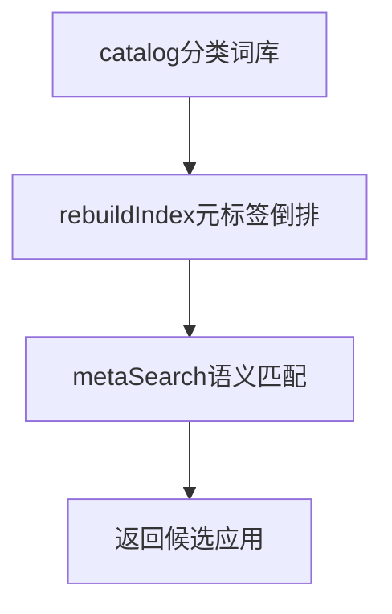
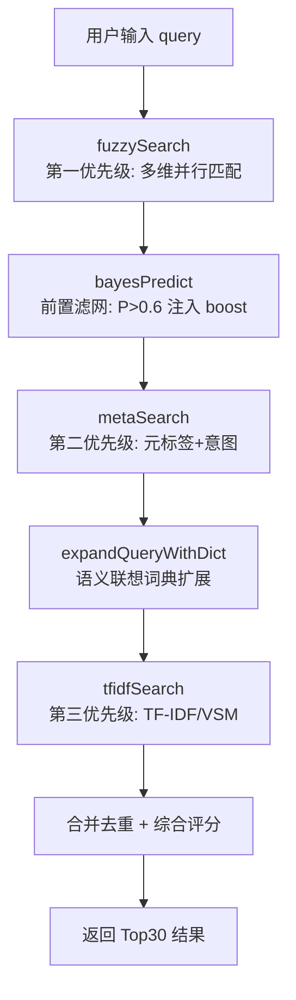
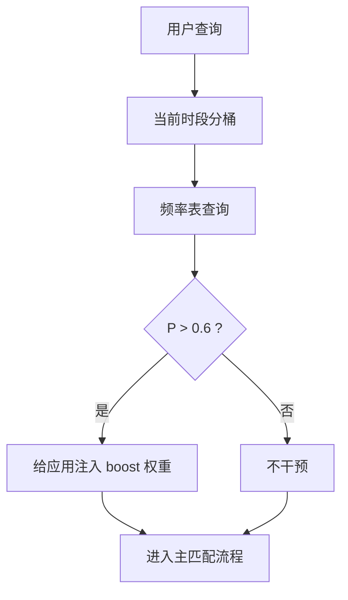
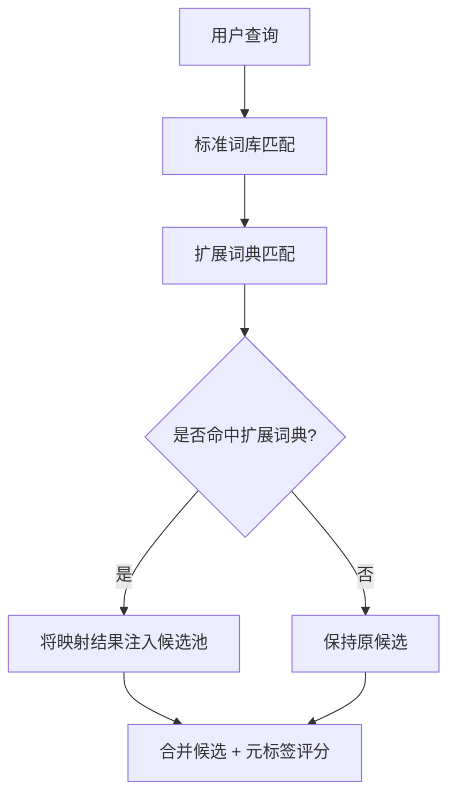
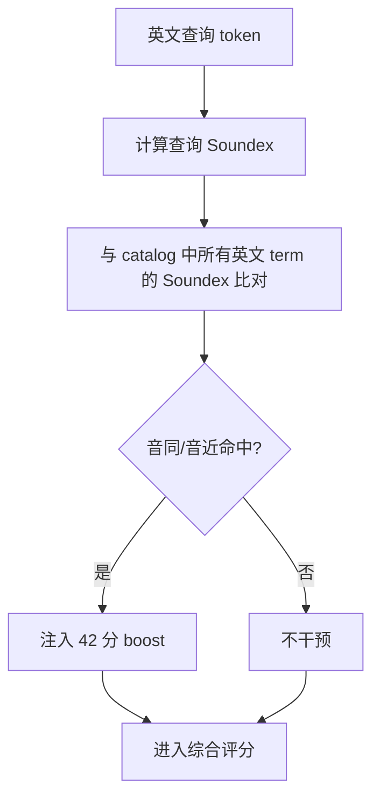

# 元标签索引

## 功能

### 功能定位

元标签索引是 GOTO 的离线本地语义层。它通过**11 类意图 + 20 分类 + 28 同义词簇**，让用户用自然语言（如"发消息给小明"）就能找到对应应用，无需联网。



#### 核心特性

| 特性 | 说明 |
| --- | --- |
| 11 类意图 | SEND / CONSUME / CONTACT / TRAVEL / BUY / WORK + SEARCH / OPEN / INSTALL / HEALTH / LEARN |
| 20 分类 | 通讯、办公、浏览器、视频、音乐、购物、支付金融、地图出行、拍照影像、阅读资讯、游戏、开发、系统工具 + 输入法、智能家居、网盘云盘、翻译、教育学习、健康运动、跑腿快递 |
| 28 同义词簇 | 每个意图对应多个触发词（如 BUY = 买 / 下单 / 点 / 点餐 / 吃饭 / 购物...） |
| 离线运行 | 全部本地词库，无网络依赖 |
| 评分机制 | 精确匹配 120 分，包含匹配 56 分 |

### 与搜索结果的关系

元标签不会单独接管搜索，而是作为 HyperFuzzy 的语义召回通道参与综合评分。直接名称、拼音和快捷索引证据优先；只有用户使用“聊天、导航、听歌、点餐”等目标表达时，标签与意图分才明显生效。

设置开关直接连接搜索管线的 `meta-tag-enabled` 运行态。切换后立即清空搜索缓存并重跑当前查询；它与模拟智能开关相互独立。

#### 可解释输出

- 命中的动作词与意图会写入搜索上下文。
- 分类候选会保留来源，便于结果行说明为什么被推荐。
- 用户修正错误推荐后，负反馈只影响对应查询场景，不永久污染全局分类。

#### 隐私与扩展

词表、索引和历史修正全部保存在本地。后续可增加新的分类分片或同义词簇，但必须保持可删除、可关闭和不联网也能完整运行。

## 设计

### 设计原则

1. **离线优先**：所有词库本地内置，无网络依赖
2. **可扩展**：分类和意图可通过 `loadCatalog` 动态加载
3. **复合场景**：支持多意图命中（如"学做饭" = LEARN + BUY）
4. **低开销**：同义词表 < 5 KB，Token 提取 < 50 ms

### 类设计概述

#### Kotlin 端

| 类 | 职责 |
| --- | --- |
| `MetaTagEngine` | 分类规则定义，应用→分类映射 |
| `MetaTagIndex` | 28 同义词簇元标签树构建与查询 |

#### JS 端（GOTO Engine）

| 模块 | 职责 |
| --- | --- |
| `intentSynonyms` | 11 类意图同义词词典 |
| `baseCatalog` | 20 分类应用库 |
| `extractTokens` | 分词与意图提取 |
| `metaSearch` | 元标签语义搜索入口 |
| `loadCatalog` | 动态加载分类（支持拓展） |

### 性能指标

| 指标 | 实测数值 | 目标 |
| --- | --- | --- |
| 同义词表大小 | 2.15 KB | < 5 KB |
| Token 提取延迟 | 7.9 μs | < 50 ms |
| 索引构建时间 | < 5 ms | < 50 ms |
| 分类数 | 20 | 20 |
| 意图数 | 11 | 11 |

## 算法

### 算法设计

#### 意图识别

用户输入会被提取 token，与 11 类意图的同义词表匹配。每类意图对应一组触发词：

| 意图 | 触发词示例 |
| --- | --- |
| SEND | 写、发、寄、送、留言、传、通知、发短信、发邮件 |
| CONSUME | 看、听、读、欣赏、刷、播放、追、阅读、收听 |
| CONTACT | 聊天、沟通、联系、找人、聊聊、回消息、私聊、群聊 |
| TRAVEL | 打车、导航、定位、出发、出行、路线 |
| BUY | 买、下单、点、点餐、吃饭、购物、买东西、点外卖、做饭、下馆子 |
| WORK | 办公、工作、文档、表格、开会、协作、汇报 |
| SEARCH | 搜、查、找、搜索、查一下、搜一下、查资料 |
| OPEN | 打开、启动、进入、开、运行、调出、唤起 |
| INSTALL | 装、安装、下载、装个、下个、装软件 |
| HEALTH | 运动、跑步、健身、喝水、睡眠、锻炼、减肥、瑜伽 |
| LEARN | 学、学习、背单词、上课、学英语、看教程、教程、课、课程、网课 |

#### Token 提取

输入查询经过 `extractTokens` 处理后，返回结构化结果：

- `query` — 原始查询（去空白）
- `lower` — 小写形式
- `words` — 分词后的数组
- `actions` — 命中的动作词
- `intents` — 命中的意图类别
- `relations` — 命中的关系词（给 / 和 / 跟 / 找）
- `target` — 提取的目标对象（如"小明"）

#### 分类评分

每个分类下的应用，根据用户查询的命中情况评分：

```
score = (精确匹配 ? 120 : 0)
      + (包含匹配 ? 56 : 0)
      + (意图命中 ? 30 : 0)
      + (分类命中 ? 20 : 0)
```

#### 查询示例

| 用户输入 | 命中意图 | 命中分类 | 返回应用 |
| --- | --- | --- | --- |
| 发消息给小明 | SEND, CONTACT | 通讯 | 微信、QQ、企业微信 |
| 看视频 | CONSUME | 视频 | YouTube、B 站、抖音 |
| 学做饭 | LEARN, BUY | 教育、购物 | 下厨房、淘宝 |
| 运动视频教程 | CONSUME, HEALTH, LEARN | 视频、健康、教育 | Keep、B 站、YouTube |
| 查一下路线 | SEARCH, TRAVEL | 浏览器、地图 | 高德地图、百度地图 |

## v3.4 搜索管线增强（贝叶斯滤网 / TF-IDF / 语义联想词典）

元标签索引作为离线语义层，在 v3.4 中接入三个新增强模块，形成完整的"前置滤网 → 语义召回 → 倒排兜底"四级管线。三者均为本地计算，不引入网络依赖，且各自带体积/条目上限，保证引擎整体仍 < 100 KB。

### 贝叶斯过滤前置滤网

作为元标签索引的**前置频率滤网**，在 `metaSearch` 之前运行，对强时间相关性的简单意图（如"晚上听歌""早上打车"）提供低成本预测。

| 项 | 说明 |
| --- | --- |
| 原理 | 基于频率表 `P(app \| query, hour)`，记录"某 query 在某时段被选中的 app 频次" |
| 时段分桶 | 4 桶：`morning`(6-12) / `afternoon`(12-18) / `evening`(18-24) / `night`(0-6) |
| 时段无数据回退 | 自动回退到全局 `P(app \| query) = total(app) / sum(all)` |
| 注入条件 | `P > 0.6` 时才向 `runSearchPipeline` 注入 boost，避免低置信度污染 |
| 最小样本 | 单 app 总样本 `< MIN_SAMPLES` 时不参与预测，防止冷启动噪声 |
| 轻量上限 | 仅维护最近 220 条 query（按 `lastTs` + 频率双层淘汰） |
| 存储 | `localStorage.goto_engine_bayes_table`，结构 `{ query: { appName: { morning, afternoon, evening, night, total, lastTs } } }` |

贝叶斯滤网解决的是马尔可夫链不擅长的"时段强相关简单意图"。它不替代元标签语义匹配，仅在用户历史频次足够强时为候选注入额外 boost。

### TF-IDF / VSM 本地倒排索引

作为搜索管线的**第三优先级**（fuzzySearch → metaSearch → tfidfSearch），从应用 `tags` + `keywords`（含 `cat` / `en` / `py`）构建本地倒排索引，弥补元标签未覆盖的关键词召回场景。

| 项 | 说明 |
| --- | --- |
| 索引来源 | 应用的 `tags` / `keywords` / `cat` / `en`（英文）/ `py`（拼音）字段 |
| TF 计算 | `tf = termCount / docLength`（词频 / 文档总词数） |
| IDF 计算 | `idf = log((N + 1) / df) + 1`（N 为总文档数，df 为含词文档数，+1 平滑避免 log(1)=0） |
| TF-IDF | `tf × idf`，保留 3 位小数 |
| 子串扩展 | query term 与索引词互为子串时按 0.6（前缀）/ 0.3（中间）权重叠加 |
| 体积控制 | 每个 term 最多保留 100 个 app（按分值截断），整体索引 < 100 KB |
| 懒构建 | 索引为空时自动从当前 dataset 重建，构建失败不影响主搜索流程 |
| 返回上限 | 按 TF-IDF 分值降序，最多返回 20 条 |

### 语义联想扩充词典

`extended-dictionary.json` 作为 `metaSearch` 的**查询扩展层**，将用户输入的网络流行词、应用别名、中英互译映射到标准应用名/分类，再交给元标签索引处理。

| 项 | 说明 |
| --- | --- |
| 文件 | `GithubPages/GOTO-Engine/extended-dictionary.json` |
| 条目数 | 约 290 条（含 `_meta` 描述） |
| 内容类型 | 网络流行词（"饿了"→外卖）、应用别名（"听歌"→网易云/QQ音乐）、中英互译（"翻译"→有道/Google翻译） |
| 匹配方式 | 精确匹配 query → 子串双向匹配（query 包含 key 或 key 包含 query） |
| 集成点 | `metaSearch` 内部调用 `expandQueryWithDict(q)`，扩展词参与元标签评分 |
| 体积约束 | 单文件 < 100 KB，整体语义资源（含 synonyms 分片）< 100 MB |

### 搜索管线流程



> 三个增强模块均带"失败静默"语义：贝叶斯表为空、TF-IDF 索引为空、词典加载失败时，分别回退到下一级管线，不阻塞主搜索流程。所有数据本地存储，可在"数据与配置"中查看与清空。

## 贝叶斯过滤（Bayesian Filtering）

### 功能定位

作为隐式马尔可夫链的"前置滤网"，贝叶斯过滤专门处理**强时间相关性的简单意图**——例如"晚上听歌""早上打车"这类无需复杂语义推断、但与时段强绑定的查询。它通过频率统计在毫秒内给出预测，避免将简单意图交给大模型处理而浪费 Token。

### 原理

基于概率论的频率统计：维护一张频率表，记录每个查询在 4 个时段分桶中启动各应用的次数。查询到来时，根据当前所属时段查表，得到该 query 在此时段下选中各应用的条件概率。

#### 4 时段分桶

| 时段 | 时间区间 | 典型意图 |
| --- | --- | --- |
| 上午 | 06:00 – 12:00 | 通勤打车、查邮件、看新闻 |
| 下午 | 12:00 – 18:00 | 办公协作、点外卖、查路线 |
| 晚上 | 18:00 – 24:00 | 听歌、看视频、玩游戏 |
| 凌晨 | 00:00 – 06:00 | 听白噪音、看小说、设闹钟 |

#### 概率公式

```
P(app | query, hourBucket) = count[query][app][hourBucket] / count[query][app].total
```

### 决策规则

当 `P > 0.6` 时，给对应应用注入 boost 权重，使其在主匹配流程中更靠前；`P ≤ 0.6` 时不干预，交由后续语义通道处理。该阈值在避免低置信度污染的同时，确保强时间相关性能被快速捕获。

### 轻量化设计

只维护一张频率表，无矩阵运算、无梯度更新，计算开销几乎为零。单次预测 < 10 μs，适合作为每次搜索的前置过滤。

### 与大模型的分工

| 通道 | 适配场景 | 典型例子 |
| --- | --- | --- |
| 贝叶斯过滤 | 时间相关性强、意图简单 | "晚上听歌"、"早上打车" |
| 大模型纠错 | 语义复杂、需上下文推理 | "Meetuanii"（错拼美团）、"刚说的那个地图" |

大模型负责复杂纠错与多轮上下文理解，贝叶斯负责时间相关性强的简单意图——两者互补，共同降低对云端算力的依赖。

### 持久化

频率表通过 `goto_bayes_table` localStorage 持久化，结构形如 `{ query: { appName: { morning, afternoon, evening, night, total, lastTs } } }`。按最近时间 + 频率双层淘汰，仅保留最近 220 条 query。

### 流程图



## TF-IDF 与向量空间模型（VSM）

### 功能定位

关键词匹配的"降维打击"——把每个 App 的功能描述拆成关键词，用 TF-IDF 权重构建向量空间，作为元标签召回的**第三优先级**兜底通道。当精确匹配与元标签均未命中时，TF-IDF 通过关键词相似度召回相关应用。

### 原理

将每个 App 的功能描述（`tags` / `keywords` / `cat` / `en` / `py`）拆成关键词，统计词频与逆文档频率，得到每个词在该 App 中的权重。查询时同样拆词，与倒排索引中的词项匹配并累加权重。

#### 公式

```
tf = termFrequency / documentLength
idf = log(totalDocs / docsContainingTerm)
tfidf = tf × idf
```

### 倒排索引

本地预先构建小型倒排索引（文件体积 < 500 KB），查询时直接查表，搜索速度毫秒级。索引在首次启动或数据集变更时懒构建，构建失败不影响主搜索流程。

#### 示例

用户搜"饿了" → 系统在倒排索引中发现"外卖"与"饿"的关联度最高 → 直接指向美团/饿了么。整个过程无需调用大模型，省下大量 AI Token。

### 优先级

第三优先级（精确匹配 > 元标签 > TF-IDF）。仅当前两级召回不足时启用，作为关键词匹配的兜底。

### 元标签 vs TF-IDF 对比

| 维度 | 元标签召回 | TF-IDF / VSM |
| --- | --- | --- |
| 召回方式 | 意图 + 分类语义映射 | 关键词词频统计 |
| 语义能力 | 强（理解"听歌""点餐"等意图） | 弱（仅匹配字面关键词） |
| 计算开销 | 低（同义词表查表） | 中（TF-IDF 权重计算） |
| 文件体积 | < 5 KB（同义词表） | < 500 KB（倒排索引） |
| 适用场景 | 目标表达型查询 | 关键词直白型查询 |

### 局限

无法理解"意图"——例如"放松一下"这种抽象表达，TF-IDF 难以匹配；但处理"关键词匹配"效率极高，能省下大量 AI Token。

### 持久化

倒排索引通过 `goto_tfidf_index` localStorage 持久化，每个 term 最多保留 100 个 app（按分值截断），返回结果按 TF-IDF 分值降序最多 20 条。

## 语义联想扩展词典

### 内容

内置互联网各大词典的精简集合，包括**网络流行词、应用别名、中英互译**三类条目，将用户的非标准表达映射到标准应用名/分类，再交给元标签索引处理。总大小限制 < 100 MB（含 synonyms 分片）。

### 集成方式

作为 `metaSearch` 的**查询扩展层**：用户查询到来时，先匹配标准词库；命中扩展词典时，将映射结果注入到候选池，参与元标签评分。

### 词典分类

| 类型 | 示例 | 命中处理 |
| --- | --- | --- |
| 网络流行词 | "种草" | 映射到购物类应用（淘宝、京东、小红书） |
| 应用别名 | "vx" | 直接指向微信 |
| 中英互译 | "music" | 映射到音乐类应用（网易云、QQ音乐） |

匹配方式：先精确匹配 query，再做子串双向匹配（query 包含 key 或 key 包含 query），避免漏命中。

### 持久化

扩展词典通过 `goto_extended_dict` localStorage 持久化，单文件 < 100 KB，整体语义资源（含 synonyms 分片）< 100 MB。

### 流程图



## Porter Stemmer 算法

### 功能

英文词干提取（Stemming）——将 "running"、"runs"、"ran" 等变形统一为词干 "run"，提升英文匹配召回率。避免因时态、单复数差异导致的漏召回。

### 5 步算法概述

| 步骤 | 规则 | 示例 |
| --- | --- | --- |
| Step 1a | 去复数与 -ed/-ing 后缀 | cats → cat, running → run |
| Step 1b | 清理 -ed/-ing 残留 | conflat → conflate |
| Step 1c | -y → -i | happy → happi |
| Step 2 | 复合后缀映射（如 -ational → -ate） | relational → relate |
| Step 3 | -al/-ic/-ful 等后缀清理 | triplicate → triplic |
| Step 4 | 词尾 -al/-ance/-ence 等清理 | defiance → defin |
| Step 5a | 词尾 -e 清理（按音节规则） | probate → probat |
| Step 5b | 双辅音尾清理 | controll → control |

### 中文化适配

中文不适用 Porter Stemmer（中文无形态变化），但与中文分词协同工作：对查询中的英文 token 应用 stem，对中文 token 走标准分词流程，两者结果合并参与匹配。

### 集成位置

在 `metaSearch` 的 token 提取阶段，对识别为英文的 token 应用 Porter Stemmer，再与倒排索引/同义词表匹配。

### 性能

纯规则算法，无模型加载，单次 stem < 10 μs，对整体搜索延迟无可感知影响。

## BPE（Byte Pair Encoding）算法

### 功能

子词切分（Subword Tokenization）——将罕见词拆分为常见子词，处理 OOV（Out-of-Vocabulary）问题。当用户输入应用名拼写不全或为罕见词时，BPE 通过子词匹配提升召回率。

### 算法

统计语料中相邻字符对的频率，将最高频对合并为一个新 token，迭代 N 次（通常 50-100 次），得到子词词表。查询时按词表对输入做最大前向匹配切分。

### 中英文支持

| 语言 | 输入 | BPE 切分结果 |
| --- | --- | --- |
| 英文 | spotify | spot + ify |
| 中文 | 网易云音乐 | 网易 + 云 + 音乐 |

英文按字符 + 子词切分，中文按字 + 高频双字组合切分，两者共用同一套 BPE 框架。

### 集成位置

在 `metaSearch` 的**索引构建阶段**，对所有应用名/标签做 BPE 切分，将子词写入倒排索引。查询时对输入做同样的切分后匹配。

### 与 Porter Stemmer 协同

| 算法 | 处理对象 | 解决问题 |
| --- | --- | --- |
| Porter Stemmer | 英文变形（时态/单复数） | "running" → "run" |
| BPE | 罕见词/子词 | "spotify" → "spot + ify" |

Porter 处理英文变形，BPE 处理子词，两者互补：先 Porter 归一化变形，再 BPE 切分剩余罕见词，最大化英文召回率。

### 性能

BPE 切分在**索引构建时一次性计算**并写入倒排索引，运行时直接查表，无额外计算开销。

## Soundex 语音算法

### 功能定位

英文"听音辨位"匹配——当用户模糊记得应用名读音但拼不出来时救命。通过将英文 token 编码为 4 位语音指纹，比对读音相同或相近的词，弥补拼写差异导致的漏召回。经典示例：Smith / Smyth → S530。

### 算法规则

1. **首字母保留**：保留原词首字母并大写，作为语音指纹的第 1 位
2. **辅音映射**：对首字母之后的辅音按下表编码

| 字母 | 编码 |
| --- | --- |
| b, f, p, v | 1 |
| c, g, j, k, q, s, x, z | 2 |
| d, t | 3 |
| l | 4 |
| m, n | 5 |
| r | 6 |

3. **元音与 h/w 跳过**：元音 a/e/i/o/u/y 与 h/w 不编码，但作为分隔符重置前一个编码（即分隔两个本应合并的同编码辅音）
4. **相邻同编码合并**：相邻辅音若编码相同，仅保留一位
5. **长度归一**：不足 4 位补 0，超过 4 位截断为 4 位（首字母 + 3 位数字）

### 计算示例

```
Smith  → S530 (S 首字母 + m→5 + th→3)
Smyth  → S530 (S 首字母 + m→5 + th→3)
Robert → R163 (R 首字母 + o 跳过 + b→1 + e 跳过 + r→6 + t→3)
Rupert → R163 (同上)
```

### 集成位置

作为 `metaSearch` 的扩展层，与 Porter Stemmer / BPE 并列，仅在英文查询场景下生效：对识别为英文的 token 计算 Soundex，与 catalog 中所有英文 term 的 Soundex 比对。

### 评分

音同/音近命中给 **42 分** boost。低于 Porter Stemmer / BPE 全匹配的 50 分，避免压过更精确的命中，仅作为读音兜底。

### 中英文适配

仅对英文 token 应用 Soundex；中文不适用（中文字符无英文辅音结构），但与中文分词协同工作：英文 token 走 Soundex，中文 token 走标准分词流程，两者结果合并参与匹配。

### 与超级语音的关系

与"超级语音"项目调性一致——超级语音让用户用语音说出应用名，Soundex 让用户用文本输入"读音接近"的应用名。Soundex 是"听音辨位"的文本版兜底，覆盖语音通道不可用或用户不便发声的场景。

### 性能

纯规则算法，无模型加载，单次编码 < 5 μs，对整体搜索延迟无可感知影响。

### 持久化

不需要持久化——算法本身无状态，每次查询实时计算即可，catalog 中英文 term 的 Soundex 可在索引构建时一次性计算缓存。

### 流程图



## 边界

### 运行链路与验收标准

| 开关状态 | 输入示例 | 预期结果 |
| --- | --- | --- |
| 关闭 | `聊天` | 不通过语义分类额外召回应用 |
| 开启 | `聊天` | 召回微信、QQ 等通讯类应用，并标记意图来源 |
| 开启 | `查一下路线` | 识别 SEARCH/TRAVEL，优先地图与浏览器类应用 |
| 任意 | 直接输入应用名 | 名称精确命中始终高于语义推断 |

元标签开关和模拟智能开关相互独立：关闭模拟智能不会关闭语义召回；只有模拟智能开启时，个人偏好权重与 Block Flag 才能修正语义候选。2026-07-21 回归同时验证了空命中结果不会触发 `hits` 访问异常。

元标签示例在文档区可以直接触发左侧预览中的搜索状态，用于观察标签、应用事实和结果提示之间的关系。这个联动只读取已有候选并更新展示，不改变 GOTO Engine、GOTO Base、GOTO Where 的冻结实现；真实应用图标与应用色仍以 Kotlin 宿主注入的数据为准。

### 鲁棒性优化

| 边界场景 | 处理策略 |
| --- | --- |
| 元标签数据库为空 | 回退到 HyperFuzzy 基础召回通道，跳过语义评分，不抛出异常并记录空库告警 |
| 查询无匹配元标签 | 返回空候选集，由名称/拼音通道接管排序，不阻塞搜索管线 |
| 元标签分类冲突 | 按分类命中权重排序，取最高分分类为主候选，其余分类保留来源标记作为备选 |
| 同义词过多导致匹配分散 | 限制单意图触发词命中上限，对分散命中降权，避免意图分过度膨胀影响排序 |
| 元标签索引损坏 | 检测索引签名失败时重建默认索引，输出错误日志，主搜索流程不受影响 |
| localStorage 存储失败 | 捕获写入异常后降级为内存态运行，会话内有效，下次启动尝试重建持久化 |
| 动态添加的元标签持久化 | 新增标签写入前校验结构合法性，失败时回滚并提示，保留旧版本索引 |
| 元标签与模糊匹配结果冲突 | 候选去重合并，名称精确命中始终优先，语义分仅作加权，不覆盖名称证据 |

*本文档基于 goto-engine.js v3.6（含 v3.4 贝叶斯滤网 / TF-IDF 倒排索引 / 语义联想扩充词典 / Porter Stemmer / BPE 子词切分 / v3.6 Soundex 语音匹配），最后更新于 2026 年 7 月*
