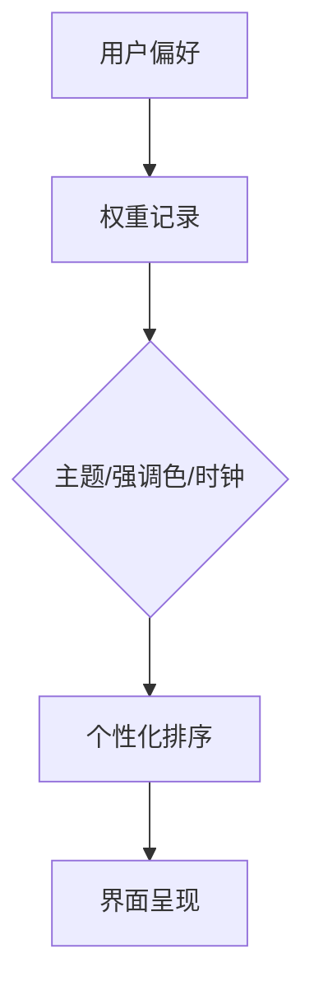

# 个性化

个性化统一管理明暗主题、时钟与强调色，不再提供单独的界面风格选择。普通状态固定使用标准模式；光感模式与超级语音统一归入一级“拓展”分类。



## 功能

### 首次欢迎

欢迎界面采用标准模式的包豪斯网格与 Braun SK4 式仪器秩序：品牌标识、时间刻度、问候语、语言、明暗与进入动作从上到下形成单一路径。问候语根据本地时段变化，中英文选择会同步软件语言、示例库和右侧文档；浅色/深色选择会在进入主界面前即时预览。进入按钮保持纯色，不使用泛光来争夺注意力。

<button class="doc-inline-demo" data-preview-action="welcome" data-preview-target="welcomeScreen">在左侧体验欢迎界面</button>

### 单一基础风格

- 标准是唯一基础风格：无悬浮阴影，以五级灰阶、明确网格、边界和留白建立高信息密度秩序。
- 原质态的材质表达并入光感模式，不再作为可单独选择的选项。
- 光感开启后由日照时段接管明暗、色温与玻璃材质；关闭后恢复标准模式以及此前选择的浅色或深色主题。

### 强调色管理

强调色面板采用与快捷索引一致的圆形“加号 → X”交互。新颜色保存到列表末尾；最多保留 6 个自定义颜色，超出时淘汰最旧项目。当前选中色使用加粗外框，而不是额外光晕。

强调色仅用于主要动作、开启状态、目录当前位置和少量品牌渐变。普通说明、边界和统计图默认使用灰阶，避免整页同时出现多个视觉焦点。

### 时钟

开启“时钟秒数”后，首页时间立即显示秒并持续刷新；关闭后恢复小时与分钟。12/24 小时制与秒数相互独立。

## 设计

### 默认视觉基线

默认组合为“浅色 + 标准”。标准模式使用黑、深灰、中灰、浅灰、白五级色阶和唯一强调色。卡片只通过实线边框识别层级，不使用悬浮阴影、玻璃模糊、炫光或无意义渐变。它的目标是长期使用时维持低注意力抢夺。

光感模式在同一信息结构上增加 Material 式半透明表面、柔和环境投影与日照色温，不改变尺寸或交互位置。开启光感后深浅模式开关会被锁定，关闭后立即恢复用户选择的主题与标准风格。

## 算法

### 反色规则

强调色可与任意主题组合。系统按颜色亮度动态选择深色或浅色前景，按钮、开关、选中项和标签均遵循同一反色变量，避免文字被背景吞没。

强调色是个性化的一个子模块，位于时钟控件下方。光感模式不再放在个性化内部，而是与超级语音一起位于独立的“拓展”大分类中。

### 强调色存储与淘汰

当前强调色持久化到 localStorage，同时维护最近 8 色的 LRU 历史，便于用户回切。

#### 存储键与校验

- **当前色 key**：`goto_accent`，值为 `#RRGGBB` 字符串。
- **历史色 key**：`goto_accent_history`，值为 JSON 数组，最多 8 项。

写入前用正则校验 HEX 格式，非法值拒绝写入并保留旧值：

```js
const HEX_RE = /^#[0-9A-Fa-f]{6}$/;
function saveAccent(hex) {
  if (!HEX_RE.test(hex)) {
    console.warn('[accent] invalid hex, rejected:', hex);
    return false;
  }
  localStorage.setItem('goto_accent', hex);
  pushAccentHistory(hex);
  return true;
}
```

#### 8 色 LRU 淘汰

历史色采用 LRU（最近最少使用）策略，最多保留 8 项：

1. 新选择的颜色若已存在于历史，先删除旧位再插入末尾（移到最新）。
2. 新颜色不存在于历史，直接插入末尾。
3. 超过 8 项时淘汰头部（最久未使用）。

```js
const ACCENT_HISTORY_MAX = 8;
function pushAccentHistory(hex) {
  let list = [];
  try {
    list = JSON.parse(localStorage.getItem('goto_accent_history') || '[]');
  } catch (e) { list = []; }
  // 去重：移除已存在项
  list = list.filter(c => c.toLowerCase() !== hex.toLowerCase());
  list.push(hex);
  // LRU 裁剪
  if (list.length > ACCENT_HISTORY_MAX) {
    list = list.slice(list.length - ACCENT_HISTORY_MAX);
  }
  localStorage.setItem('goto_accent_history', JSON.stringify(list));
}
```

#### 与面板上限的关系

| 上限来源 | 数量 | 作用 |
|---|---|---|
| 自定义颜色面板 | 6 | 界面可见的自定义颜色槽位，超出淘汰最旧 |
| LRU 历史 | 8 | 内部记录，含系统预设色，供回切参考 |

面板 6 项是 LRU 8 项的子集筛选结果（仅保留自定义来源），二者不冲突。

### 主题切换令牌重算

切换明暗主题或强调色时，需重算一组派生 CSS 变量（悬停态、禁用态、透明覆盖等），统一写入 `:root`。

#### 派生色计算

基于强调色 `--accent` 与主题基色 `--bg` / `--fg`，通过 `color-mix` 计算派生变量：

| CSS 变量 | 计算方式 | 用途 |
|---|---|---|
| `--accent-hover` | `color-mix(in srgb, var(--accent) 85%, white 15%)` | 悬停态 |
| `--accent-active` | `color-mix(in srgb, var(--accent) 75%, black 25%)` | 按下态 |
| `--accent-soft` | `color-mix(in srgb, var(--accent) 15%, var(--bg) 85%)` | 软背景 |
| `--accent-on` | 依据亮度自动选择黑/白 | 强调色上的文字 |
| `--accent-disabled` | `color-mix(in srgb, var(--accent) 40%, var(--bg) 60%)` | 禁用态 |

#### 重算流程

1. 遍历预定义的 CSS 变量清单。
2. 对每个变量调用 `color-mix` 计算派生值。
3. 批量写入 `:root` 的 `style` 属性，避免多次重排。

```js
function recomputeTokens(accent, theme) {
  const root = document.documentElement;
  const bg = getComputedStyle(root).getPropertyValue('--bg').trim();
  const fg = getComputedStyle(root).getPropertyValue('--fg').trim();
  const onAccent = relativeLuminance(accent) > 0.5 ? '#000000' : '#ffffff';
  const tokens = {
    '--accent': accent,
    '--accent-hover': `color-mix(in srgb, ${accent} 85%, white 15%)`,
    '--accent-active': `color-mix(in srgb, ${accent} 75%, black 25%)`,
    '--accent-soft': `color-mix(in srgb, ${accent} 15%, ${bg} 85%)`,
    '--accent-on': onAccent,
    '--accent-disabled': `color-mix(in srgb, ${accent} 40%, ${bg} 60%)`
  };
  // 批量写入，减少重排
  for (const [k, v] of Object.entries(tokens)) {
    root.style.setProperty(k, v);
  }
}
```

#### 强调色上文字的反色判定

`--accent-on` 通过相对亮度判定使用黑字还是白字，保证文字在强调色背景上可读：

```js
function relativeLuminance(hex) {
  const r = parseInt(hex.slice(1,3),16)/255;
  const g = parseInt(hex.slice(3,5),16)/255;
  const b = parseInt(hex.slice(5,7),16)/255;
  const lin = c => c <= 0.03928 ? c/12.92 : Math.pow((c+0.055)/1.055, 2.4);
  return 0.2126*lin(r) + 0.7152*lin(g) + 0.0722*lin(b);
}
```

亮度 > 0.5 用黑字，否则用白字（遵循 WCAG 对比度建议）。

### 时钟秒数刷新机制

开启「时钟秒数」后，首页时间显示到秒，采用节流的 `setInterval` 刷新，并响应页面可见性变化以节省资源。

#### 刷新策略

| 页面状态 | 刷新间隔 | 触发方式 |
|---|---|---|
| 前台可见 | 1000ms | `setInterval` |
| 后台隐藏 | 5000ms 节流 | `visibilitychange` 恢复时立即校准 |
| 关闭秒数 | 不刷新 | 仅显示时:分 |

#### 实现逻辑

```js
let clockTimer = null;
let clockThrottled = false;

function startClock(withSeconds) {
  stopClock();
  if (!withSeconds) {
    renderClock(false); // 仅时:分，一次渲染
    return;
  }
  const tick = () => renderClock(true);
  tick(); // 立即渲染一次
  clockTimer = setInterval(tick, 1000);
}

function stopClock() {
  if (clockTimer) {
    clearInterval(clockTimer);
    clockTimer = null;
  }
}

document.addEventListener('visibilitychange', () => {
  if (document.hidden) {
    // 后台：停止秒级刷新，降级为 5s 节流
    stopClock();
    clockThrottled = true;
    clockTimer = setInterval(() => renderClock(true), 5000);
  } else if (clockThrottled) {
    // 恢复前台：立即校准 + 恢复 1s 刷新
    stopClock();
    clockThrottled = false;
    renderClock(true); // 立即校准，避免显示旧秒数
    clockTimer = setInterval(() => renderClock(true), 1000);
  }
});
```

#### 校准对齐

为避免 `setInterval` 长时间漂移，每次渲染取 `Date.now()` 实际值而非累加计数：

```js
function renderClock(withSeconds) {
  const now = new Date();
  const h = String(now.getHours()).padStart(2, '0');
  const m = String(now.getMinutes()).padStart(2, '0');
  const text = withSeconds
    ? `${h}:${m}:${String(now.getSeconds()).padStart(2, '0')}`
    : `${h}:${m}`;
  document.getElementById('clock').textContent = text;
}
```

#### 12/24 小时制独立性

12/24 小时制与秒数开关相互独立，状态分别存储：

| 开关 | key | 默认值 |
|---|---|---|
| 时钟秒数 | `goto_clock_seconds` | `false` |
| 12/24 小时制 | `goto_clock_hour12` | `false`（24 小时） |

二者可任意组合，例如「12 小时制 + 显示秒数」合法。

### 权重记录与个性化排序

个性化模块记录用户对各候选的选择频次（weight），用于在多个候选中排序，使常用项靠前。

#### 权重写入

用户每选择一次某候选项，其 `weight` 自增 1，并归一化到 `[0,1]` 便于跨维度比较：

```js
function bumpWeight(key) {
  const weights = loadWeights();
  weights[key] = (weights[key] || 0) + 1;
  saveWeights(weights);
  normalizeWeights(weights);
}
function normalizeWeights(weights) {
  const max = Math.max(...Object.values(weights), 1);
  for (const k of Object.keys(weights)) {
    weights[k + '_norm'] = weights[k] / max; // 归一化值
  }
  return weights;
}
```

#### 排序算法

候选列表按 `weight` 降序排列，归一化值用于跨维度加权（如与相关度分数融合）：

```js
function sortByWeight(candidates, weights) {
  return candidates.slice().sort((a, b) => {
    const wa = weights[a.id] || 0;
    const wb = weights[b.id] || 0;
    if (wb !== wa) return wb - wa; // 权重降序
    return a.createdAt - b.createdAt; // 稳定排序
  });
}
```

#### 融合示例

个性化排序可与搜索相关度融合，最终分数为加权组合：

$$
\text{finalScore} = \alpha \cdot \text{relevance} + (1-\alpha) \cdot \text{weight}_{\text{norm}}
$$

其中 $\alpha \in [0,1]$ 控制相关度与个性化偏好的平衡，GOTO 默认 $\alpha = 0.7$（相关度优先）。

#### 权重衰减

为避免历史权重过度主导，采用指数衰减：每次写入时对全部权重乘以衰减因子 $\lambda = 0.95$，使旧选择影响逐渐降低：

```js
const LAMBDA = 0.95;
function decayWeights(weights) {
  for (const k of Object.keys(weights)) {
    if (k.endsWith('_norm')) continue;
    weights[k] *= LAMBDA;
  }
  return weights;
}
```

衰减在每次 `bumpWeight` 前执行，保证近期选择权重相对提升。

## 边界

### 验收要点

- 标准模式所有主卡片阴影计算值为 none。
- 页面不存在独立的质态选择；历史 `neumorphic` 配置会迁移为标准模式。
- 新保存颜色始终出现在自定义颜色末尾。
- 第 7 个自定义颜色保存后，最旧颜色被移除。

### 鲁棒性优化

| 边界场景 | 触发条件 | 处理策略 | 兜底表现 |
| --- | --- | --- | --- |
| 个性化数据为空（冷启动） | 首次启动或个性化数据被清除 | 加载“浅色 + 标准”默认组合与默认强调色，不触发迁移 | 进入标准模式，主题、强调色与时钟均为初始值 |
| 键盘布局未识别 | 读取键盘布局失败或返回未知枚举 | 跳过布局相关个性化项，沿用系统默认布局 | 主题与强调色不受影响，仅布局项回退 |
| 个性化配置文件损坏 | 配置文件解析异常或关键字段缺失 | 丢弃损坏字段，与默认值合并后重建配置并备份原文件 | 保留可读字段，损坏部分重置为默认，不阻塞启动 |
| 快照数据过期 | 快照时间戳超出有效周期或与当前时段偏差过大 | 标记过期快照不可用并触发重新采集 | 回退到最近一次有效状态，无采集时不应用时段推断 |
| SharedPreferences 访问失败 | 读写抛出 IO 或权限异常 | 内存缓存兜底，写入重试有限次后放弃并记录日志 | 当前会话内可用，重启后丢失本次变更 |
| 个性化权重极端值 | 权重为 NaN/Infinity 或超出合法阈值 | 钳制到合法区间并记录告警，不参与本次计算 | 输出稳定，界面不出现抖动或闪烁 |

> 版本: v4.0 | 最后更新: 2026-07-24
