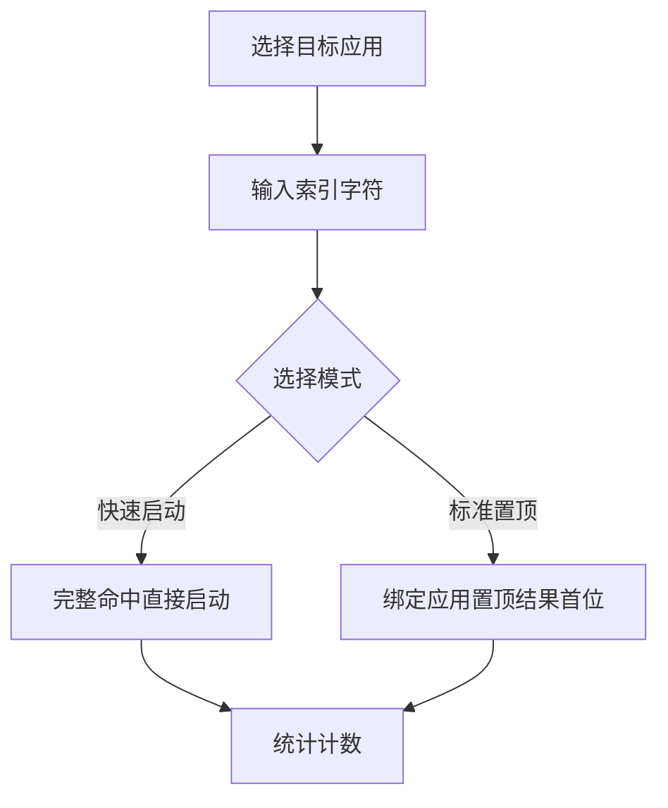

# 快捷索引

## 功能

### 功能定位

GOTO 只有一个核心交互入口：搜索框。快捷索引是搜索输入的增强能力，不建立第二套入口，也不脱离搜索流程。快捷手势不属于当前产品范围。



### 数据与统计

快捷索引复用普通搜索结果的统一启动链路，因此真实启动、最近使用、实时统计和“已打开 XX”反馈保持一致。只有从 GOTO 内实际启动应用且统计功能已激活时才计数。

## 设计

### 声明式创建

编辑器使用一句接近用户意图的表达：

> 我想要打开 **目标应用**，通过输入 **索引字符**。

用户先选择应用，再输入字符，最后选择“快速启动”或“标准置顶”并保存。界面不再重复显示“索引应用”“索引字符”等表单标题。

- **快速启动**：完整命中后直接走统一应用启动链路。
- **标准置顶**：生成搜索结果后将绑定应用稳定置于第一位。
- **保存与删除**：按钮占满编辑器宽度；删除只在编辑已有索引时出现。

### 总开关、子开关与模式

- 打开总开关时，全部子项同步开启；关闭总开关时，全部子项同步关闭。
- 总开关关闭时开启任一子项，总开关同步开启。
- 总开关开启时关闭最后一个子项，总开关同步关闭。
- 总开关和子项使用同一种开关样式；相邻模式按钮只负责在快速与标准之间切换。

## 算法

### 大小写策略

用户不需要管理“区分大小写”开关。同一小写归一组只有一种写法时兼容大小写；当 `w` 与 `W` 等相似索引同时存在时，该组自动切换为精确匹配。删除冲突项后恢复兼容。

### 索引字符匹配优先级

搜索输入与快捷索引的匹配按三级优先级裁决，分数高者优先排前。同一结果内只取最高分，不累加。

| 优先级 | 匹配类型 | 分数 | 判定条件 |
|---|---|---|---|
| 1 | 精确匹配 | 1000 | `input === shortcut.char`（考虑大小写组策略） |
| 2 | 前缀匹配 | 800 | `shortcut.char.startsWith(input)` 且非精确 |
| 3 | 包含匹配 | 600 | `shortcut.char.includes(input)` 且非前缀 |

```js
function scoreShortcut(input, char, caseSensitive) {
  const a = caseSensitive ? input : input.toLowerCase();
  const b = caseSensitive ? char : char.toLowerCase();
  if (a === b) return 1000;
  if (b.startsWith(a)) return 800;
  if (b.includes(a)) return 600;
  return -1; // 不命中
}
```

#### 命中筛选与排序

1. 遍历所有**已激活**的快捷索引项，未激活项跳过且不计数。
2. 对每项计算分数，`score < 0` 的项排除。
3. 按分数降序排列；同分时按 `createdAt` 升序（先创建者靠前），保证排序稳定可复现。
4. 将命中的快捷项与普通搜索候选合并进入最终结果列表。

```js
function matchShortcuts(input, shortcuts) {
  const hits = [];
  for (const s of shortcuts) {
    if (!s.active) continue;
    const score = scoreShortcut(input, s.char, s.caseSensitive);
    if (score < 0) continue;
    hits.push({ ...s, score });
  }
  hits.sort((x, y) =>
    y.score - x.score || x.createdAt - y.createdAt);
  return hits;
}
```

### 快速启动与标准置顶的排序注入

两种模式对候选列表的注入策略不同，决定它们在结果中的位置：

| 模式 | 注入位置 | 行为 |
|---|---|---|
| 快速启动 | 独占顶部 | 完整命中时直接走启动链路，**不进入普通候选列表**；输入与索引字符完全一致时立即触发 |
| 标准置顶 | 融入候选首位 | 绑定应用按分数注入候选列表，并强制置于第 1 位，其余候选项顺延 |

#### 快速启动触发判定

快速启动只在**精确匹配（score === 1000）**时触发，前缀与包含不触发，避免输入中途误启动：

```js
function tryQuickLaunch(input, hits) {
  const top = hits[0];
  if (top && top.mode === 'quick' && top.score === 1000) {
    launchApp(top.packageName);
    recordShortcutHit(top.id);
    return true;
  }
  return false;
}
```

#### 标准置顶注入逻辑

标准置顶项不抢占比普通候选更高的分数，而是通过**位次强制**置顶：

```js
function injectPinned(hits, normalCandidates) {
  const pinned = hits.filter(h => h.mode === 'pinned');
  const rest = normalCandidates.filter(
    c => !pinned.some(p => p.packageName === c.packageName));
  // 置顶项按其分数内部排序，整体置于列表头部
  pinned.sort((a, b) => b.score - a.score);
  return [...pinned, ...rest];
}
```

#### 注入对比示例

输入 `w`，快捷索引含 `w → 企业微信(标准置顶)`、`www → 企业微信(标准置顶)`：

| 候选 | 来源 | 分数 | 最终位次 |
|---|---|---|---|
| 企业微信 | 快捷索引 `w` | 1000 | 第 1 位（强制置顶） |
| 企业微信 | 快捷索引 `www` | 800 | 与上同应用去重，保留高分项 |
| 微信 | 普通搜索 | — | 第 2 位 |
| 网易云音乐 | 普通搜索 | — | 第 3 位 |

### 统计计数触发条件

只有满足全部条件才写入快捷索引命中计数，避免误统计：

1. 应用从 GOTO 内**实际启动**（走统一启动链路，非外部唤起）。
2. 统计功能已激活（未激活时只走启动链路，不落计数）。
3. 启动来源确实是快捷索引匹配（非首页卡片、非普通搜索结果）。

```js
function recordShortcutHit(shortcutId) {
  if (!statsActivated()) return;          // 统计未激活不计数
  if (!launchSource.isShortcut) return;   // 非快捷来源不计数
  bumpCount(`goto_shortcut_hits`, shortcutId);
  schedulePersist();                      // 防抖落盘
}
```

#### 防抖与持久化

计数先在内存累加，**500ms 防抖**后批量写入 localStorage，避免高频点击导致存储写入抖动：

```js
let persistTimer = null;
function schedulePersist() {
  if (persistTimer) clearTimeout(persistTimer);
  persistTimer = setTimeout(flushHitsToStorage, 500);
}
```

#### LRU 上限 100 条

`goto_shortcut_hits` 采用 LRU 结构，最多保留 100 个快捷项的计数记录，超出时淘汰最久未命中项：

```js
const HITS_LRU_MAX = 100;
function bumpCount(store, id) {
  const map = readMap(store);          // Map 保序
  map.delete(id);                      // 删除旧位
  map.set(id, (map.get(id) || 0) + 1); // 重新插入到末尾
  if (map.size > HITS_LRU_MAX) {
    const oldest = map.keys().next().value;
    map.delete(oldest);                // 淘汰头部
  }
  writeMap(store, map);
}
```

### 冲突检测算法

保存快捷索引前执行冲突检测，避免同一索引字符绑定多个应用导致歧义。

#### 检测步骤

1. **大小写归一化比较**：将待保存字符与已有索引字符按当前组的大小写策略归一化。
2. **同组冲突判定**：若归一化后字符相同，且不属于允许的「精确分组」场景，判定为冲突。
3. **生成冲突列表**：收集所有冲突项返回给用户，高亮提示。

```js
function detectConflicts(candidate, shortcuts) {
  const conflicts = [];
  const norm = candidate.char.toLowerCase();
  for (const s of shortcuts) {
    if (s.id === candidate.id) continue;          // 编辑自身不冲突
    const sNorm = s.char.toLowerCase();
    // 同小写归一组：只有当二者都显式区分大小写时才不冲突
    const bothExplicit = s.char !== sNorm && candidate.char !== norm;
    if (sNorm === norm && !bothExplicit) {
      conflicts.push(s);
    }
  }
  return conflicts;
}
```

#### 冲突提示策略

| 冲突类型 | 处置 | 用户提示 |
|---|---|---|
| 同字符同模式 | 拒绝保存 | 「索引 X 已绑定 Y，请先删除或修改」 |
| 同字符不同模式 | 拒绝保存 | 「X 已作为快速启动/标准置顶绑定，不可重复」 |
| 大小写变体冲突 | 拒绝保存 | 「X 与已有索引 Y 冲突，将切换为精确匹配，是否继续？」 |
| 无冲突 | 直接保存 | — |

### 9 应用上限裁剪策略

文件夹类应用展开后的快捷索引数量受 9 项上限约束，超出部分降级处理。

#### 裁剪流程

1. 按**使用频率降序**排列候选快捷项（取自 `goto_shortcut_hits` 计数，未命中项频率记为 0）。
2. 频率相同者按 `createdAt` 升序（先创建者保留）。
3. 取 Top 9 生效，第 10 项及之后**降级为普通候选**，仍可在普通搜索中命中，只是不再享有快捷索引的置顶/快速启动能力。

```js
const SHORTCUT_MAX = 9;
function pruneShortcuts(shortcuts, hits) {
  const sorted = shortcuts.slice().sort((a, b) => {
    const fa = hits.get(a.id) || 0;
    const fb = hits.get(b.id) || 0;
    if (fb !== fa) return fb - fa;       // 频率降序
    return a.createdAt - b.createdAt;    // 创建升序
  });
  return {
    active: sorted.slice(0, SHORTCUT_MAX),
    degraded: sorted.slice(SHORTCUT_MAX) // 降级为普通候选
  };
}
```

#### 降级后行为

| 属性 | 生效项（Top 9） | 降级项（>9） |
|---|---|---|
| 快速启动 | 可触发 | 不可触发 |
| 标准置顶 | 可置顶 | 不置顶 |
| 命中计数 | 计入 | 计入（用于未来回升） |
| 普通搜索命中 | 是 | 是 |

用户界面提示「超出 9 项上限，已按使用频率精简，其余应用仍可通过搜索启动」。

### 持久化数据结构

快捷索引数据持久化到 localStorage，单 key 存储完整索引数组。

#### 存储键与结构

- **key**：`goto_shortcut_index`
- **value**：JSON 序列化的数组

```json
[
  {
    "id": "sc_1700000000001",
    "packageName": "com.tencent.wework",
    "name": "企业微信",
    "char": "w",
    "mode": "pinned",
    "active": true,
    "caseSensitive": false,
    "createdAt": 1700000000001,
    "updatedAt": 1700000000001
  },
  {
    "id": "sc_1700000000002",
    "packageName": "com.netease.cloudmusic",
    "name": "网易云音乐",
    "char": "www",
    "mode": "pinned",
    "active": true,
    "caseSensitive": false,
    "createdAt": 1700000000002,
    "updatedAt": 1700000000002
  }
]
```

#### 字段说明

| 字段 | 类型 | 说明 |
|---|---|---|
| `id` | string | 唯一标识，`sc_` + 时间戳 |
| `packageName` | string | 目标应用包名，启动链路依据 |
| `name` | string | 应用显示名，用于冲突提示与列表渲染 |
| `char` | string | 索引字符，1–3 个字符 |
| `mode` | string | `quick`（快速启动）/ `pinned`（标准置顶） |
| `active` | boolean | 是否激活，未激活不参与匹配与计数 |
| `caseSensitive` | boolean | 该组是否已切换为精确匹配（冲突时自动置 true） |
| `createdAt` | number | 创建时间戳，用于稳定排序 |
| `updatedAt` | number | 最后修改时间戳 |

#### 写入与读取

```js
function loadShortcuts() {
  try {
    return JSON.parse(localStorage.getItem('goto_shortcut_index') || '[]');
  } catch (e) {
    console.warn('[shortcut] parse failed, fallback to []', e);
    return [];
  }
}
function saveShortcuts(list) {
  try {
    localStorage.setItem('goto_shortcut_index', JSON.stringify(list));
  } catch (e) {
    // localStorage 写入失败，降级为内存缓存
    memoryCache.shortcutIndex = list;
    console.warn('[shortcut] persist failed, use memory cache', e);
  }
}
```

## 边界

### 验收标准

- `www` 绑定企业微信并选择标准置顶后，企业微信位于结果首位。
- 单独存在 `w` 时，`W` 可以命中；二者并存时分别精确命中。
- 未激活条目不触发、不计数。
- 保存、编辑、删除和开关操作立即持久化。

### 鲁棒性优化

| 边界场景 | 处理策略 |
| --- | --- |
| 快捷操作列表为空 | 渲染空状态占位并引导用户创建首个快捷操作，不展示空列表容器 |
| 文件夹应用数量超过9个 | 仅取前 9 项生效，超出部分忽略并向用户提示精简 |
| 手势录制中断 | 丢弃未完成的录制数据，恢复至上一稳定状态，提示用户重新录制 |
| 高频应用窗口无数据 | 回退到默认排序，不阻塞主搜索流程 |
| 快捷操作冲突 | 检测到索引或手势冲突时拒绝保存并高亮冲突项，提示用户修改 |
| localStorage 存储失败 | 捕获异常后降级为内存缓存，会话内保持可用，并在控制台告警 |
