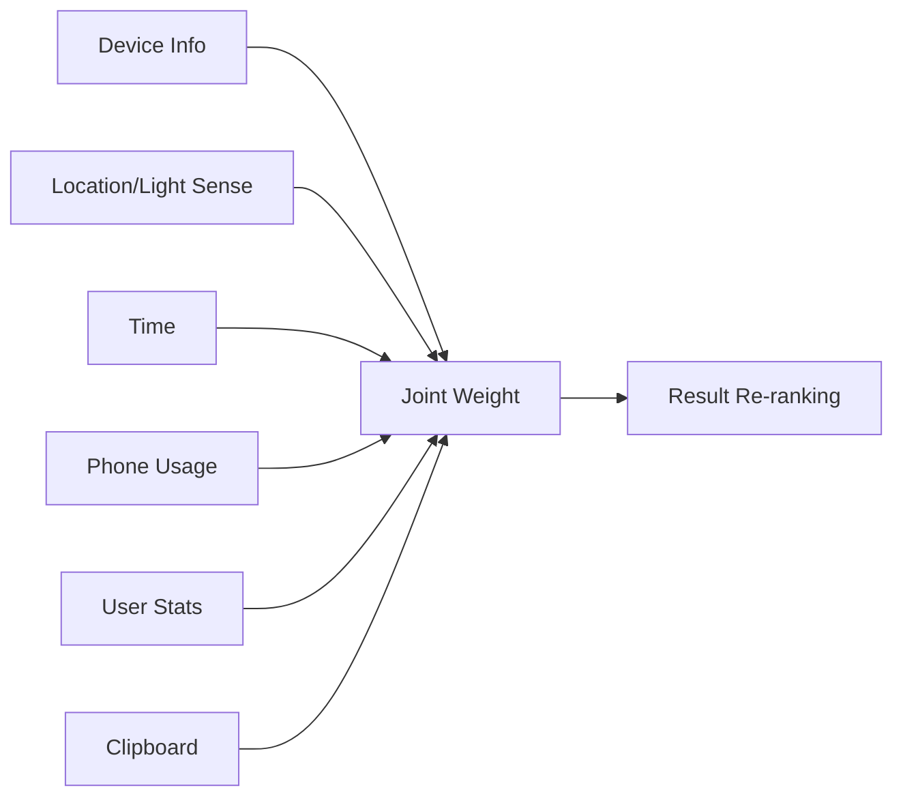
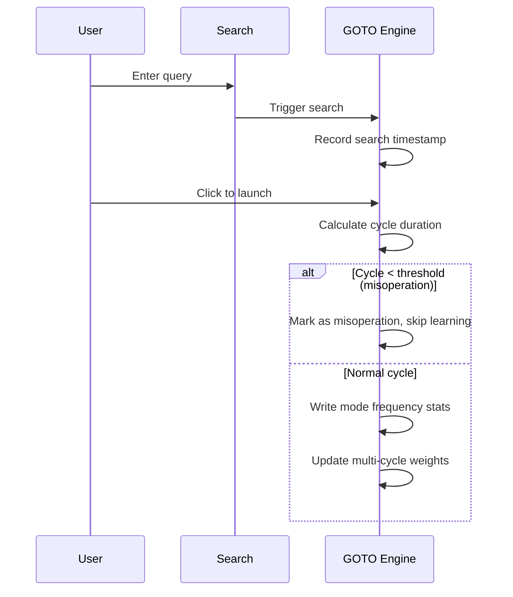

# Smart Intuition and Chain-of-Action

Smart Intuition is GOTO’s deterministic local recommendation layer. It predicts a likely next action from hourly usage, all-day frequency, query memory, and A→B action chains.

## Core behavior

- 24 hourly buckets model time-specific habits.
- Chain-of-Action stores app transitions and promotes edges above the confidence threshold.
- A 220-item memory store decays with a 30-day half-life.
- Negative feedback blocks an incorrect suggestion for three days, then allows recovery.
- Self-healing prunes stale memory and weak chain edges.

The visible Smart Hint appears only after the first search-box focus, shows a time-aware greeting and at most two predicted apps, and uses local data only. It is not a floating-window feature.

## Runtime path and acceptance

When enabled, successful launches can update local preference weights, action chains, hourly patterns, and temporary negative-feedback blocks. These signals adjust ranking only after a retrieval candidate exists. When disabled, learned weights and block flags do not affect current results and no new learning sample is written.

Regression coverage includes learning isolation, weight application, block-flag isolation, deterministic recommendations, and local-only persistence.

## Enhanced Simulated Intelligence

Building on the base simulated intelligence, the enhanced mode introduces:

- **Euclidean Distance Optimization**: Key distance calculation adds row stagger compensation (QWERTY row offset `[0, 0.5, 1.25]`) and diagonal penalty (0.15) for more accurate physical key distance.
- **Multi-dimensional Parallel Search**: Fuzzy matching uses independent event union — each mode (initial, T9, prefix, char, full pinyin) computes independently then merges results.
- **Mode Frequency Statistics**: Backend records which fuzzy match mode contributes most per search; multi-cycle statistics adjust weights to favor high-frequency modes.
- **Search Cycle Recording**: "Search → click launch" counts as one cycle. Rapid launches within short intervals are treated as misoperations, sharing the same correction logic as adaptive refresh.
- **Fast Render Path**: When input is very fast (interval < 50ms) and highly matched, adaptive refresh is skipped for direct rendering.
- **Hesitation Compensation Delay**: When Gaussian key distance decay or adjacent key swap correction triggers, a Δ_hesitate delay is added to the debounce formula.

## Micro-Context — Core of Enhanced Simulated Intelligence

Micro-Context combines six dimensions to compute recommendation weights, active only when enhanced simulated intelligence is enabled:



| Dimension | Source | Weight Example |
| --- | --- | --- |
| Device Info | Model, SDK, screen size | Low-end device (SDK<24) penalizes heavy apps (-20) |
| Location/Light | Light sense mode, GPS | Light sense: navigation +30, music +15 |
| Time | Current hour | Late night: clock/sleep +35, morning rush: news/maps +25 |
| Phone Usage | Screen-on minutes, app switches | Long usage (>120min): entertainment +25, frequent switching (>8): productivity +20 |
| User Stats | Historical selection frequency | App selected ≥3 times for query: +8/time (max +30) |
| Clipboard | Content type (tracking/url/phone/text) | Tracking number → logistics apps +40, URL → browser +35 |

**Permission Mapping**:
- Web: Auto-injects mock data when enhanced sim int is enabled (no UI permission toggle)
- Kotlin: Maps to real system permissions (USAGE_STATS, LOCATION, clipboard read)

## Physical Hardware Action Recommendation

Backend infers user intent from hardware connection states for zero-input recommendations. This feature is hidden from users, serving only as an algorithm-layer enhancement:

| Hardware Action | System State | Inferred Intent | Top 1~2 Recommendations |
| --- | --- | --- | --- |
| Plug charger | AC / fast charging | Rest, charge & watch | Video/social, desk clock, charge monitor |
| USB to PC | File transfer / debug | Transfer files, debug, sync | File manager, transfer tool, ADB tool |
| Wireless charging | Desk/bedside rest | Enter immersive mode | Todo (Lindo), pomodoro, alarm |
| Plug headphones | 3.5mm / Type-C | Listen, watch, quiet | Music app, Bilibili, podcast |
| Car Bluetooth | Driving | Navigate, car music | Maps, car music, voice assistant |
| OTG peripheral | USB drive / HDD | Read external data | Archive tool, doc reader, media player |

## Search Cycle & Misoperation Detection



## Smart Reminder Floating Window

The "lightweight reminder boundary" of simulated intelligence already has one layer inside the search box; the smart reminder floating window is a **second outlet that sits alongside, but independent of, the search box**, placed under the "Enhanced Simulated Intelligence" toggle. Its goal is not to replace the in-box hint card but to cover cases where the user is **not inside the search box** yet still benefits from a prediction hit.

### Interaction states

| State | Visual form | Trigger |
| --- | --- | --- |
| Idle | A small rounded-rectangle dot hugging the top-left or top-right screen edge (icon only) | Simulated intelligence on, no prediction hit |
| Hit | Expands horizontally into a card: `GOTO Recommend open QQ?` + `Yes / No` | Action chain hit or HMM confidence above threshold |
| Accept | Card fades out, GOTO directly launches the target app | User clicks "Yes" |
| Reject | Card retracts to the idle dot, weights adjusted | User clicks "No" |
| Off | Fully hidden | User turns off the "Smart Reminder Floating Window" toggle in settings |

### Decision and feedback flow

```mermaid
flowchart LR
    A[User launches app X] --> B[Backend action chain query X→Y]
    C[HMM computes P(Y|X)] --> B
    B --> D{Confidence ≥ threshold?}
    D -- No --> E[Stay as idle dot]
    D -- Yes --> F[Floating window expands into card]
    F --> G{User choice}
    G -- Yes --> H[GOTO directly launches Y]
    G -- No --> I[Action chain weight -0.3<br/>block flag for 3 days]
    H --> J[Action chain weight +1.0<br/>HMM transition reinforced]
```

### Division of labor with the in-search-box hint card

| Dimension | In-box hint card | Floating window |
| --- | --- | --- |
| Surface | User has focused the search box (FOCUS phase) | User is outside the search box, on any screen |
| Trigger signal | Hourly frequency + recent action chain | Action chain + HMM confidence |
| Visual layer | Embedded in the search box extension area | Independent floating layer, does not block the main screen |
| User action | Tap candidate to launch directly | Tap "Yes" to launch via GOTO; tap "No" to down-weight |
| Data source | `chainStore` + `hourBuckets` | `chainStore` + `hiddenMarkovModel` |

The two **share** `chainStore`, `hourBuckets`, `weights`, and `blockFlags` in local storage; they never double-write. Accept/reject signals from the floating window flow back into the unified learning pipeline of simulated intelligence, keeping weights consistent with the in-box hint card.

### Hidden Markov Model

On top of the existing action chain (first-order transition probabilities), the backend additionally maintains a **hidden Markov model** to infer hidden states (e.g. "work stream", "social stream", "commute stream") on top of the user's observable behavior.

- **Observable states**: the user's actual launch sequence (e.g. WeChat → QQ → Feishu).
- **Hidden states**: the backend-inferred current behavior stream (e.g. `work_session`, `social_session`, `commute_session`).
- **Transition matrix**: `A_ij = P(hidden_j | hidden_i)`; each hidden state maintains an emission distribution `B_j(app)`.
- **Update rule**: when the user accepts a recommendation, both the transition `A_ij` and the emission `B_j(app)` are reinforced; on rejection, only `B_j(app)` is decayed — `A_ij` is left untouched, so a single rejection does not contaminate the whole stream.
- **Cold start**: the initial hidden state count is 3 (work / social / other); it can grow up to 8 as samples accumulate, after which similar states are merged by explained variance.
- **Coordination with simulated intelligence**: the HMM only produces "recommended candidate + confidence"; it does not rewrite search-result ranking directly. Whether to actually display is still gated by the unified simulated-intelligence policy (insufficient evidence → stay blank).

### Boundaries

1. The floating window may appear only when simulated intelligence is on; it is force-hidden when simulated intelligence is off.
2. The floating window does not read third-party app internals, does not make network requests; all inference is local.
3. The same app is not re-recommended within 5 minutes, to avoid noise.
4. The HMM transition matrix is stored locally, never uploaded; it can be inspected and cleared under "Data & Config".

<button class="doc-inline-demo" data-preview-action="settings" data-preview-target="pioneerCard">Inspect the floating-window demo on the left</button>

*This document is based on goto-engine.js v3.3, last updated July 2026*
