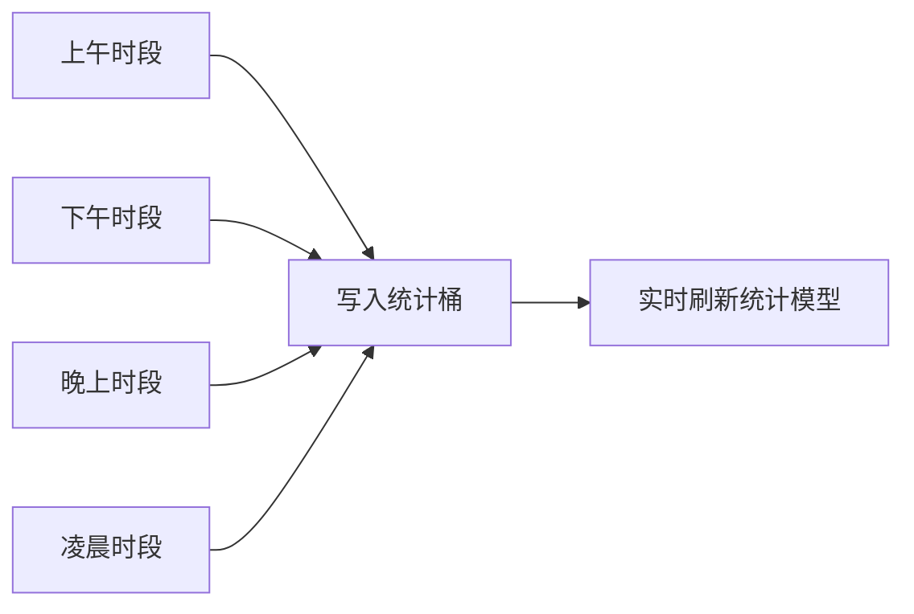

# 统计功能

> 统计不是预置仪表盘。未激活时所有数字保持 0；激活后只记录从 GOTO 内完成的应用启动，样本不足的图表在界面中显示 `—`，不填充演示数据。



<button class="doc-inline-demo" data-preview-action="stats" data-preview-target="statsThanksCard">在左侧打开统计页面</button>

## 功能

### 从数据到模拟智能

统计页除累计搜索、累计启动、总输入字符、平均每日、快捷索引、一日内趋势、24 小时热力图和应用排名外，还显示四项可解释指标：

- **首选命中率**：用户最终选择第一候选的比例。
- **搜索转启动率**：搜索记录中真正完成应用内启动的比例。
- **行为链稳定度**：同一动作之后最常见下一动作的加权置信度。
- **时段画像完整度**：24 个小时桶中存在真实启动样本的覆盖率。

这些指标直接辅助模拟智能判断“是否有足够依据”，不会用示例数据补齐。

<button class="doc-inline-demo" data-preview-action="stats" data-preview-target="statsIntelligenceCard">定位到模拟智能辅助指标</button>

### 指标口径

- 累计搜索：激活后的有效搜索刷新次数。
- 累计启动：激活后通过搜索结果、首页卡片或快捷索引实际启动应用的次数。
- 总输入字符：四个时段桶中的有效输入样本。
- 平均每日：基于本地统计周期计算，不使用预测值。
- 快捷索引：快速启动和标准置顶的有效命中次数。

快捷手势已退出产品范围，因此统计页面、导出数据和当前功能文档均不再提供手势指标。

### 实时更新

搜索、应用启动和快捷索引命中采用事件写入：数据落盘后立即刷新统计模型。独立的轻量同步器每秒校准一次界面，因此统计页无论是否打开，数据都会持续记录并在打开时呈现最新状态。

### 首页卡片的数据关系

- **未激活统计**：最近、常用卡片不读取历史残留，也不填充演示数据，显示“该功能依赖统计功能实现”。
- **已激活但无样本**：对应卡片显示 `—`，明确区分“功能不可用”和“有功能但暂无数据”。底层计算仍可用 `null` 表示不可计算，但不直接暴露给用户。
- **最近**：读取 24 个小时分桶中与当前小时相同的真实启动样本，按次数排序，最多展示 6 个应用。
- **常用**：读取激活后的全时段累计启动次数，最多展示 6 个应用。

统计关闭时，搜索与启动事件不会写入上述统计桶；首次激活会先清理旧预览残留，再从零开始。

### 数据管理

统计导出使用 `goto-transfer` v2 数据包。未激活时导出为空统计集；统计包不包含激活状态。清空统计会清除四个时段桶、快捷索引次数、启动记录和学习记忆，并将当前页面恢复为初始状态。

### 清空数据的确认流

“清空统计数据”位于统计卡片体系之外。第一次点击后按钮向下延展，展示责任边界和倒计时；倒计时结束后才出现可执行的“我已确认”，用户仍可取消。完成后只清除统计、行为记忆与激活状态，保留授权和普通设置。

## 设计

### 激活边界

统计功能默认未激活。用户在统计页长按激活卡片后，才开始记录搜索、启动、输入字符、时段与快捷索引数据。

未激活时所有指标必须显示为 `0`，图表显示空状态；页面不得读取或展示旧预览、测试数据。首次激活会建立干净基线，激活状态不能通过配置导入获得。

## 算法

### 智能统计应用启动排名

与 24 小时分时段排名（严格按小时分段）不同，智能排名基于 GOTO 使用间隔动态聚类时段。

#### 切分逻辑

1. **仅以 GOTO 启动事件为切分点**：用户通过 GOTO 启动应用的时间点作为时段边界。
2. **最小间隔过滤**：相邻 GOTO 启动间隔 < 5 分钟时视为同一时段内的连续操作，不形成新切分点。
3. **最大间隔截断**：相邻切分点间隔 > 6 小时时跳过该时段，不形成过长时段。
4. **时段区间可重叠**：边界点同时属于前后两个时段。
5. **应用可多时段出现**：同一应用可在多个时段的 Top 5 中重复出现。

#### 示例

用户 13:02 通过 GOTO 启动微信，18:02 再次通过 GOTO 启动抖音 → 形成时段 13:02–18:02，该时段内所有应用启动（含非 GOTO 启动）计入排名。

#### 数据展示

每个时段显示：
- 时间区间（如 13:02–18:02）
- 总启动次数和持续时长
- Top 5 应用排名（按启动次数降序）

该卡片独立运行，与 24 小时分时段排名卡片共同展示，互不影响。

### 24 小时热力图聚合

热力图将一天 24 小时按整点分桶，统计每小时的启动次数，再归一化映射到颜色深度。

#### 分桶算法

```js
function aggregateHourly(launchRecords) {
  // 初始化 24 个桶为 0
  const buckets = new Array(24).fill(0);
  for (const rec of launchRecords) {
    const h = new Date(rec.timestamp).getHours(); // 0-23
    buckets[h]++;
  }
  return buckets;
}
```

跨午夜时段（如 23:00–02:00）按实际小时归档到对应桶，不折叠到单日，保证热力图反映真实小时分布。

#### 归一化与颜色映射

将每个桶的计数归一化到 `[0,1]`，再映射到颜色深度（0 = 最浅，1 = 最深）：

```js
function normalizeBuckets(buckets) {
  const max = Math.max(...buckets, 1); // 避免除以 0
  return buckets.map(c => c / max);
}
function heatColor(norm) {
  // 0 → 浅灰，1 → 强调色
  const alpha = 0.15 + norm * 0.85; // [0.15, 1.0]
  return `rgba(59, 130, 246, ${alpha.toFixed(2)})`; // 强调色蓝
}
```

#### 颜色梯度表

| 归一化值 | alpha | 视觉强度 |
|---|---|---|
| 0.0 | 0.15 | 几乎透明（无活动） |
| 0.25 | 0.36 | 浅 |
| 0.5 | 0.58 | 中 |
| 0.75 | 0.79 | 深 |
| 1.0 | 1.0 | 满色（活动峰值） |

无样本的小时（计数为 0）显示为最浅色而非空白，保持 24 格视觉连续性。

### 四项可解释指标计算

模拟智能辅助卡片展示的四项指标，公式明确可解释，不使用黑盒预测值。

#### 1. 首选命中率

衡量搜索结果首位是否命中用户意图：

$$
\text{首选命中率} = \frac{\text{首选点击次数}}{\text{总搜索次数}}
$$

```js
function firstHitRate(stats) {
  const total = stats.searchCount;
  if (total === 0) return null; // 无样本显示 NULL
  return stats.firstChoiceClicks / total;
}
```

#### 2. 搜索转启动率

衡量搜索是否真正促成应用启动：

$$
\text{搜索转启动率} = \frac{\text{启动次数（来源=搜索）}}{\text{搜索次数}}
$$

```js
function searchToLaunchRate(stats) {
  if (stats.searchCount === 0) return null;
  return stats.launchFromSearch / stats.searchCount;
}
```

注意分子只统计「来源=搜索」的启动，不含首页卡片与快捷索引启动，避免与首选命中率重复加权。

#### 3. 行为链稳定度

基于动作转移矩阵，取每个动作的 top-1 转移概率的平均值：

$$
\text{行为链稳定度} = \frac{1}{|S|} \sum_{s \in S} \max_{s'} P(s \to s')
$$

其中 $S$ 为出现过的源动作集合，$P(s \to s')$ 为从动作 $s$ 转移到 $s'$ 的经验概率。

```js
function behaviorStability(chain) {
  // chain: { sourceAction: { targetAction: count } }
  const sources = Object.keys(chain);
  if (sources.length === 0) return null;
  let sum = 0;
  for (const s of sources) {
    const targets = chain[s];
    const total = Object.values(targets).reduce((a,b)=>a+b, 0);
    if (total === 0) continue;
    const top1 = Math.max(...Object.values(targets));
    sum += top1 / total;
  }
  return sum / sources.length;
}
```

#### 4. 时段画像完整度

24 个小时桶中存在真实启动样本的覆盖率：

$$
\text{时段画像完整度} = \frac{\text{已记录小时数}}{24}
$$

```js
function hourProfileCompleteness(buckets) {
  const recorded = buckets.filter(c => c > 0).length;
  return recorded / 24;
}
```

#### 指标无样本处理

| 指标 | 无样本时 | 显示 |
|---|---|---|
| 首选命中率 | 分母为 0 | `NULL` |
| 搜索转启动率 | 分母为 0 | `NULL` |
| 行为链稳定度 | 转移矩阵为空 | `NULL` |
| 时段画像完整度 | 全 0 桶 | `0`（明确为 0，非 NULL） |

完整度始终有定义（最小值 0），因此无样本时显示 `0` 而非 `NULL`，与其他三项区分。

### 分页读取与虚拟滚动

统计记录超过阈值时启用分页读取与虚拟滚动，避免一次性渲染大量数据导致卡顿。

#### 分页参数

| 参数 | 值 | 说明 |
|---|---|---|
| 单页条数 | 50 | 每次从存储读取 50 条 |
| 渲染窗口 | 视口可见 + 上下缓冲各 10 条 | 虚拟滚动仅渲染可见区域 |
| 预加载触发 | 距底部 20 条时 | IntersectionObserver 检测哨兵元素 |

#### 预加载触发

列表底部放置哨兵元素，进入视口时触发下一页加载：

```js
const sentinel = document.getElementById('list-sentinel');
const observer = new IntersectionObserver((entries) => {
  if (entries[0].isIntersecting && hasMore) {
    loadNextPage();
  }
}, { rootMargin: '200px' }); // 提前 200px 触发
observer.observe(sentinel);
```

#### 加载流程

```js
let page = 0;
let hasMore = true;
async function loadNextPage() {
  if (!hasMore) return;
  page++;
  const records = await readStatsPage(page, 50); // 按时间倒序
  if (records.length < 50) hasMore = false;
  appendToVirtualList(records);
}
```

#### 边界处理

| 场景 | 处理 |
|---|---|
| 总记录 < 50 | 不分页，一次渲染全部 |
| 记录 > 10000 | 仅按时间倒序截断近 10000 条参与模型刷新，避免计算抖动 |
| 快速滚动 | 预加载请求合并，避免重复请求同一页 |
| 存储读取失败 | 显示已加载部分 + 错误提示，不阻塞已渲染内容 |

## 边界

### 验收标准

1. 未激活时全部数字为零，即使本地存在旧测试数据。
2. 激活后完成一次搜索，累计搜索立即增加。
3. 激活后启动一次应用，累计启动立即增加。
4. 激活后命中一次快捷索引，快捷索引次数立即增加。
5. 关闭统计页面执行上述行为，再次打开时数据不得延迟或丢失。
6. 未激活时首页最近/常用显示依赖提示；激活无数据时显示 `NULL`。
7. 同一应用在当前小时启动后进入最近排序，在任意时段累计启动后参与常用排序。

### 鲁棒性优化

| 边界场景 | 处理策略 | 预期行为 |
| --- | --- | --- |
| 统计数据为空（冷启动） | 不使用示例数据补齐，所有指标保持 0，图表显示空状态 | 页面呈现干净基线，激活后从零开始记录 |
| 统计数据量过大（>10000 条记录） | 触发分页读取与增量渲染，按时间倒序截断展示 | 界面不卡顿，统计模型仅基于近期有效样本刷新 |
| 跨天统计数据 | 按本地日期边界切分，平均每日基于完整自然日计算 | 不混淆不同日期的样本，每日均值不被跨天片段污染 |
| 时段跨午夜（如 23:00–02:00） | 跨午夜时段按实际时间区间归档，不强制折叠到单日 | 时段排名与热力图正确反映跨午夜行为 |
| 应用名称为空或异常 | 跳过空名/异常名样本，不写入统计桶与排名 | 排名不出现空位，累计计数不受污染 |
| localStorage 存储失败 | 捕获写入异常，回退到内存模型并提示，不阻塞统计 | 数据落盘失败时仍可继续记录，下次启动尝试重写 |
| 智能排名时段数量过多 | 限制保留时段数量上限，超过时按时间近度裁剪 | 排名卡片只展示最近有效时段，避免列表过长 |
| 并列排名处理 | 同次数应用按最近启动时间次级排序，并列展示 | 排名稳定可复现，不因插入顺序抖动 |
