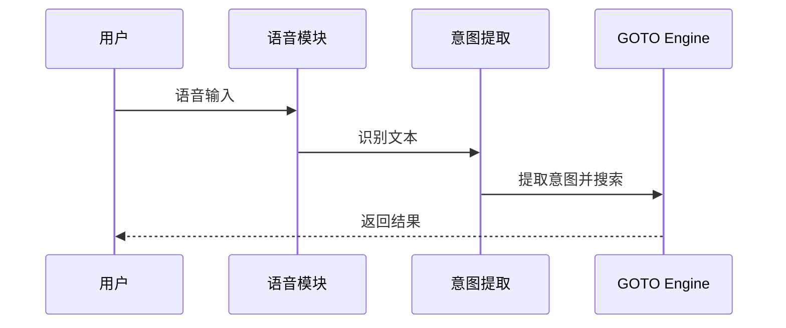

# 超级语音

> 当前为规划功能。设置页仅显示"中文"能力铭牌，并在右侧按钮内标注"开发中"；不提供可操作开关，也不展示"暂不可使用"等重复说明。

<button class="doc-inline-demo" data-preview-action="settings" data-preview-target="superVoiceCard">查看当前占位状态</button>

## 功能

### 功能定位

超级语音是"拓展"大分类下的独立预览功能，规划用于为 GOTO 的唯一搜索入口提供语音输入。当前处于开发中；计划首期仅支持中文，不会替代键盘搜索，也不会新增第二套功能入口。

### 设计理念：对话式而非录入式

超级语音的核心目标不是"用嘴替键盘打字"，而是把人机交互从"点击 → 录入 → 关闭语音"的传统三段式闭环里抽出来，变成一次启动后可以**连续对话、连续操作**的轻量陪伴层。

| 维度 | 传统语音助手 | 超级语音 |
| --- | --- | --- |
| 触发模型 | 每次点击麦克风 → 录音 → 关闭 | 一次激活后保持监听窗口，按需追加指令 |
| 注意力占用 | 抢占主屏，强制聚焦于语音面板 | 非抢占式，悬浮于搜索框之上，不遮挡当前候选 |
| 操作连续性 | 单次闭环，每次重新启动 | 同一会话内可连续追问、连续启动多个应用 |
| 与搜索的关系 | 替代搜索框 | 复用搜索框，识别结果汇入既有候选排序 |
| 失败处理 | 弹窗报错，要求重试 | 静默降级回键盘输入，不打断用户节奏 |

设计原则可以概括为三条：

1. **不抢占注意力**：语音层永远不是主屏主角，搜索框和候选结果保持可见可点。
2. **不替代既有路径**：识别出的文本仍走首页搜索框的统一匹配链路，不引入第二套排序或第二套候选渲染。
3. **不强迫闭环**：用户可以在一次语音会话内连续发起多个指令，也可以随时切回键盘，不需要显式"关闭语音"。

## 设计

### 当前行为

- 当前页面左侧使用"中文"铭牌说明语言范围，右侧按钮只显示"开发中"。
- 不请求麦克风权限，不启动录音，不写入启用状态。
- 正式开放后仍应通过首页搜索框承接查询与应用启动。
- 设备端语音识别权限、离线模型与系统服务可用性以实际 Android 实现为准。

## 算法

本功能尚处于规划阶段，未确定最终识别引擎。计划采用 Android 系统语音识别服务或第三方离线模型，识别结果通过首页搜索框统一承接，不引入独立的排序或匹配算法。具体算法方案将在正式实现后补充。

## 边界

### 隐私与权限边界

正式 Android 版本接入语音识别前，应在请求麦克风权限时说明用途，并根据实际采用的系统或第三方识别服务更新隐私说明。本预览页面不请求麦克风权限，也不上传语音数据。

### 限制

超级语音目前属于预览功能，仅标注中文支持范围；语言自动识别、多语言模型和连续对话不在当前承诺范围内。

### 鲁棒性优化

| 边界场景 | 触发条件 | 处理策略 | 用户感知 |
| --- | --- | --- | --- |
| 语音识别不可用 | 设备无语音识别服务或离线模型缺失 | 隐藏语音入口或显示“暂不可用” | 设置页保持占位状态，不影响其他功能 |
| 麦克风权限被拒 | 用户拒绝麦克风权限或系统策略限制 | 引导用户前往系统设置开启权限 | 弹窗提示权限用途并提供跳转设置入口 |
| 语音识别超时 | 录音超过最大时长或长时间无语音输入 | 自动停止录音并提示重试 | 显示“未检测到语音，请重试” |
| 识别结果为空 | 识别服务返回空结果或置信度过低 | 清空录音并提示用户重新表述 | 显示“未识别到内容，请再说一次” |
| 噪音环境识别率低 | 环境噪音过大导致识别准确率下降 | 提示用户切换安静环境或使用键盘输入 | 显示“环境嘈杂，建议使用键盘输入” |
