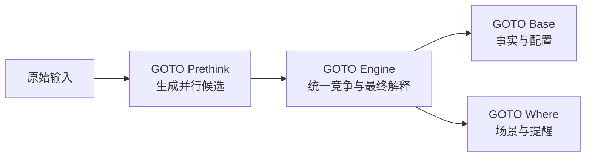

# GOTO Prethink：预联想与查询猜测

GOTO Prethink 是独立于 GOTO Engine、GOTO Base、GOTO Where 的第四个页面级能力。它属于“预联想”一类，不属于正式匹配或提醒本身。



## 核心边界

- Prethink 永远保留原始查询，不改写输入框，也不删除用户输入。
- 它最多生成 3–5 个候选；低于最低置信度的候选直接丢弃。
- 原始查询永远优先，其他候选只作为并行参考交给同一个 Engine。
- Engine 仍拥有最终匹配、排序和解释权；Base 与 Where 的实现和契约保持冻结。
- 模糊匹配回答“用户想找到什么”，Prethink 回答“用户可能还想输入什么”。两者不重复。

## 候选契约

```js
QueryCandidate {
  query: "chrome",
  confidence: 0.78,
  source: "KEYBOARD_CORRECTION",
  editCost: 0.22,
  explanation: "字符交换 + 邻位误触"
}
```

候选来源必须可解释，包括键盘邻位、字符交换、重复字符、缺失字符、中英文/拼音转换、已安装应用集合和本地搜索—点击历史。模型接入点可由宿主注册，但对普通用户隐藏，并且不能阻塞原始查询。

例如输入 `ggooogoto` 时，Prethink 可以并行提供 `goto`、以 `g` 开头的应用候选和低置信度的 `google`。它不把输入改成其中任何一个。

`choroefm → facebook` 只有在存在明确的字符来源、编辑成本和解释时才允许进入候选；不能因为字符数量接近就制造候选。

## 路径合并

每个候选进入同一个 Engine。相同应用由最高路径得分决定，第二条命中只提供有限奖励：

```text
appScore = highestPathScore - 0.1 × secondHighestPathScore
```

这样可以避免原始、拼音、纠错和标签四条路径同时召回同一个应用后分数异常膨胀。原始查询的路径永远保持最高优先级。

## 开关与运行时

页面端开关位于 `SuperGOTO` 卡片内，紧跟“自适应刷新”之后，名称为 `GOTO Prethink 预处理`。开关关闭时只运行原始查询；打开后才扩展候选。

页面使用 `prethink/goto-prethink.js`，通过 `GOTOPrethink.expand()` 和 `GOTOPrethink.mergeResults()` 暴露稳定边界。模型可以通过隐藏的 `setModelProvider()` 接入，模型输出仍必须经过置信度、数量和解释校验。

## 多语言协同

JS、Kotlin、Rust 共享上述 `QueryCandidate` DTO。JS 负责 GitHub Pages 与 WebView 的交互，Kotlin 负责 Android 宿主侧的本地应用集合适配，Rust 负责可选的纯函数候选生成。三者只通过 Prethink 边界协同，不调用或修改冻结组件内部代码。

## 验收标准

1. 原始输入在输入框、搜索历史、统计中保持不变。
2. 最多 5 个候选，低于 `0.45` 的候选不进入 Engine。
3. 每个候选都有 `query / confidence / source / editCost / explanation`。
4. 重复命中使用最高路径减去第二路径的有限奖励。
5. Engine、Base、Where 的源文件无修改；Page 只编排调用与展示。

