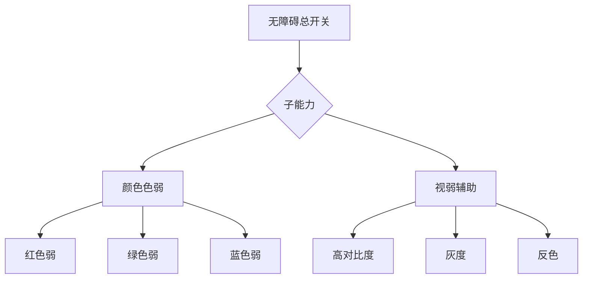

# 无障碍

无障碍总开关统一管控整组能力。开启后，子卡片在自身位置向下延展，不推动或展开母卡片；关闭后整组能力一并收回。设置页只展示功能名与当前状态，副标题与开发提示移入文档，减少视觉负担。

关闭总开关只暂停无障碍效果，不清空颜色色弱与视弱辅助的选择。下一次开启时恢复上一次关闭前的子项状态；用户仍可再次点击当前选项，将单项恢复为未选择状态。

## 功能

### 子能力

无障碍模式开启后可用以下两项子能力：

- **颜色色弱**：通过色觉变换帮助区分关键状态。提供红色弱、绿色弱、蓝色弱三档，选择后立即生效，不需要二次确认。再次点击当前档位即可取消。开启后强调色不会成为唯一的启停依据，状态仍可通过文字、形状与位置冗余识别。
- **视弱辅助模式**：用于特定阅读情境，提供 高对比度 / 灰度 / 反色 三档。
  - 高对比度提升前景与背景差异。
  - 灰度去除颜色信息，保留亮度层级。
  - 反色用于夜间或强光阅读，与文档区的反色同步生效。

所有交互控件应具备可读名称、清晰焦点和不依赖颜色的状态表达。

## 设计

### 设置原则

设置页只显示功能名称、当前状态和必要控件，不在卡片中堆放解释性副标题。色觉辅助与视弱辅助分别在自己的卡片中延展，选择后立即预览，不需要额外确认。两类子能力可叠加，叠加顺序按色觉 → 视弱处理。

### 与其他模块的关系

- 视弱辅助中的反色会与文档区反色模式联动，文档字体与图表同步反色处理。
- 高对比度不会覆盖强调色与品牌色，只提升文字与背景对比。
- 关闭无障碍总开关后立即恢复普通视觉，但保留用户上次选择，便于再次启用。

## 算法

无障碍模块的视觉变换遵循“叠加 → 变换管线 → 即时预览”的处理流程，所有变换均在客户端实时计算，不依赖远端服务：

1. **状态叠加**：色觉变换与视弱变换按“色觉 → 视弱”顺序叠加，前一阶段输出作为后一阶段输入，保证两类子能力可同时启用且互不覆盖。
2. **变换管线**：色觉档位通过色觉矩阵对像素 RGB 分量做线性映射；视弱档位中高对比度调整 Gamma 与亮度差、灰度按 ITU-R BT.601 亮度系数合成、反色对 RGB 通道取反。
3. **即时预览**：选择后立即生效，无需二次确认；取消时回退到上一稳定状态，保留用户上次选择以便再次启用。

## 边界

### 验收要点

- 键盘焦点始终可见。
- 开关状态可通过文字或位置判断，不依赖颜色。
- 辅助模式不会隐藏主要操作或主要导航。
- 关闭总开关后恢复普通视觉，再次开启时回到上次选择。
- 色觉辅助与视弱辅助可同时启用，且互不覆盖。

### 鲁棒性优化

| 边界场景 | 触发条件 | 处置策略 | 用户感知 |
|---|---|---|---|
| 无障碍服务未启用 | 系统无障碍开关关闭或未授权 | 总开关置灰，子卡片收回不展开 | 无法启用子能力，提示前往系统设置开启 |
| 手势识别失败 | 触发动作不规范或传感器异常 | 降级为点击兜底，记录未识别事件 | 手势无响应，但点击操作仍可用 |
| 辅助功能冲突 | 与其他无障碍工具同时启用导致视觉叠加异常 | 检测冲突并按优先级禁用冲突项，保留用户显式选择 | 冲突项被临时停用，提示冲突原因 |
| 无障碍服务崩溃 | 系统无障碍进程异常退出 | 自动重连并恢复上次状态，失败则回退普通视觉 | 短暂视觉闪烁后恢复，或回退普通模式 |
| 权限被撤销 | 用户在系统设置中撤回无障碍权限 | 监听权限变更，自动收回总开关并清空效果 | 子能力立即失效，提示重新授权 |
