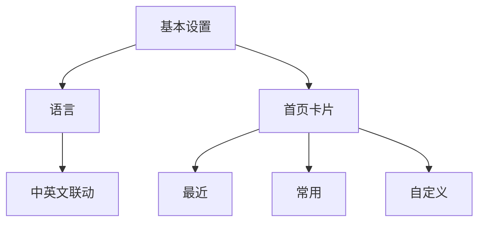

# 基本设置

基本设置只保留影响软件基础行为的选项：语言与首页卡片。语言切换会同步界面文案、内置示例库名称和右侧文档，不产生局部中英文混排。

## 功能

### 首页卡片

首页卡片与搜索框属于同一个搜索工作区。关闭首页卡片时，搜索框位于可用屏幕中心；首次点击后以柔和阻尼上移并展开智能提醒。开启后，最近、常用与自定义卡片可分别启停。

### 语言联动范围

语言不是单页属性。切换中文或英文后，首页提示、应用示例库、设置标签、统计标题、空状态、按钮反馈和右侧文档目录应在同一次状态更新中完成。已输入的搜索内容不被清空，用户无需重新开始当前任务。

### 自定义应用编辑器

自定义卡片的圆形加号会把卡片本体向下延展。编辑器复用设备应用库中的真实应用名称、图标和品牌色；Android 壳通过 `PackageManager` 注入已安装应用后，预览测试图标会被真机图标替换。已添加应用在编辑列表顶部显示，右侧 `×` 可将其从待保存列表移除；未添加应用使用 `+` 加入。所有增删在点击底部“保存”后一次写入，最多保留 12 个应用。

编辑器内部独立滚动，搜索框与底部保存按钮保持同宽，延展区不会突破手机内容边界。

## 设计

### 设计约束

- 搜索框始终是首页唯一功能主体。
- 状态开关只负责开与关，设置卡本身不承担长篇说明。
- 语言状态全局唯一，并持久化到本机。

### 状态持久化

基本设置写入本地偏好。启动时先恢复语言，再恢复首页卡片，最后计算搜索框位置，避免页面先以错误语言或错误高度闪现。重置设置后回到浅色、标准、英文优先的初始体验（适配 GitHub 首次访问的国际化场景）。

## 算法

### 首页卡片规则

“最近”依据统计功能的 24 小时分桶匹配当前时段，“常用”依据激活后的全时段累计频率排序，“自定义”只展示用户明确添加的项目。统计未激活时前两者显示依赖提示；激活后没有有效样本时显示 `NULL`，不使用演示数据伪造活跃度。三个区域均关闭时，首页卡片整体退出布局，搜索框恢复到可用屏幕中心。任何子卡片关闭都不影响搜索能力。

### 默认排序

未输入关键词时，中文应用优先显示并按名称首个汉字的常用字频序排列，拉丁字母应用按 A–Z 排列；混合列表对中文候选设置数量上限，避免单一文字系统挤占整个首屏。输入关键词后改为匹配优先，不再截断命中的文字类型。

中文排序依据采用教育部 2013 年《[通用规范汉字表](https://www.moe.gov.cn/jyb_sjzl/ziliao/A19/201306/t20130601_186002.html)》一级常用字范围，并参考北京大学 CCL 现代汉语语料库的[现代汉语汉字字符频次](https://corpus.pku.edu.cn/statistics/ccl_corpus_statistics.html)。该顺序只用于无搜索条件下的发现排序，不参与 GOTO 搜索相关度计算。

### 设置项优先级与默认值

- 启动恢复顺序：语言 → 首页卡片 → 搜索框位置，三者依次完成后再渲染首页。
- 语言默认值为中文；未读取到本地偏好时回退到中文。
- 首页卡片默认开启“最近”与“常用”，“自定义”默认关闭。
- 自定义应用上限 12 个，超出时按添加时间淘汰最旧项。
- 重置设置后统一回到浅色、标准、中文优先的初始状态。

## 边界

### 验收要点

- 中英文切换后不存在孤立的旧语言标签。
- 首页卡片开关与实际可见区域一致。
- 关闭全部首页卡片后，搜索框宽度保持不变。
- 刷新页面后状态与刷新前一致。

### 鲁棒性优化

| 边界场景 | 触发条件 | 处理策略 | 兜底表现 |
| --- | --- | --- | --- |
| 设置项值为空或 null | 本地偏好读取失败或字段缺失 | 回退到该项默认值，不抛出异常 | 界面以默认语言与默认卡片状态呈现 |
| 设置项值超出范围 | 自定义应用数 > 12、语言枚举非法等 | 截断到合法区间或丢弃非法值并记录日志 | 保持上次有效状态，不阻塞首页渲染 |
| 设置持久化失败 | 存储空间不足或写入被拦截 | 仅在内存中保留本次会话状态，下次启动回退默认 | 提示用户一次，不影响当前操作 |
| 多个设置项冲突 | 语言为中文但示例库标记为英文等 | 以语言状态为最高优先级重算联动项 | 联动项统一跟随语言，消除混排 |
| 设置项实时生效失败 | 卡片开关切换后布局未刷新 | 触发一次重渲染重试，仍失败则回滚开关状态 | 开关状态与可见区域保持一致 |
| 设置页布局适配异常 | 窄屏、横屏或系统字号过大 | 编辑器独立滚动并约束延展区不突破内容边界 | 保存按钮始终可见且与搜索框同宽 |

> 版本: v4.0 | 最后更新: 2026-07-24
