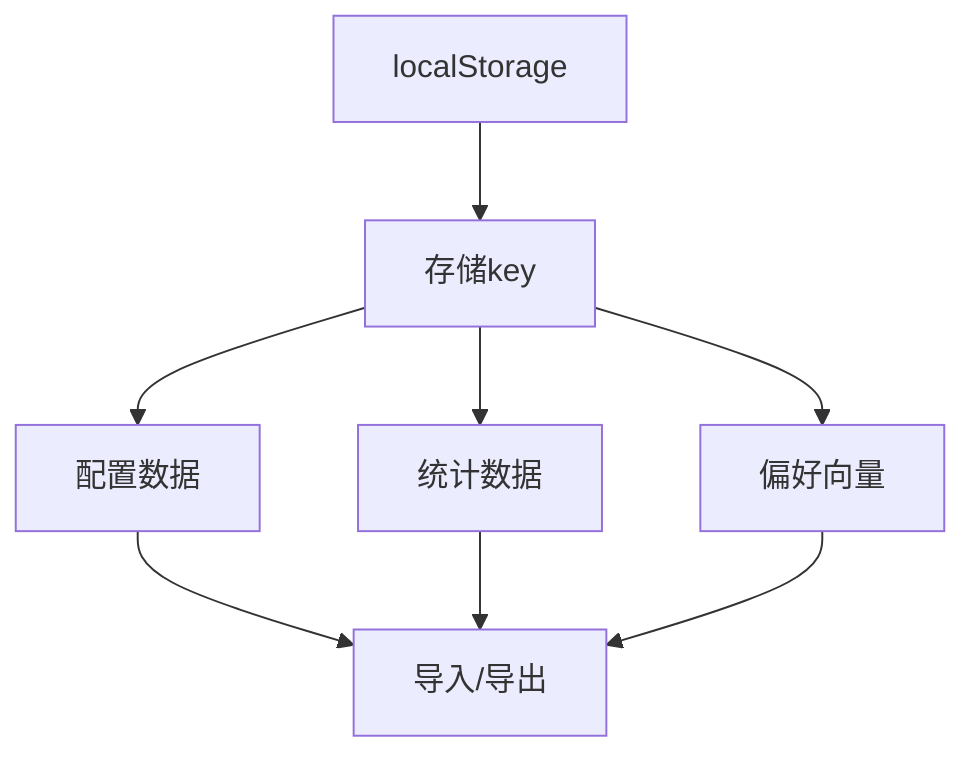

# 数据与配置

## 功能

### 功能定位

数据与配置负责设置、统计、偏好向量和备份。所有数据默认只保存在设备本地；导入前校验，导出时标注格式版本，清除操作按数据域隔离。

设置页中，该模块以四张子卡片形式呈现，命名与界面一致：**导入 / 导出 配置数据**、**导入 / 导出 统计数据**、**导入 / 导出 统计数据向量**、**备份（BETA）**。每张子卡片点击后向下延展对应操作，关闭后收回。模块最底部为「重置设置」按钮，使用强调色样式以区别于普通二级操作。

### 导入 / 导出 配置数据

配置包包含语言、主题、界面风格、强调色、首页卡片、无障碍、进阶功能状态、快捷索引及其他本地偏好。当前格式为 `goto-transfer` v2。

- JSON：标准可回导格式，适合完整迁移。
- TXT：内容与 JSON 相同，便于人工查看和复制。
- CSV：按 `key,value` 展开，可用于审计与表格查看，也支持回导。
- PNG：带 GOTO 标识的可读摘要图，不作为回导文件。

为防止凭据泄露，WebDAV 密码与 S3 密钥不进入配置导出包。旧版只包含 `goto_settings` 的 JSON 仍可兼容导入。

### 导入 / 导出 统计数据

统计包只包含真实发生的本地行为：搜索次数、应用启动、时段桶、快捷索引触发、模拟智能记忆与引擎反馈。预测结果不会冒充历史统计。

导入统计后立即刷新统计页面；清空统计会同步清除晨间、午后、晚间、夜间字符桶以及快捷方式计数，避免刷新后旧数字重新出现。

### 导入 / 导出 统计数据向量

向量工作台支持生成预览、导出 JSON、导入校验和复制向量。导入时检查对象结构、维度和每个数值的有效性，不接受 `NaN`、无穷值或维度不一致的数据。

预览区会展示维度、记忆样本量、最近更新时间以及前 16 个数值，便于人工核对。导出 JSON 只保留精简字段，避免冗余体积。

### 备份（BETA）

备份卡片标 BETA 标签，点击后向下延展选择备份方式，**WebDAV** 与 **S3** 二选一：

- **WebDAV**：填写服务器地址、用户名、密码（或应用专属密码）与远程文件路径，提供「测试 / 备份 / 恢复」三个动作。
- **S3**：填写 Endpoint、Bucket、Region、Access Key 与 Secret Key，同样提供「测试 / 备份 / 恢复」三个动作。

凭据只保存在本机，不进入配置导出包。备份内容是配置与统计的合并快照；恢复时按数据域分别写入，不相互覆盖。

### 重置与清除

- **重置设置**：模块最底部的强调色按钮。恢复界面与功能配置，不伪造统计数据；执行后会重新进入欢迎界面，随后必须且只能进入初始界面，伴随 3s 转圈后恢复默认状态并清空统计数据。
- **清空统计**：仅清除统计、学习记忆和激活统计，保留授权状态与界面配置。
- **导入**：只写入对应数据域，配置文件不能覆盖统计，统计文件也不能覆盖配置。

### 多重授权说明

本项目采用**混合授权模式**，不同资源类型适用不同协议：

| 资源范围 | 适用协议 | 说明 |
|---|---|---|
| 仓库根目录源代码（`.js`/`.html`/`.css`/`.kt` 等） | AGPL-3.0 | 遵循根目录 LICENSE，允许自由使用、修改、分发，但衍生作品须同样开源 |
| `/music` 文件夹内的所有媒体资产（MP3/WAV/OGG/M4A/FLAC/歌词/海报/封面） | CC BY-NC-ND 4.0 | 署名-非商业性使用-禁止演绎；允许在 GOTO 项目演示场景内分发，严禁商业提取、二次混音发行或未署名传播 |
| GOTO 宣传曲（`slot: "easter_egg_2"`） | CC BY-NC-ND 4.0 | 用户绑定 MP3 后自动继承此协议，不得在 GOTO 项目语境之外提取、再分发或商业使用 |

**核心条款**：
- **代码 vs 媒体分离**：`/music/LICENSE` 文件单独声明媒体资产不属于 AGPL 范畴。
- **"火了算我的"原则**：允许社交媒体传播，允许个人修改，但必须保留原始作者声明与来源链接。
- **个人修改限制**：用户可对 `/music` 资产做个人使用范围内的修改，但修改版本**不得公开发布**；如需贡献改进，请提交代码层（AGPL-3.0）的 PR。
- **商业禁区**：严禁任何形式的商业提取、再授权、二次混音后发行或未署名再分发。

详见 [`/music/LICENSE`](../music/LICENSE) 完整条款。

## 设计

### 验收标准

1. JSON、TXT、CSV 导出后可在同版本中回导。
2. 错误格式、空文件、跨数据域文件必须拒绝并给出提示。
3. 导出包包含 `schema`、`version`、`kind`、`exportedAt` 与 `data`。
4. PNG 固定使用 GOTO 品牌标识且只展示摘要，不泄露具体配置值。
5. 清空统计后当前页面和重新加载后的数字均为初始状态。
6. 备份卡片延展后可切换 WebDAV / S3，凭据不入导出包。
7. 重置设置按钮使用强调色样式，且单独位于数据模块最底部。

#### 界面快照 PNG

“截个图，保存一下？”只捕获手机预览区域，并合成固定的 GOTO 标识、生成时间和本地搜索声明。导出过程优先使用可用的页面渲染器；没有外部渲染库时，使用同源样式与 SVG `foreignObject` 本地渲染。输出始终为 PNG，文件名包含生成时间。生成期间按钮进入忙碌状态并阻止重复点击，失败时恢复按钮并显示原因。

重置设置和清空统计的进度覆盖层会在打开瞬间记录当前明暗主题。即使重置随后清除主题配置，覆盖层仍保持执行前的浅色或深色外观，结束后再移除临时主题类，避免处理过程中闪白。

日志下方保留一张独立的金属铭牌小卡，左侧为 `Focus , And More`，右侧为 `Lesong`；两端均使用 Geist 字体，不承载交互或状态。

## 算法

## 边界

### 鲁棒性优化

| 边界场景 | 触发条件 | 处理策略 | 用户反馈 |
| --- | --- | --- | --- |
| 导出数据为空 | 对应数据域无任何记录 | 仍生成含 `schema`/`version`/`kind` 的最小包，`data` 置空 | 提示“无可导出数据”，允许生成空包 |
| 导入文件格式错误 | JSON 解析失败或缺少必备字段 | 拒绝写入，原数据保持不变 | 提示“文件格式错误，已拒绝导入” |
| 导入数据版本不兼容 | `version` 高于当前版本或不在兼容范围 | 拒绝导入并记录版本号 | 提示“版本不兼容，需升级或使用兼容版本” |
| 备份文件损坏 | WebDAV / S3 恢复时校验或解包异常 | 中止恢复，不覆盖任何本地数据域 | 提示“备份文件损坏，恢复已中止” |
| 数据迁移失败 | 跨数据域写入冲突或导入中断 | 按数据域回滚，保持各域隔离 | 提示“迁移失败，已回滚至原状态” |
| 导出数据过大 | 导出包体积超过阈值 | 精简非必要字段，向量仅保留精简字段 | 提示“数据量较大，已精简导出” |
