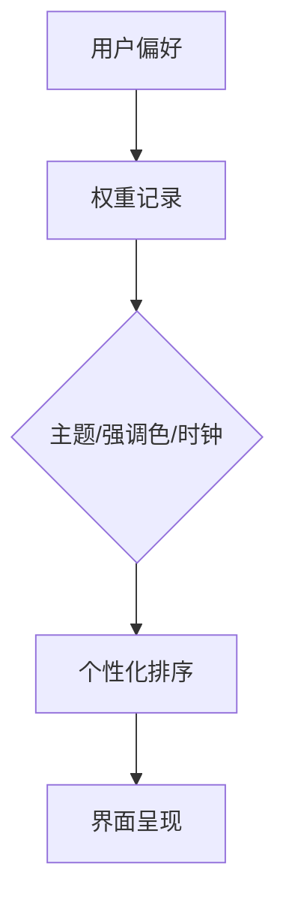

# 个性化

个性化统一管理明暗主题、时钟与强调色，不再提供单独的界面风格选择。普通状态固定使用标准模式；光感模式与超级语音统一归入一级“拓展”分类。

## 功能

### 首次欢迎

欢迎界面采用标准模式的包豪斯网格与 Braun SK4 式仪器秩序：品牌标识、时间刻度、问候语、语言、明暗与进入动作从上到下形成单一路径。问候语根据本地时段变化，中英文选择会同步软件语言、示例库和右侧文档；浅色/深色选择会在进入主界面前即时预览。进入按钮保持纯色，不使用泛光来争夺注意力。

<button class="doc-inline-demo" data-preview-action="welcome" data-preview-target="welcomeScreen">在左侧体验欢迎界面</button>

### 单一基础风格

- 标准是唯一基础风格：无悬浮阴影，以五级灰阶、明确网格、边界和留白建立高信息密度秩序。
- 原质态的材质表达并入光感模式，不再作为可单独选择的选项。
- 光感开启后由日照时段接管明暗、色温与玻璃材质；关闭后恢复标准模式以及此前选择的浅色或深色主题。

### 强调色管理

强调色面板采用与快捷索引一致的圆形“加号 → X”交互。新颜色保存到列表末尾；最多保留 6 个自定义颜色，超出时淘汰最旧项目。当前选中色使用加粗外框，而不是额外光晕。

强调色仅用于主要动作、开启状态、目录当前位置和少量品牌渐变。普通说明、边界和统计图默认使用灰阶，避免整页同时出现多个视觉焦点。

### 时钟

开启“时钟秒数”后，首页时间立即显示秒并持续刷新；关闭后恢复小时与分钟。12/24 小时制与秒数相互独立。

## 设计

### 默认视觉基线

默认组合为“浅色 + 标准”。标准模式使用黑、深灰、中灰、浅灰、白五级色阶和唯一强调色。卡片只通过实线边框识别层级，不使用悬浮阴影、玻璃模糊、炫光或无意义渐变。它的目标是长期使用时维持低注意力抢夺。

光感模式在同一信息结构上增加 Material 式半透明表面、柔和环境投影与日照色温，不改变尺寸或交互位置。开启光感后深浅模式开关会被锁定，关闭后立即恢复用户选择的主题与标准风格。

## 算法

### 反色规则

强调色可与任意主题组合。系统按颜色亮度动态选择深色或浅色前景，按钮、开关、选中项和标签均遵循同一反色变量，避免文字被背景吞没。

强调色是个性化的一个子模块，位于时钟控件下方。光感模式不再放在个性化内部，而是与超级语音一起位于独立的“拓展”大分类中。

## 边界

### 验收要点

- 标准模式所有主卡片阴影计算值为 none。
- 页面不存在独立的质态选择；历史 `neumorphic` 配置会迁移为标准模式。
- 新保存颜色始终出现在自定义颜色末尾。
- 第 7 个自定义颜色保存后，最旧颜色被移除。

### 鲁棒性优化

| 边界场景 | 触发条件 | 处理策略 | 兜底表现 |
| --- | --- | --- | --- |
| 个性化数据为空（冷启动） | 首次启动或个性化数据被清除 | 加载“浅色 + 标准”默认组合与默认强调色，不触发迁移 | 进入标准模式，主题、强调色与时钟均为初始值 |
| 键盘布局未识别 | 读取键盘布局失败或返回未知枚举 | 跳过布局相关个性化项，沿用系统默认布局 | 主题与强调色不受影响，仅布局项回退 |
| 个性化配置文件损坏 | 配置文件解析异常或关键字段缺失 | 丢弃损坏字段，与默认值合并后重建配置并备份原文件 | 保留可读字段，损坏部分重置为默认，不阻塞启动 |
| 快照数据过期 | 快照时间戳超出有效周期或与当前时段偏差过大 | 标记过期快照不可用并触发重新采集 | 回退到最近一次有效状态，无采集时不应用时段推断 |
| SharedPreferences 访问失败 | 读写抛出 IO 或权限异常 | 内存缓存兜底，写入重试有限次后放弃并记录日志 | 当前会话内可用，重启后丢失本次变更 |
| 个性化权重极端值 | 权重为 NaN/Infinity 或超出合法阈值 | 钳制到合法区间并记录告警，不参与本次计算 | 输出稳定，界面不出现抖动或闪烁 |

> 版本: v4.0 | 最后更新: 2026-07-24
