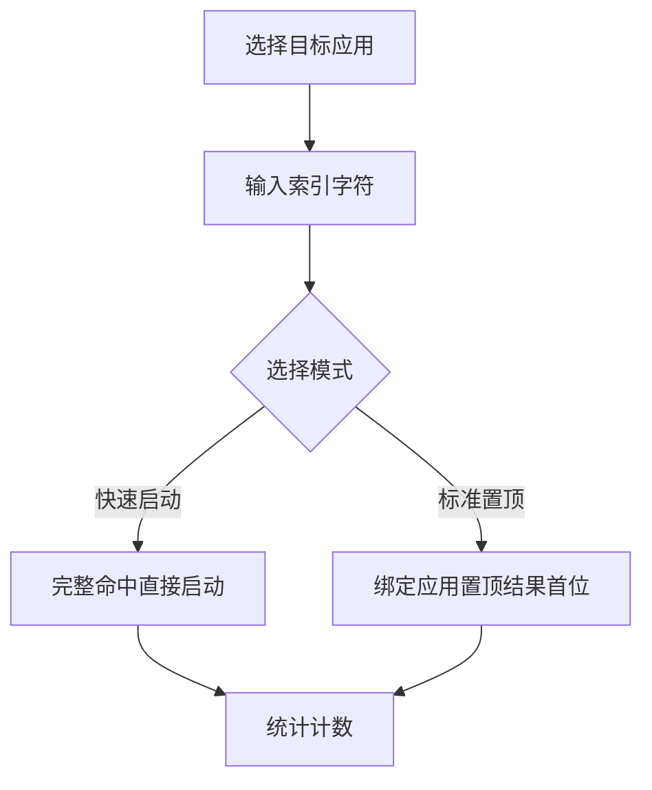

# 快捷索引

## 功能

### 功能定位

GOTO 只有一个核心交互入口：搜索框。快捷索引是搜索输入的增强能力，不建立第二套入口，也不脱离搜索流程。快捷手势不属于当前产品范围。

### 数据与统计

快捷索引复用普通搜索结果的统一启动链路，因此真实启动、最近使用、实时统计和“已打开 XX”反馈保持一致。只有从 GOTO 内实际启动应用且统计功能已激活时才计数。

## 设计

### 声明式创建

编辑器使用一句接近用户意图的表达：

> 我想要打开 **目标应用**，通过输入 **索引字符**。

用户先选择应用，再输入字符，最后选择“快速启动”或“标准置顶”并保存。界面不再重复显示“索引应用”“索引字符”等表单标题。

- **快速启动**：完整命中后直接走统一应用启动链路。
- **标准置顶**：生成搜索结果后将绑定应用稳定置于第一位。
- **保存与删除**：按钮占满编辑器宽度；删除只在编辑已有索引时出现。

### 总开关、子开关与模式

- 打开总开关时，全部子项同步开启；关闭总开关时，全部子项同步关闭。
- 总开关关闭时开启任一子项，总开关同步开启。
- 总开关开启时关闭最后一个子项，总开关同步关闭。
- 总开关和子项使用同一种开关样式；相邻模式按钮只负责在快速与标准之间切换。

## 算法

### 大小写策略

用户不需要管理“区分大小写”开关。同一小写归一组只有一种写法时兼容大小写；当 `w` 与 `W` 等相似索引同时存在时，该组自动切换为精确匹配。删除冲突项后恢复兼容。

## 边界

### 验收标准

- `www` 绑定企业微信并选择标准置顶后，企业微信位于结果首位。
- 单独存在 `w` 时，`W` 可以命中；二者并存时分别精确命中。
- 未激活条目不触发、不计数。
- 保存、编辑、删除和开关操作立即持久化。

### 鲁棒性优化

| 边界场景 | 处理策略 |
| --- | --- |
| 快捷操作列表为空 | 渲染空状态占位并引导用户创建首个快捷操作，不展示空列表容器 |
| 文件夹应用数量超过9个 | 仅取前 9 项生效，超出部分忽略并向用户提示精简 |
| 手势录制中断 | 丢弃未完成的录制数据，恢复至上一稳定状态，提示用户重新录制 |
| 高频应用窗口无数据 | 回退到默认排序，不阻塞主搜索流程 |
| 快捷操作冲突 | 检测到索引或手势冲突时拒绝保存并高亮冲突项，提示用户修改 |
| localStorage 存储失败 | 捕获异常后降级为内存缓存，会话内保持可用，并在控制台告警 |

