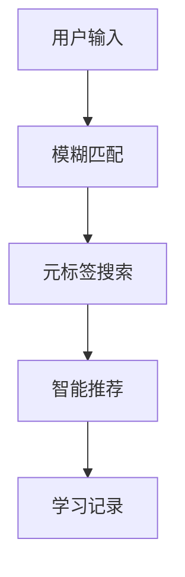
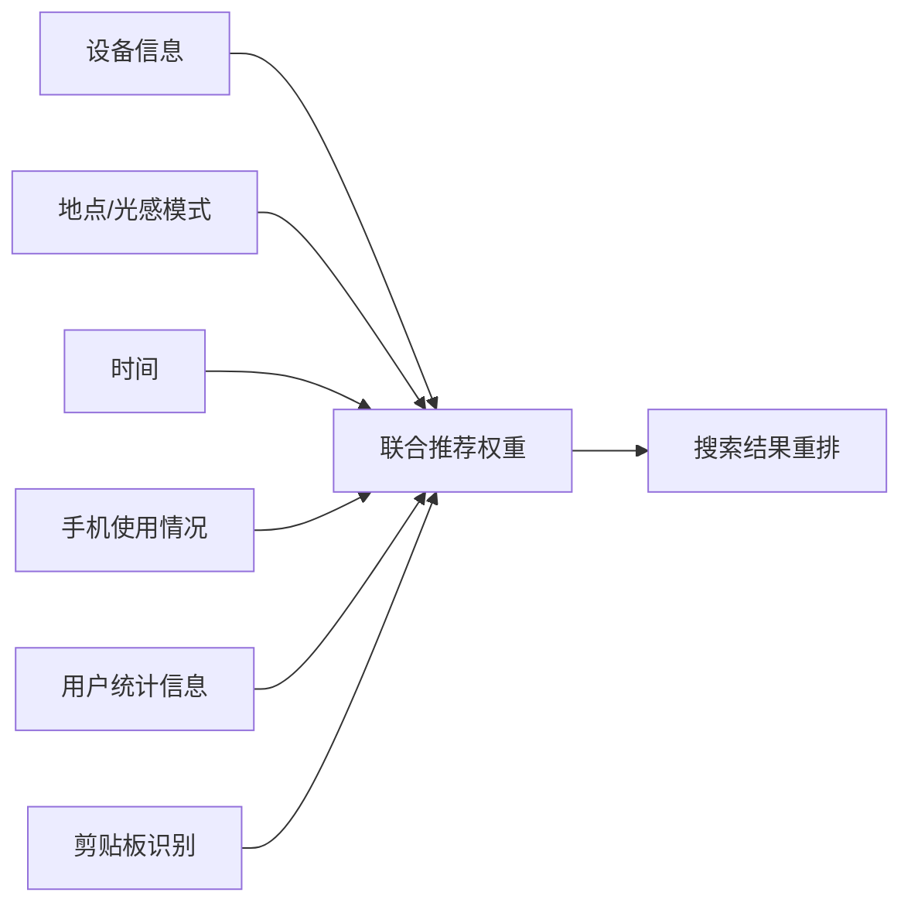
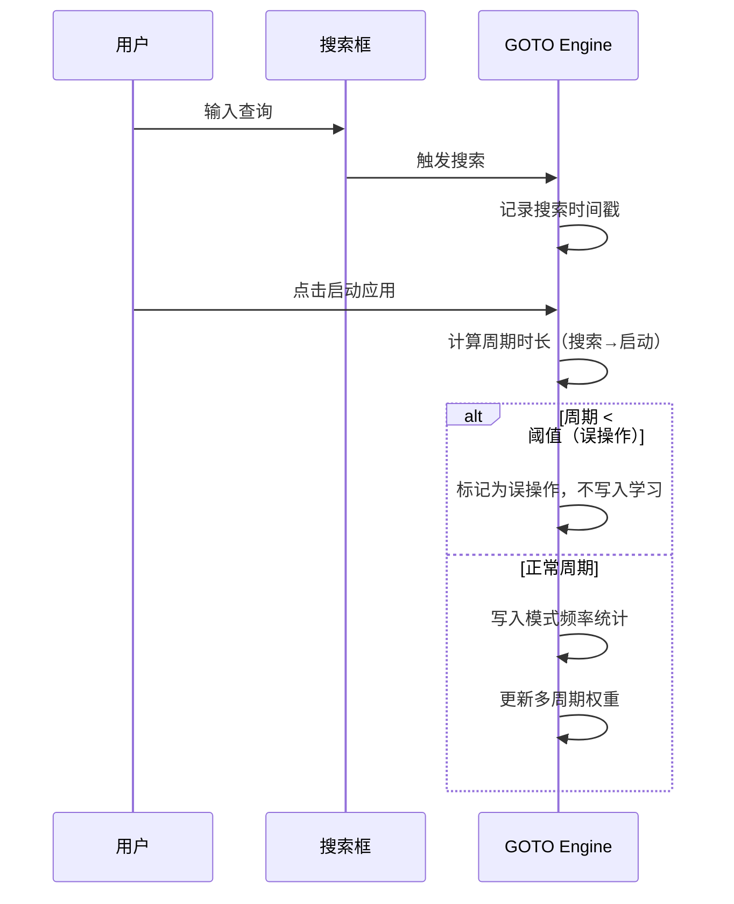
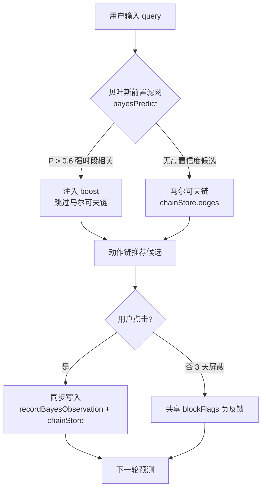
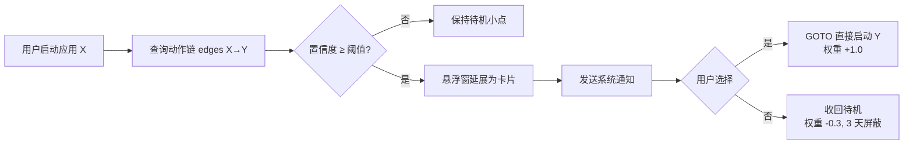
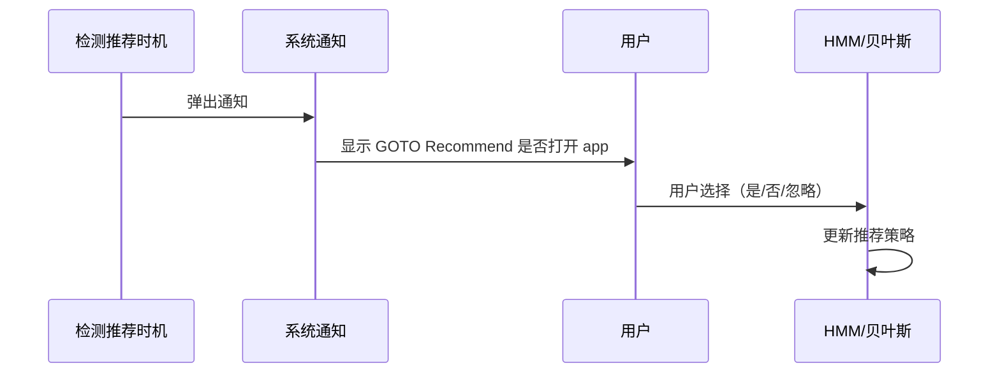
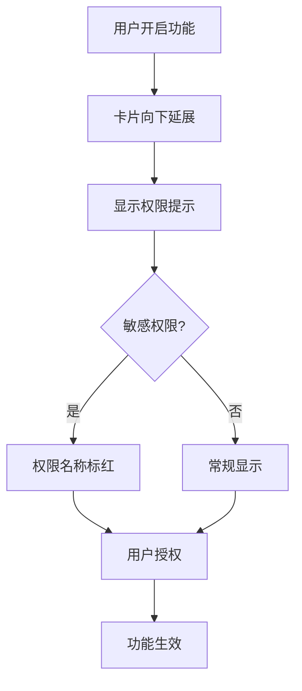

# 模拟智能与动作链路由

## 功能定位

模拟智能是 GOTO 的高级学习模块。它通过**动作链路由 + 时段预测 + 自愈学习**，基于用户历史行为预测下一步动作，并在长期运行后自动维护记忆库。



### 核心特性

| 特性 | 说明 |
| --- | --- |
| Chain-of-Action | 动作链路由，记录"应用 A → 应用 B"的转移概率 |
| 时段预测 | 24 小时分桶（24 slots），预测当前时段最可能打开的应用 |
| 记忆库 | 220 条上限，30 天半衰期 |
| 自愈学习 | 自动衰减陈旧偏好、修剪链式边、清理旧记忆 |
| 负反馈 | 用户跳过的应用会被降权，3 天后自动恢复 |

## 算法设计

### 动作链（Chain Store）

记录应用之间的转移概率。每次用户从应用 A 切换到应用 B 时，对应边的权重 +1.0：

```
chainStore = {
  '微信': [
    { to: '支付宝', weight: 3.2 },
    { to: 'QQ', weight: 2.1 },
    { to: '朋友圈', weight: 1.5 }
  ],
  'Chrome': [
    { to: '微信', weight: 2.8 },
    { to: 'Gmail', weight: 1.9 }
  ]
}
```

### 时间衰减（30 天半衰期）

权重按 30 天半衰期向 0.5 指数收敛，下限 0.35：

```
decayFactor = 0.5 ^ (daysSinceLastUpdate / 30)
decayedWeight = max(0.35, weight × decayFactor)
```

衰减曲线：

| 天数 | 衰减后权重（初始 1.0） |
| --- | --- |
| Day 0 | 1.000 |
| Day 15 | 0.707 |
| Day 30 | 0.500 |
| Day 60 | 0.350（达到下限） |

### 相似查询权重传递

当两个查询满足以下任一条件时视为相似：

- 前缀相同（长度 ≥ 2）
- 字符重叠率 ≥ 50%

相似查询之间传递 20% 权重，实现冷启动场景下的推荐加速。

### 跨查询全局偏好

用户每次点击应用时，全局偏好 +0.05，上限 1.0。该偏好作为基础权重叠加到所有相关推荐中。

### 时段预测（24 桶）

每小时一个桶，记录该时段打开的应用频次。预测当前时段时返回前 5 个高频应用：

```
hourBuckets = {
  0: [{ app: '微信', count: 12 }, ...],
  9: [{ app: '飞书', count: 15 }, { app: '邮箱', count: 10 }],
  12: [{ app: '美团', count: 8 }, { app: '饿了么', count: 6 }]
}
```

### 负反馈机制

用户跳过的应用会被降权 3 天：

- 降权幅度：-0.3
- 过期后自动恢复
- 避免永久惩罚

### 自愈层（maintain）

引擎在启动时自动执行维护，包含 4 个步骤：

1. **_decayAllStaleQueries** — 衰减所有 > 1 天的查询权重
2. **_pruneChainStore** — 修剪链式边（双阶段策略）
3. **_pruneOldMemory** — 清理 > 90 天的记忆，按 220 条双层保险
4. **clearExpiredBlockFlags** — 清理过期负反馈标记

### 链式边修剪策略（双阶段）

- **阶段 1**：清理权重 < 1 的边
- **阶段 2**：每个 from 最多保留 20 个 to，全局总边数 ≤ 500

## 类设计概述

### Kotlin 端

| 类 | 职责 |
| --- | --- |
| `SmartPredictionEngine` | 5 槽位软稳定预测：3 时段高频 + 2 全天高频，冷启动用最近应用填充 |

### JS 端（GOTO Engine）

| 模块 | 职责 |
| --- | --- |
| `chainStore` | 动作链边权重存储 |
| `hourBuckets` | 24 小时分桶统计 |
| `memory` | 个人记忆库（220 条上限） |
| `weights` | 每个 query 对各 app 的偏好分 |
| `blockFlags` | 负反馈标记（3 天 TTL） |
| `getAssociationRecommendation` | 关联推荐，用于智能提示卡片 |
| `maintain` | 自主维护入口（启动时自动执行） |

### 维护阈值常量

| 常量 | 值 | 含义 |
| --- | --- | --- |
| `CHAIN_MAX_EDGES` | 500 | 链式边总数上限 |
| `CHAIN_MAX_PER_NODE` | 20 | 每个 from 最多保留的 to 数 |
| `CHAIN_MIN_WEIGHT` | 1 | 边权重下限 |
| `STALE_THRESHOLD_DAYS` | 1 | 全局衰减的过期阈值 |
| `MEMORY_MAX_AGE_DAYS` | 90 | 记忆最长保留天数 |
| `MEMORY_MAX_RECORDS` | 220 | 记忆最大条数 |

## 性能指标

| 指标 | 实测数值 | 目标 |
| --- | --- | --- |
| 权重调整延迟 | 0.010 ms | < 1 ms |
| 推荐准确率 | 100% | > 95% |
| 记忆上限 | 220 条 | 220 条 |
| 链式边上限 | 500 条 | 500 条 |
| 半衰期 | 30 天 | 30 天 |
| 自愈触发 | 每次启动 | 每次启动 |

## 设计原则

1. **本地优先**：所有学习数据仅存本机，无云同步
2. **自愈**：长期运行后自动维护，避免状态堆积
3. **半衰期**：30 天衰减保证近期行为权重更高
4. **负反馈**：用户跳过的应用降权，但 3 天后自动恢复（避免永久惩罚）
5. **可拓展**：通过 `window.GotoEngine` 暴露统一接口


## 智能提示卡片

模拟智能的可视化出口是搜索框内部的智能提示卡片，不使用系统悬浮窗。它只在用户第一次点击搜索框后的 FOCUS 阶段出现，包含六时段问候语和最多两个预测应用；开始输入后让位给真实搜索结果。

模拟智能关闭时不会写入搜索记忆、负反馈、动作链或未知应用学习，也不会让这些权重影响搜索排序；开启后才恢复本地学习。基础模糊匹配、启动次数与时段统计不依赖该开关。

### 决策顺序

1. 读取当前时段高频与全天高频候选。
2. 查询最近动作对应的 A→B 动作链。
3. 合并查询记忆、全局偏好与三天负反馈。
4. 去重后保留两个最高可信候选；证据不足时不强行推荐。

用户关闭单项开关后，该模块既不展示提示，也不参与触发；历史数据仍可在数据管理中查看、导出或清空。

## 运行链路与验收标准

| 状态 | 搜索与学习行为 | 验收条件 |
| --- | --- | --- |
| 关闭 | 不写入查询记忆、动作链、未知应用或 Block Flag | 多次搜索后智能存储保持不变 |
| 开启 | 启动应用后记录查询偏好、时段和 A→B 动作链 | 下一次相同场景排序可得到可解释加权 |
| 开启并负反馈 | 对当前查询设置 3 天 Block Flag | 对应候选降权或隐藏，过期后自动恢复 |
| 空查询聚焦 | 在搜索框延展区显示问候与最多两个预测应用 | 开始输入后让位给结果，清空输入后恢复问候 |

2026-07-21 回归已验证学习写入门控、偏好加权、关闭状态隔离，以及 Block Flag 只在模拟智能开启时参与搜索。该能力不会替代模糊匹配或元标签索引。

### 轻量提醒边界（增强模式候选）

模拟智能的增强模式建议只增加“提示”，不增加自动操作：

1. **时段提示**：当前小时存在稳定的历史启动偏好时，在问候卡片中提示“此时段常用”，最多展示两个可点击应用。
2. **连续操作提示**：动作链存在足够证据时提示下一步候选；用户点击后才启动，不自动打开、不改变搜索结果排序。
3. **快捷索引提示**：用户输入与已绑定快捷索引完全匹配时，仅显示绑定关系和启动模式，避免重复展示无关推荐。

增强模式不新增网络请求、不读取第三方应用内部数据，也不绕过现有统计门控。证据不足时保持空白，避免为了“智能感”制造噪声。以上三类提醒在实现前需要确认产品取舍；当前实现继续保持问候卡片与搜索框同一延展容器的结构。

## 增强模拟智能（Enhanced Simulated Intelligence）

在模拟智能基础上，增强模式引入以下能力：

- **欧氏距离优化**：按键距离计算加入行交错补偿（QWERTY 键盘行偏移 `[0, 0.5, 1.25]`）和对角线惩罚（0.15），更准确反映实际按键物理距离。
- **多维度并行搜索**：模糊匹配改为独立事件并集，各匹配模式（拼音首字母、T9、前缀、字符、全拼）独立计算后合并结果，避免单一模式主导。
- **模式频率统计**：后台记录每次搜索中哪种模糊匹配模式贡献最大，多周期统计后适当提高高频模式的权重。
- **搜索周期记录**：用户"搜索→点击启动"算一个周期。短时间内快速启动视为误操作，与自适应刷新共用重复修正逻辑。
- **快速渲染路径**：检测到用户输入特别快（间隔 < 50ms）且高度匹配时，直接跳过自适应刷新渲染，最大化流畅性。
- **犹豫补偿延迟**：触发高斯按键距离衰减或邻位交换（Swap）纠错时，在防抖公式上叠加 Δ_hesitate 延迟。

## 微观上下文（Micro-Context）— 增强模拟智能的绝对核心

微观上下文联合六个维度计算推荐权重，仅在增强模拟智能启用时生效：



| 维度 | 数据来源 | 权重影响示例 |
| --- | --- | --- |
| 设备信息 | 设备型号、SDK 版本、屏幕尺寸 | 低端设备（SDK<24）压制重型应用（-20） |
| 地点/光感 | 光感模式状态、GPS 坐标 | 光感模式下导航应用 +30，音乐 +15 |
| 时间 | 当前小时 | 深夜推荐时钟/睡眠（+35），早高峰推荐新闻/地图（+25） |
| 手机使用情况 | 屏幕亮屏时长、应用切换次数 | 长时间使用（>120min）推荐娱乐（+25），频繁切换（>8次）推荐效率应用（+20） |
| 用户统计 | 历史选择频率 | 该查询下历史选择≥3次的应用加权（+8/次，上限+30） |
| 剪贴板 | 内容类型识别（tracking/url/phone/text） | 快递单号→推荐菜鸟/物流（+40），URL→推荐浏览器（+35） |

**权限映射**：
- Web 端：增强模拟智能启用时自动注入 Mock 数据，无需 UI 权限开关
- Kotlin 端：映射到真实系统权限（USAGE_STATS、LOCATION、剪贴板读取）

## 物理硬件动作推荐

后台根据物理硬件连接状态预判用户意图，生成零输入推荐。该功能对用户隐藏，仅作为算法层增强：

| 物理硬件动作 | 系统捕获的细分状态 | 隐形用户意图 | 零输入推荐（Top 1~2） |
| --- | --- | --- | --- |
| 插上充电线 | AC 直充 / 极速快充 | 准备放置手机、休息、边充边刷剧 | 视频/社交应用、桌面时钟、充电监测 |
| USB 连接电脑 | 文件传输 / 调试模式 | 准备传输文件、调试、数据同步 | 文件管理器、互传工具、开发者/ADB 工具 |
| 无线充电板 | 办公桌/床头静置 | 准备进入沉浸状态 | 待办清单（Lindo）、禅定/番茄钟、深夜闹钟 |
| 插上/连接耳机 | 有线 3.5mm / Type-C | 准备听歌、看视频、不打扰他人 | 网易云/QQ音乐、B站、播客 |
| 车载蓝牙 / AUX | 驾驶状态 | 准备导航或听车机音乐 | 高德/百度地图、车载音乐、音频助手 |
| 插入外设/OTG | U盘 / 移动硬盘 | 准备读取外部资料或备份 | 解压软件、文档阅读器、媒体播放器 |

## 搜索周期与误操作检测



## v3.4 贝叶斯前置滤网与马尔可夫链协同

模拟智能原有动作链路完全依赖**马尔可夫链**（`goto_engine_action_chains`）预测"应用 A → 应用 B"的转移概率。但马尔可夫链对**强时间相关性简单意图**（如"晚上听歌""早上打车""午饭点外卖"）建模成本高、收敛慢：这类意图的特征是 query 简单、动作链短（通常只有一步）、但与时段高度相关。

v3.4 引入**贝叶斯过滤前置滤网**（`bayesPredict`）作为马尔可夫链的前置层，二者分工如下：

| 模块 | 适用场景 | 数据来源 | 预测成本 | 输出 |
| --- | --- | --- | --- | --- |
| 贝叶斯前置滤网 | 强时间相关简单意图（晚上听歌、早上打车、午饭外卖） | `goto_engine_bayes_table`（query × app × 时段频次） | 低（频率比值） | `P(app \| query, hour) > 0.6` 时注入 boost |
| 马尔可夫链 | 复杂动作链（微信 → 朋友圈 → 相册 → 修图） | `goto_engine_action_chains`（A→B 边权重） | 中（转移矩阵） | `confidence = count(Y) / Σcount`，达标后推荐 |

### 协同流程

1. 用户输入 query 后，先调用 `bayesPredict(query, hourBucket)` 查询贝叶斯表。
2. 若存在 `P > 0.6` 的高置信度候选，直接向 `runSearchPipeline` 注入 boost，**跳过马尔可夫链**的 A→B 查询，降低开销。
3. 若贝叶斯无高置信度候选（冷启动、query 未记录、时段无数据），则回退到马尔可夫链 `chainStore.edges[from][to]` 查询动作链推荐。
4. 用户点击后，`recordBayesObservation(query, appName, hourBucket)` 与 `chainStore` 同步写入，两者共享 `blockFlags` 负反馈机制。

### 协同流程图



### 设计原则

- **贝叶斯前置，马尔可夫兜底**：简单意图走低成本贝叶斯路径，复杂动作链走马尔可夫链，避免马尔可夫链被高频简单意图稀释。
- **共享负反馈**：用户否决的候选同时影响贝叶斯表和 `chainStore`，3 天后自动恢复，避免双重惩罚。
- **冷启动安全**：贝叶斯表为空或样本不足（`< MIN_SAMPLES`）时静默回退，不影响现有马尔可夫链行为。
- **本地优先**：贝叶斯表与动作链均存储在 `localStorage`，不上传，可在"数据与配置"中查看与清空。

> 贝叶斯前置滤网不替代马尔可夫链，二者是**互补关系**：贝叶斯处理"什么时候做什么"的时段强相关意图，马尔可夫链处理"做完 A 接着做 B"的复杂动作链。智能提醒卡片与悬浮窗的预测逻辑均先走贝叶斯，再走马尔可夫链。

## 智能提醒（Smart Reminder）

智能提醒是模拟智能的**第二出口**，位于"增强模拟智能"开关下方的独立卡片中。它同时具备**悬浮窗**与**系统通知**两种形态，覆盖用户**不在搜索框中**时也能被预测命中的场景。

> 命名说明：原"智能提醒悬浮窗"已更名为"智能提醒"，因为它不再仅是悬浮窗，而是悬浮窗 + 系统通知的双通道提醒。

### 预测逻辑

提示的应用**不再固定为 QQ**，而是根据后台统计结果和模拟智能共享软件底层的**马尔可夫链**（`goto_engine_action_chains`），预测用户下一个可能启动的应用：

- **数据源**：`chainStore.edges[from][to] = count`（动作链转移频次）
- **场景 (a)**：用户打开应用前，从全局转移矩阵中找出最高置信度的边 `P(to|from)`
- **场景 (b)**：用户启动应用 X 后，查询 `edges[X]` 中频次最高的后继 Y，计算 `confidence = count(Y) / Σcount`
- **屏蔽检查**：3 天内被用户否决（点击"否"）的目标不再主推

### 展示与收回机制

智能提醒**默认收回为待机态**（28×28 圆角小点 + 脉冲动画），仅在以下两种情况才延展为卡片：

| 场景 | 触发时机 | 调用入口 |
| --- | --- | --- |
| (a) 应用启动前 | 用户聚焦搜索框 / 停留首页，检测到特别高概率的应用启动 | `_smartReminderTryExpandBeforeLaunch()` |
| (b) 应用启动后 | 用户启动了某一个应用，预测有可能启动另一个应用 | `_smartReminderTryExpandAfterLaunch(appName)` |

两种场景均要求：模拟智能开启 + 增强模拟智能开启 + 智能提醒开关开启。

### 交互形态

| 状态 | 视觉形态 | 触发条件 |
| --- | --- | --- |
| 待机（idle） | 28×28 圆角小点 + 脉冲动画 | 默认收回态，无预测命中或证据不足 |
| 命中（hit） | 延展为卡片：`GOTO Recommend 打开 {预测应用}?` + 「是 / 否」 | 马尔可夫链置信度达标 |
| 接受（accept） | 卡片淡出，由 GOTO 启动目标应用 | 用户点击「是」→ 权重 +1.0 |
| 拒绝（reject） | 卡片收回为待机小点，权重 -0.3，3 天屏蔽 | 用户点击「否」 |
| 隐藏（hidden） | 完全隐藏 | 关闭模拟智能 / 增强模拟智能 / 智能提醒开关 |

### 通知实现

智能提醒在延展为卡片的同时，会**调用安卓系统通知接口**发送通知：

```javascript
// 优先调用安卓原生通知接口
if(window._gotoNativeBridge && typeof window._gotoNativeBridge.sendNotification === 'function'){
  window._gotoNativeBridge.sendNotification(title, text, target);
}else if(typeof Notification === 'function'){
  // Web 端回退：Web Notifications API
  new Notification(title, { body: text, tag: 'goto-smart-reminder-' + target });
}
```

- **安卓端**：通过 `JavascriptInterface` 注入的 `_gotoNativeBridge.sendNotification(title, text, target)` 调用系统通知
- **Web 端**：回退到浏览器原生 `Notification` API（需用户授权）
- **可视反馈**：始终额外显示一个轻量 toast，即便通知已发送

### 决策与反馈链路



### 与搜索框智能提示卡片的分工

| 维度 | 搜索框内智能提示卡片 | 智能提醒（悬浮窗 + 通知） |
| --- | --- | --- |
| 出现场景 | 用户已聚焦搜索框（FOCUS 阶段） | 用户未在搜索框内，处于任意界面 |
| 触发信号 | 时段高频 + 最近动作链 | 动作链 + 马尔可夫链置信度 |
| 视觉层级 | 嵌入搜索框延展区 | 独立悬浮卡片 + 系统通知 |
| 用户操作 | 点击候选直接启动 | 点击「是」由 GOTO 启动；点击「否」降权 |
| 数据来源 | `chainStore` + `hourBuckets` | `goto_engine_action_chains`（马尔可夫链） |

二者**共享** `chainStore`、`weights`、`blockFlags` 等本地存储，不重复写入；智能提醒的接受/拒绝信号同时回流到模拟智能的整体学习链路，与搜索框内的提示卡片保持权重一致。

### 边界

1. 智能提醒仅在模拟智能 + 增强模拟智能均开启时才可能出现；关闭后强制隐藏。
2. 智能提醒不读取第三方应用内部数据，不发起网络请求，所有推断在本地完成。
3. 同一应用 3 天内被否决后不再主推，避免噪声。
4. 动作链数据本地存储（`goto_engine_action_chains`），不上传，可在"数据与配置"中查看与清空。

<button class="doc-inline-demo" data-preview-action="settings" data-preview-target="pioneerCard">在左侧查看智能提醒交互演示</button>

## 模拟智能分级

模拟智能分为两级 — **普通模拟智能**（基础）和**增强模拟智能**（高级）。前者仅依赖统计数据完成简单预测，后者在后台自动维护 HMM、贝叶斯表与动作链，实现长期跟踪与自愈学习。

| 维度 | 普通模拟智能 | 增强模拟智能 |
| --- | --- | --- |
| 预测方式 | 统计数据简单预测 | 隐式马尔可夫链 + 频率 + 热力度综合预测 |
| 学习能力 | 单次记录 + 时段统计 | 长期跟踪 + 自愈学习 + 链式转移 |
| 推荐 | 基于频率排序 | 基于转移概率 + 时段匹配度 + 应用热力度 |
| 隐私 | 全部本地 | 全部本地 |
| 性能开销 | 极低 | 中等（额外维护 HMM） |

## 隐式马尔可夫链（HMM）

隐式马尔可夫链是**增强模拟智能专用**模块，在后台自动维护，长期跟踪并智能推荐用户即将启动的应用。普通模拟智能只使用统计数据简单预测，不启用 HMM。

### 三要素

| 要素 | 含义 |
| --- | --- |
| 转移矩阵 A_ij | 应用 i 切换到应用 j 的概率 |
| 发射概率 B_j(app) | 在状态 j 下启动 app 的概率 |
| 初始分布 π | 各应用的初始启动概率 |

### 与频率、热力度的融合

- **频率**：应用在当前时段的启动次数 / 总启动次数
- **热力度**：最近 7 天启动频率 × 时段匹配度
- **综合分**：`0.4 × HMM 转移概率 + 0.3 × 频率 + 0.3 × 热力度`

### 启用与持久化

- **仅增强模拟智能启用**：普通模拟智能只使用统计数据简单预测，不维护 HMM。
- **持久化**：`goto_hmm_model` localStorage 键。

### 状态转移示意


## 智能提醒卡片

智能提醒卡片与"增强模拟智能"**同级**，同归属于"模拟智能"开关下，并非其子选项。

### 触发条件

需**同时启用**以下三个开关：

1. 模拟智能
2. 增强模拟智能
3. 浮窗开关

### 卡片状态

| 状态 | 视觉形态 |
| --- | --- |
| 待机态 | 28×28 圆形浮窗 + 脉冲动画 |
| 展开态 | 3 秒后展开为 `GOTO Recommend 打开 [app]?` 卡片 |

### 交互按钮

| 按钮 | 行为 |
| --- | --- |
| 是 | 触发 toast 提示 + 应用权重 +1.0 |
| 否 | 触发 toast + 权重 -0.3 + 3 天抑制 |
| 忽略 | 24 小时内不再提醒该应用 |

### 可见性控制

通过 `body.simint-on` class 控制卡片可见性。

### 持久化键

| 键 | 用途 |
| --- | --- |
| `goto_smart_reminder_block_<app>` | 3 天抑制时间戳 |
| `goto_smart_reminder_ignore24_<app>` | 24 小时忽略时间戳 |

## 安卓通知栏通知

依附于安卓系统通知栏，模拟系统通知 UI，作为智能提醒的另一种触达形态。

### 通知内容

```
GOTO Recommend 是否打开 [app]？
```

### 通知选项

| 选项 | 行为 |
| --- | --- |
| 是的 | 直接启动应用 + 反馈到统计链条（+1.0 权重） |
| 不 | 关闭通知 + 反馈到统计链条（-0.3 权重 + 3 天抑制） |
| 忽略 | 关闭通知 + 24 小时不再提醒 |

### 用户选择反馈

根据用户选择调整后台维护的统计链条（**HMM 转移矩阵 + 贝叶斯频率表**），与智能提醒卡片共享同一套权重与负反馈机制。

### 时序图



## 权限申请提示

### 触发条件

当功能需要申请权限时（如位置权限、通知权限、文件索引权限等），用户开启该功能后，**卡片向下延展**出权限提示内容。

### 提示格式

```
软件将会获取 XX XX 权限 以改善您的搜索体验
```

### 强调色标红

敏感权限（如位置、通讯录、文件访问）的权限名称使用**强调色标红**显示。

### UI 行为

| 开关状态 | UI 行为 |
| --- | --- |
| 关闭 | 收起权限提示 |
| 开启 | 卡片向下延展 → 显示权限提示 |
| 授权 | 不需要用户额外点击确认 |

### 权限映射

| 功能 | 所需权限 |
| --- | --- |
| 光感模式 | 位置权限（自动检测时区） |
| 文件索引 | 文件访问权限 |
| 智能提醒（通知） | 通知权限 |
| 模拟智能（学习） | 使用情况访问权限 |

### 流程图



*本文档基于 goto-engine.js v3.4，最后更新于 2026 年 7 月*
